# Automotive Safety Integrity Level (ASIL)

- 汽车安全完整性等级（ASIL）表达了与系统**功能**相关的关键性 
- 它定义了系统设计和开发必须满足的安全要求，即使在故障情况下，系统也能为用户（驾驶员，乘客，道路交通参与者等）提供足够的安全保障。

# ASIL基础
- ASIL不是为物理系统组件计算的，而是为**功能**计算的
- 与功能相关的ASIL由实现该功能的软件和硬件元素**继承**
- 一个硬件组件或软件组件可能会实现**多个不同ASILs的功能**(如单片机)
- 与硬件或软件组件相关联的ASIL从运行在其上的**ASIL最高功能**继承而来

# 降低ASIL

- 在某些情况下，ASIL可以通过ASIL分解（**ASIL Decomposition**）技术降低
- IEC 61508中已经存在这一概念 
  - 它并不是全新的！
- 这可能是有利的 
  - 例如，在生产成本方面 - 通常根据较低的ASIL开发成本较低（劳动力，时间，工具
- 但是必须遵守严格的基本概念和规则 

# ASIL分解基础
- 实现用于解决给定安全目标的具有给定的ASIL的元素，可以被分解为可能具有较低的ASIL**两个独立元素**
  - 每个人必须解决相同的安全目标 
  - 每个人必须采取相同的安全状态
- ASIL分解可用于以下阶段 
  - 功能安全概念 
  - 系统设计 
  - 硬件设计 
  - 软件设计
- ASIL分解是一个**定性**概念，更多地解决**系统问题**（架构）而不是随机错误（硬件可靠性）
  - 它可以使架构更加健壮 
  - 类似于61508容错架构概念

# 冗余？
- ASIL分解是引入冗余的一种方式吗？
  - yes and no
- 请记住（一般情况下）汽车系统实际上只有很少的冗余 
  - 只有一个气泵，只有一个电池，......  
  - 成本！这被广泛接受
- ASIL分解引入了**功能冗余** 
  - 两个独立的架构元素朝着相同（冗余）的**安全目标**努力
- 这些独立的架构元素几乎总是**多样化**的 
  - **通过架构设计元素实现异构冗余** 
  - 这不是我们通常在61508中考虑的**同构硬件冗余**

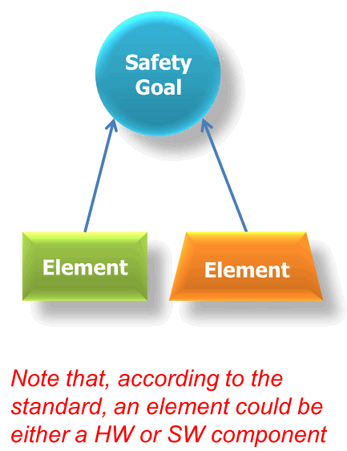

# Case Study

## 问题描述
- 考虑一个功能F，当从传感器S1，S2，...的组合输入时，Sn向执行器M（“电机”）发出激活命令 
  - 假设F的安全状态为“**M停用**” 
  - 假设危险和风险分析已确定功能F的**ASIL D**.

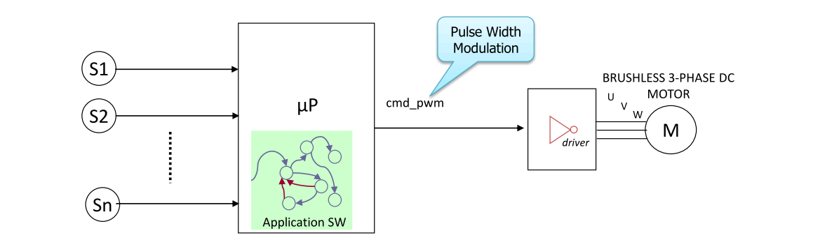

- 假设我们已经确定了以下安全目标：“避免不期望的M激活” 
  - 因此“不期望的”意味着“由于传感器S1，S2，...... Sn的错误组合”

## ASIL分配
- 进一步假设传感器S1，S2，...... Sn测量一些不同的值 
  - 也就是说，传感器彼此独立且非冗余
- 此外，在这种情况下，我们假设这些传感器中的每一个，如果有故障，本身可能导致要违反的安全目标 
  - 标准的ASIL理论说因此每个传感器还必须继承分配给功能F的ASIL D.

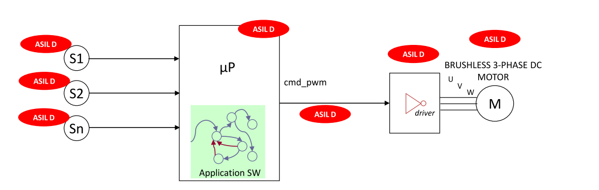

## 第一次分析
- 此时，我们开始分析我们的架构，推断实际架构中哪些元素**具有违反安全目标的能力** 
  - 这可能会利用所涉及技术的特定知识
- 在这个例子中，我们从理论上知道控制无刷三相直流电动机，三相需要**及时精确定义的信号** 
  - 因此有些部件（例如，驱动器及其相关的命令通道）在发生故障的情况下，**不可能产生错误激活M所需的精确信号** 
  - 因此它们本身**无法违反安全目标**

【注】：注意ASIL只分析故障情况，安全目标是出现故障后需要马达立刻停机。如果马达或马达驱动器本身是有故障的，那马达就不会运行，也就是本身就是安全的。这很好理解，如果一个车开不起来，那当然是安全的。如果开起来后，遇到紧急问题，我们需要马达停机，但因为控制器的故障而不能停机这才叫不安全。

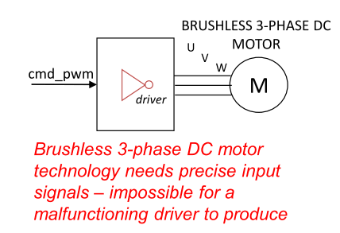

## 降低ASIL
通过这种分析，我们有理由将驱动器，电机和命令通道的ASIL**降低到QM**  
- 请注意，这完全取决于技术;如果电机是基于连续技术，那么就不可能将ASIL降低到QM

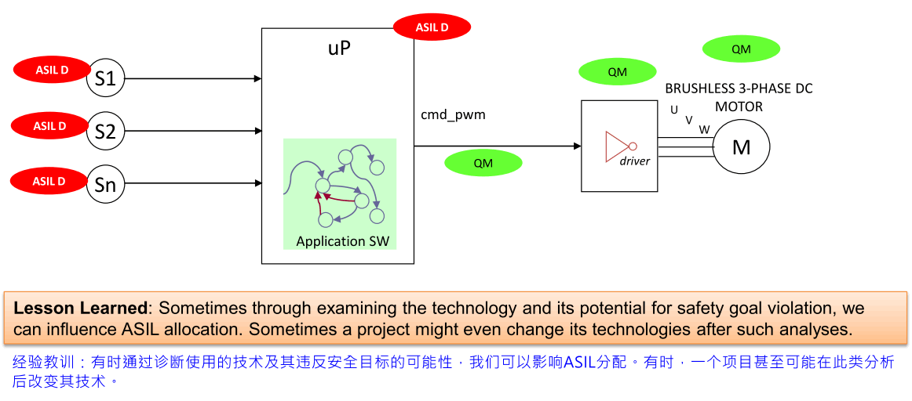

## 利用H＆R分析
- 我们现在通过利用**危害和风险（H＆R）分析**的结果来寻找改进安全架构的方法
- 在当前形式中，架构仅考虑“错误的传感器输入”，无论操作场景如何 
  - 但假设 H＆R分析区分了操作场景，例如车辆的速度？（这是典型的）
- 假设H＆R分析产生的结果是，**M的不期望的激活仅在大于某个阈值的速度下是危险的**？
  - （作为另一个例子，考虑不期望的安全气囊展开 - 其效果取决于车辆的速度） 
  - 其他典型的操作场景示例可能是“驾驶员侧车门打开”或“发动机温度大于某个阈值”
- H＆R分析的结果产生了我们可以利用的信息，以便在我们的架构中引入**安全机制**

## 安全机制介绍
- 我们现在引入一种安全机制：“当车速大于指定的阈值时，不得激活功能M” 
  - 这有效地引入了一种“与”门，以降低M被错误激活的可能性 
  - 不期望的M激活只发生在：如果功能F失效，且v>阈值.

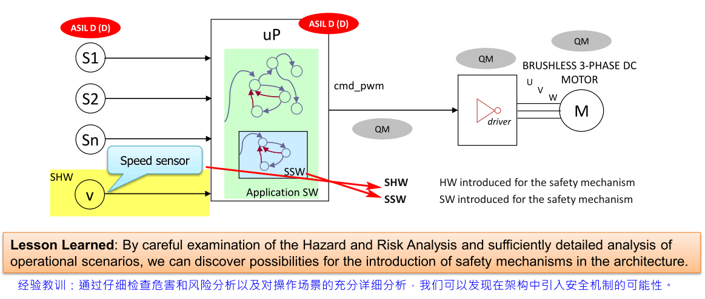

## Safety Mechanism ASIL?
- 请注意，我们现在实际上已经改变了架构 
  - 我们引入了新的传感器V  
  - 我们已经引入了新的软件
- 但是我们改变了ASIL分配吗？
  - 答案是“否” 
  - 仅仅添加安全机制本身并不会改变ASIL分配 

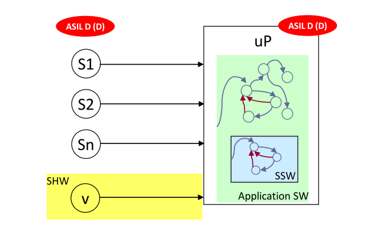

## SW ASIL分解？
我们发现系统软件的ASIL D太高，但我们不希望在控制逻辑中引入硬件冗余。因此我们决定在**软件级别应用ASIL分解**

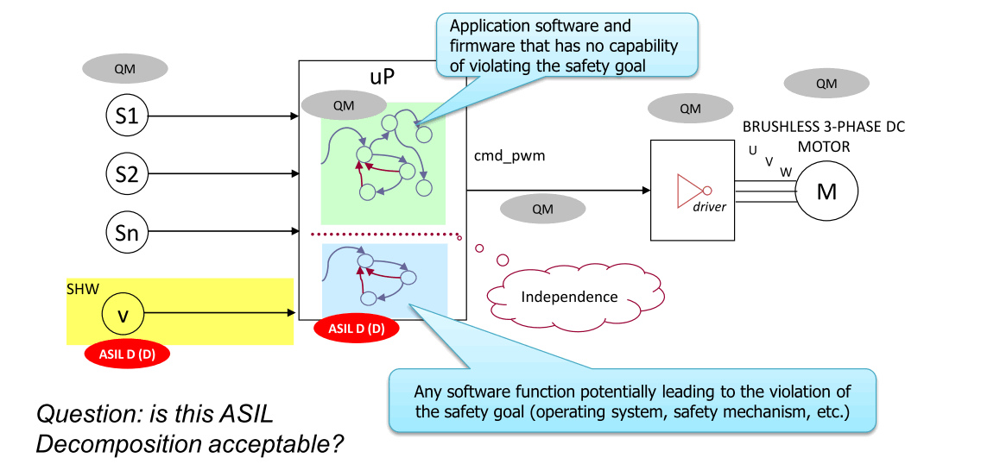

## 软件独立吗？
- 答：只有满足独立性标准，才能接受建议的软件级ASIL分解 
  - 这不仅包括检查软件，还包括硬件
- 此外：硬件度量如何？它们会成为ASIL QM还是ASIL D？或者基于百分比的某种组合？
  - 答案：硬件指标不受影响，所以它们仍然是ASIL D！
- 有几个问题 
  - 如何与底层操作系统共享软件资源？
  - 共享固件？
  - 如何共享内存，ALU等硬件资源？

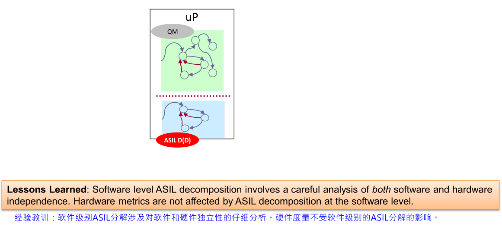

## HW-Level分解
- 我们对软件级分解的分析表明存在太多问题，我们决定进行硬件级分解

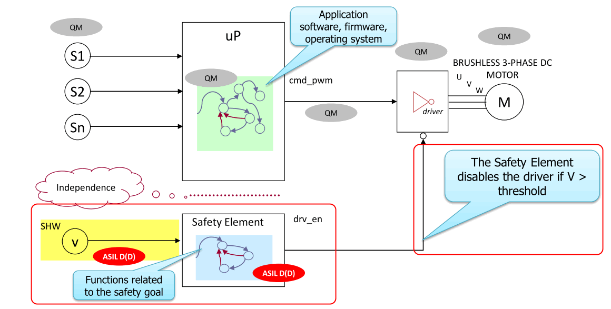

## The Safety Element
- 硬件方面的**安全元素**究竟是什么？
  - 这不一定是一个完整的微处理器 
  - 它可能是一个**可编程的门阵列**，基本上只是一个状态机，只编程一次，没有操作系统 - 它们的成本仅为整个微处理器的十分之一，并且非常 可靠，具有自己的时钟和电源，易于管理
- 没有嵌入式逻辑 - 因此没有软件 
  - 这对26262安全过程产生影响 
  - 您不再需要第6部分，只需要第5部分 （注：ISO26262第5部分介绍硬件，第六部分介绍软件） 
- 这就是为什么它只被称为安全元件 
  - 它取决于要执行的安全功能

经验教训：硬件级别ASIL分解涉及对可用硬件特性的深入了解，因此可以正确平衡独立性，功能性和成本。

## 可选的分解？
- 当我们有许多可以限制在微观上的非关键功能，以及有限数量的安全关键功能共享相同的安全状态（驱动器停用）时，我们刚刚介绍的硬件级别分解可能是有利的。
- 在两个元素上分解原始ASIL（D）还有哪些其他可能性？
- 两种可能性：
  - 1.ASIL B（分配给μP）+ ASIL B（分配给安全元件）
  - 2.ASIL C（分配给μP）+ ASIL A（分配给安全元件） 

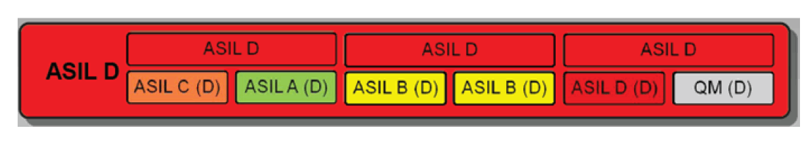

## 第一种分解
第一个替代分解表现为具有两个基本上等效的具有冗余功能的处理器 
- 但它已经是硬件方面的昂贵解决方案（处理器比例如简单的传感器昂贵得多） 
- 此外，软件必须使用“多样性”技术开发，也被认为是非常昂贵的

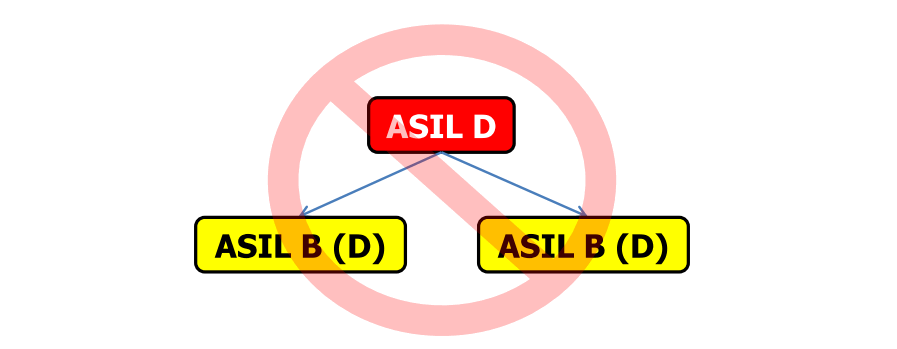

## 第二种分解
- 最后的替代方案再次代表了非对称布局 
  - 分配给主微处理器的软件实现了控制器的整体功能 
  - 安全元件简单，廉价且可靠
- 为什么不反过来？为什么没有处理器ASIL A和安全元件ASIL C - 这通常是直观的选择吗？
  - 因为在某些情况下，安全元件可能是以前设计中的遗留元素，并且在此特定项目中使用了它 
  - 可能过于简单，无法处理更复杂的安全功能 

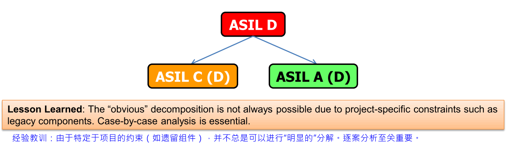

## 第二种设计

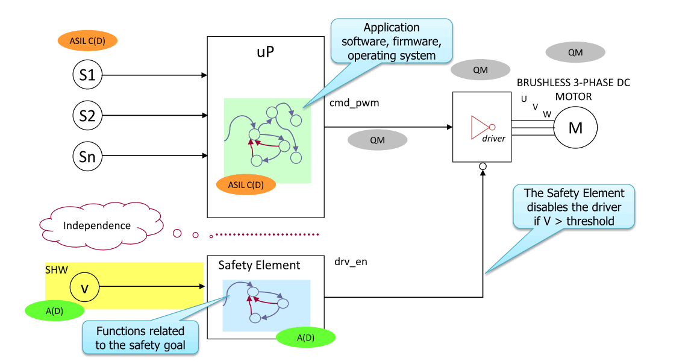

## 十大ASIL误解
- 10.ASIL仅处理硬件开发 
  -  ASIL对硬件，软件和支持流程产生影响
- 9.可以将硬件元素设计为ASIL X用于任何系统 
  - 硬件元件可以设计为满足ASIL X安全性在给定系统中的要求
- 8.ASIL分解是硬件冗余的一种形式 
  - yes and no：ASIL分解意味着功能冗余，但也具有多样性，独立性和免受干扰
- 7.ASIL分解用于降低HW度量目标 
  - 不！在ASIL分解之后，初始安全目标（分解前）的相同目标适用于分解的HW / SW元素
- 6.ASIL分解主要是关于随机故障 
  - 对于IEC61508是正确的，但不适用于ISO 26262。它更多的是处理系统问题（例如架构）
- 5.26262标准要求ASIL分解 
  - 实际上，它不是必需的步骤。可以将其视为在SW分区到HW元件期间分配具有不同安全关键性的均匀功能的机会。
- 4.软件级别ASIL分解比硬件级别分解更简单，更便宜 
  - 实际上，由于对多样性和独立性的严格要求，软件级别分解通常比硬件级别分解更困难且更昂贵
- 3.ASIL分解是唯一的方法 降低元素的ASIL  
  - 实际上，有时可以通过对所涉及的技术和体系结构进行知情和仔细分析来直接降低元素的ASIL。**许多人仍然没有意识到这一点**。(比如例子中马达定级为QM)
- 2.ASIL分解总是可行的 
  - 实际上，使用有许多不同的ASILS等级实现的多个功能（如在现代微控制器中）可能使得在某些情况下实现ASIL分解基本上是不可能的。
- 1.ASIL分解始终是可取的 
  - 实际上，总是存在成本 - 收益权衡，并且经过仔细分析后，ASIL分解通常会表现为不需要的。

## 结论
- ASIL分解可以降低系统元素（硬件和软件）所需的ASIL
- 它需要采取架构决策 
  - 它们可能会影响硬件，软件或两者兼而有之 
  - 有时这些决策极难评估
- 有时候问题表现出独立性，并且需要做太多工作才能证明成本合理
- 有许多因素需要考虑！

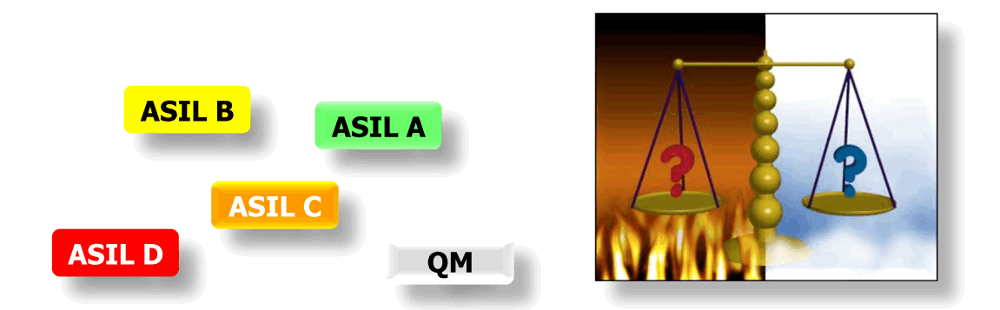