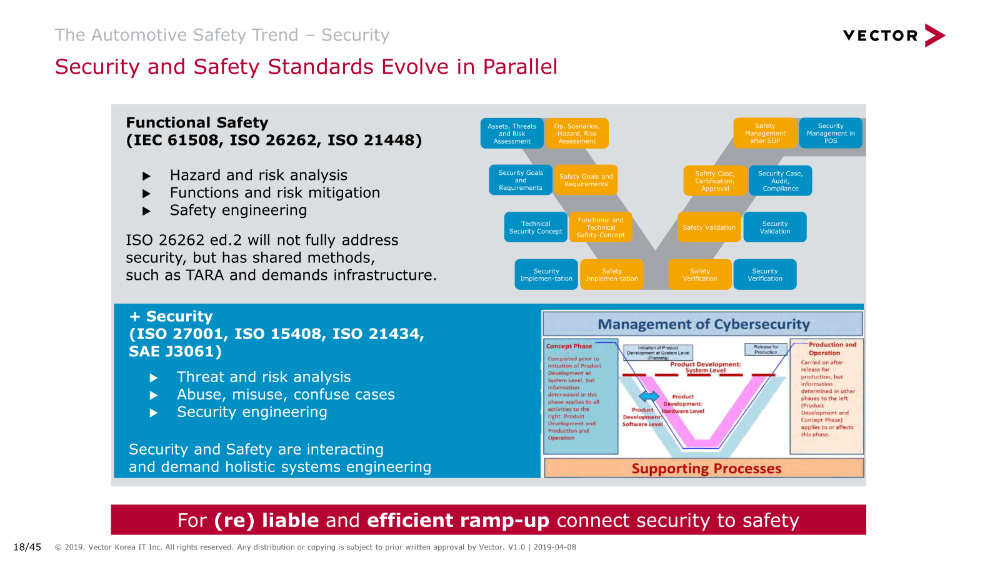

# 概览
这篇文档是对阅读了大量汽车电子功能安全，可靠性设计，不同芯片供应商，整车厂方案后的总结，并不是一本书，而是一本阅读笔记。针对每一个话题和概念，本人尽量通过找描述最好的PPT来解释，因为理解有限，并没有提供过多的个人解读。如果想对某个话题有更深入的理解，可以阅读每一章提供的参考文档链接。某些未公开的文档，不方便提供链接。如果需要可以直接联系我: skd2278@gmail.com

本文首先介绍ISO26262功能安全基本概念（Chapter 1），再介绍ISO21448自动驾驶汽车所需的功能安全（chapter 2）。然后讨论目前汽车软硬件设计需要处理的各种故障（chapter 3），针对这些故障处理，介绍了几种目前安全关键嵌入式系统的常见软硬件设计模式（chapter 4）。

提供了这些顶层的概览之后，接着介绍主流自动驾驶厂商的控制器安全方案（chapter 5）。并对常用汽车专用处理器的安全机制进行介绍（chapter 6）。再了解完这些之后，详细介绍了Xilinx提供的安全方案，和软硬件实现机制（chapter 7）。然后总结了常用的安全机制(chapter 8)，并介绍了ISO26262功能安全设计时几种分析方法（chapter 9)，最后对AUTOSAR提供的功能安全机制做了简单介绍(chapter 10)。

同时提供了Xilinx Safety Manual的翻译文档（chapter 11）。

另外需要澄清的是安全这个词在英语中有两个词，Safety与Security
- Safety是**预防事故**（可能涉及或可能不涉及人员的事故，但无论如何都**不是故意的**）。相对于汽车，可以定义详细的
- Security是防止人们的**恶意活动**（抢劫，入室盗窃，抢劫，恐怖活动等）。

目前来讲所说的功能安全ISO26262主要是针对Safety，当然如果Security出问题会也间接影响Safety.针对自动驾驶车辆，这两者都是至关重要的因素。不过本文档目前只关注功能安全。

