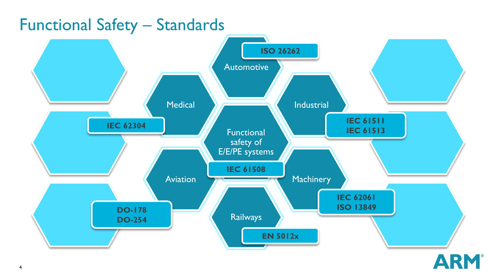
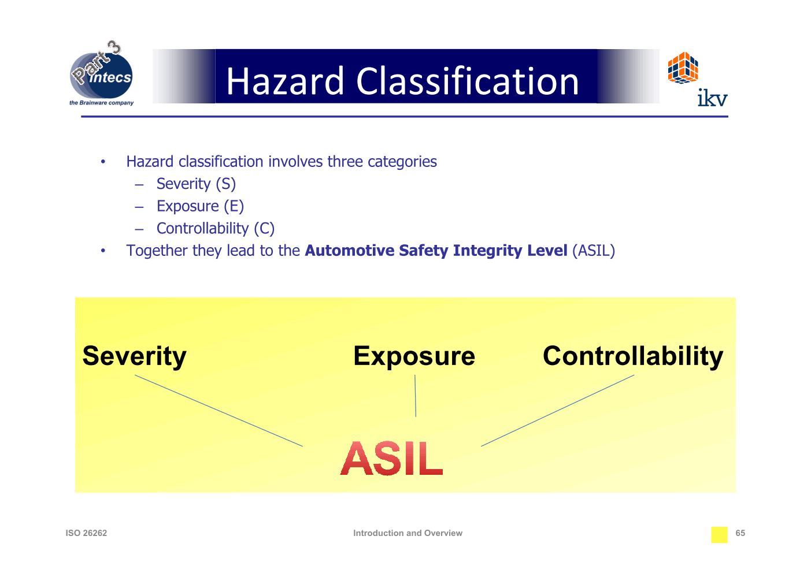
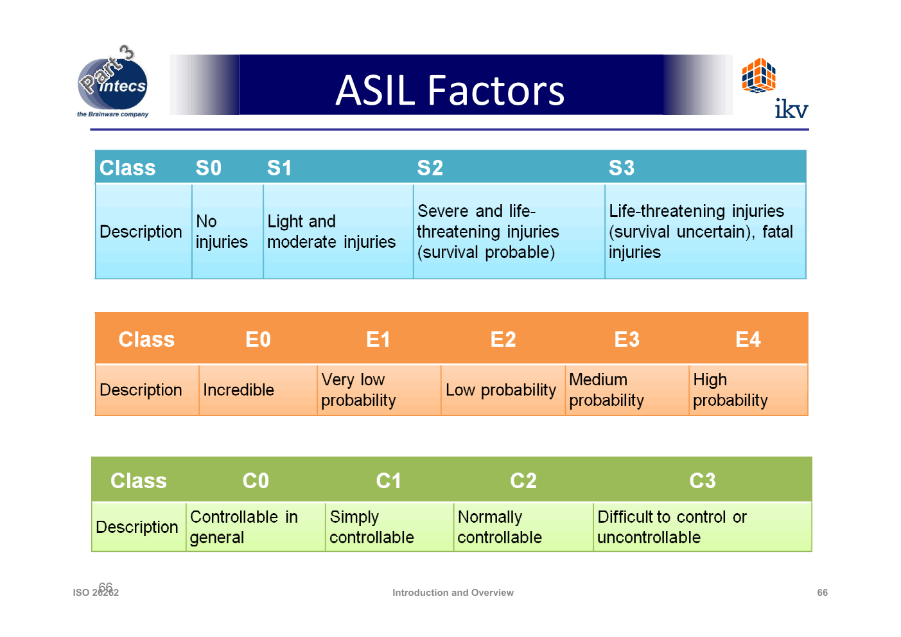
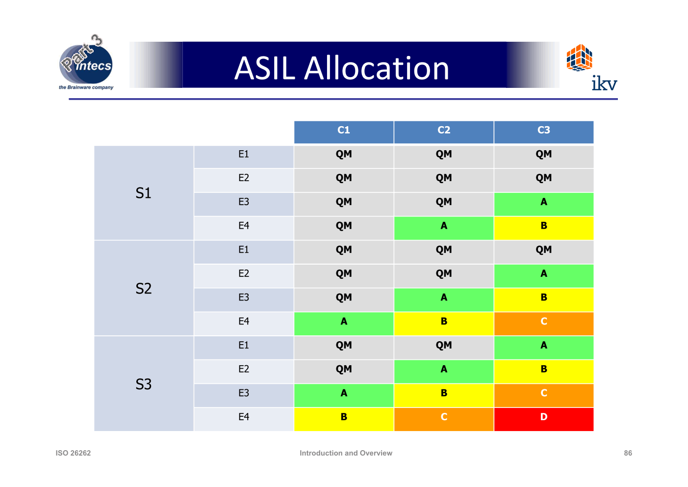
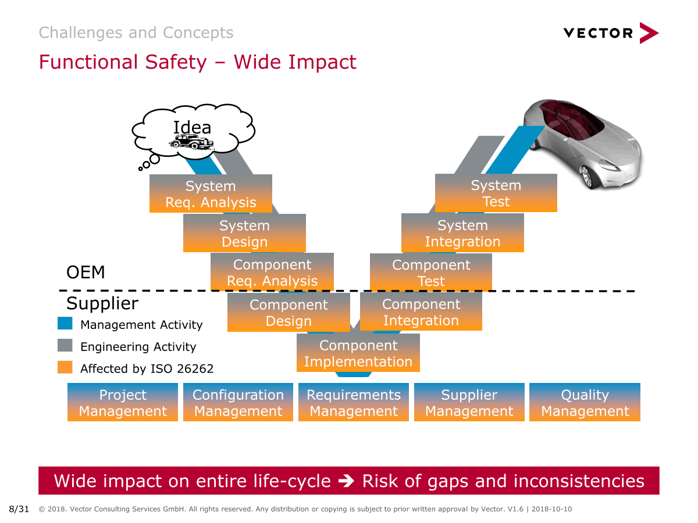
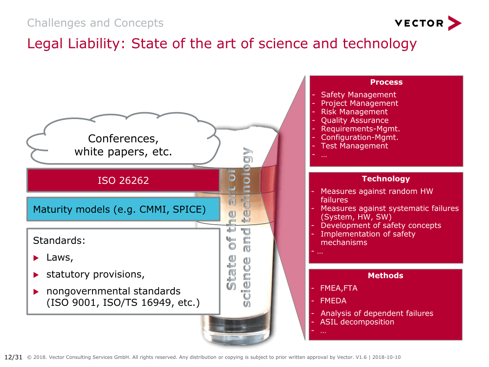
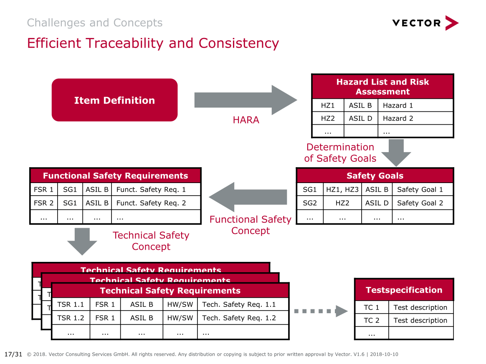

# 1. 功能安全概览
## 1.1. 定义
“**Absence of unreasonable risk** due to hazards caused by malfunctioning behavior of electrical/electronic systems” – ISO 26262-1:2011; 1.51

**Safety = Absence of unreasonable risk**

由于**电子/电器**系统故障导致的危害，没有不合理的风险。

功能安全是由于控制系统越来越多地使用**E/E(电子和电气)系统**而产生的。目前，功能安全应用于许多行业，包括航空电子、汽车、铁路和医疗器械行业。最通用的标准是IEC 61508，它起源于工业市场。它目前作为标准存在于IEC/ISO基本安全出版物中，涵盖了一些行业的“一般功能安全”。ISO 26262特别适用于汽车乘用车电气和电子系统。**ISO 26262标准是IEC 61508标准的一个分支**。

- 注意，功能安全性和ISO 26262不考虑E/E系统中的所有风险。他们**只考虑降低E/E系统故障行为的风险**

## 1.2. 汽车安全与汽车功能安全
车辆有许多不同的系统，包括液压系统、机械系统、电气系统、电子系统和化学系统。有各种各样的汽车标准，涵盖了有关安全的主题和最佳设计实践。你可以在汽车工程师协会的网站上找到一些例子。各国政府甚至有自己的安全标准，如美国政府的联邦汽车安全标准和联合国统一汽车管理世界论坛。

**功能安全，只关注电气和电子系统故障，只是整体汽车安全的一部分**。

## 1.3. 功能安全性和标称性能
**功能安全性也不考虑标称性能**。例如，自动制动系统的标称性能可以是车辆以每小时60英里的速度在5秒内完全停止。功能安全不决定车辆是否在5秒内刹车。

相反，**功能安全应该关注的是故障**，比如刹车功能在本不应该启动的时候启动了，或者系统刹车太猛导致驾驶员受伤。标称性能问题仍然可能导致安全问题，但标称性能不是功能安全标准的一部分。

## 1.4. 什么是功能安全
在最基本层面上 功能安全包含三个要素：

- 第一，**识别**出会对**人身健康**造成伤害的潜在问题，我们将这些潜在的问题称为**危害**
- 第二，对危害造成的**风险**进行**评估**
- 第三，利用系统工程学的知识将风险**降低至一个可以接受的范围内**

## 1.5. 什么程度的风险是合理的?
- 安全带的历史：许多人认为卡尔·本茨在1885年左右发明了汽车。安全带直到20世纪20年代才开始出现，当时医生开始在他们自己的车上安装安全带。直到20世纪50年代，汽车公司才将安全带作为可选设备提供。直到20世纪50年代末，安全带才成为标准设备。1968年，美国通过了一项法律，要求所有车辆都要系上安全带。1970年，澳大利亚成为第一个要求系安全带的国家。1984年，纽约是美国第一个通过类似立法的州。因此，各国花了近一个世纪才要求使用安全带。
- 如果安全带是机械的将不作为功能安全考虑的一部分。如果包含电子元件，则作为功能安全一部分。

- 综上，功能安全关注的是将风险**保持在当前社会的阈值以下**

## 1.6. 完全消除风险
为什么你只是试图将风险降至合理水平，而不是消除所有风险?**消除所有风险将使工程、产品开发和测试陷入瘫痪**。不幸的是，要确保人们在车祸中不受伤，恐怕是不可能的。另一方面，没有消除足够的风险可能导致失败的产品，召回，诉讼甚至生命损失。最后，**每个公司都必须自己决定从产品中消除多少风险**。

## 1.7. “功能性”是什么意思?
术语“功能性”来自于系统工程的一个分支，称为需求工程。系统工程将需求划分为:

- 功能需求——**系统应该做什么**;换句话说，系统的功能。
  > 功能要求：form X system shall do Y.例如，“转弯信号系统应打开指示灯，告诉司机系统是活动的”。
- 非功能性需求—**—系统应该如何表现**:例如，系统有多可靠?
  > 非功能性要求：the form X system shall be Y.例如:“当车辆点火开关处于on位置时，转弯信号系统应该是可用的”。

**功能安全关注的是当系统做了不该做的事情时会发生什么，这被称为故障**。当为车辆设计添加新的工程要求，以确保系统的安全。可能会注意到，在功能安全模块中经常出现**shall**这个词。这是因为工程需求几乎总是包含“shall”这个词。如果看到shall这个词，那么可能正在查看一个工程需求。

## 1.8. ASIL

严重程度、发生危险场合可能性和可控性提供了风险评估的系统化方法。我们将这三种因素混合成为一个度量单位叫作汽车安全完整性等级（ASIL）。

注意这里对三个因素做了分级

汽车安全完整性等级用来衡量在每一种危害情形下风险的大小，低风险等级为ASIL A级，而最高的风险的等级为ASIL D级。一个快速的定级方法`6,7,8,9 -> A, B, C, D`

ASIL要点
- ASIL不是为物理系统组件计算的，而是为**功能计算**的
- 与功能相关的ASIL由实现该功能的软件和硬件元素**继承**
- 一个硬件组件或软件组件可能会实现**多个不同ASILs的功能**(如单片机)
- 与硬件或软件组件相关联的ASIL从运行在其上的**ASIL最高功能继承**而来

## 1.9. 功能安全流程

## 参考资料
- [Vector: Functional Safety with ISO 26262](https://assets.vector.com/cms/content/consulting/publications/Webinar_Safety.pdf)
- Udacity Self Driving Car - Functional Safety
- ikv ++ technologies ag Functional Safety Training
