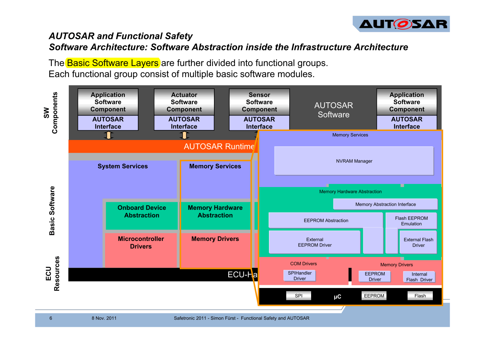
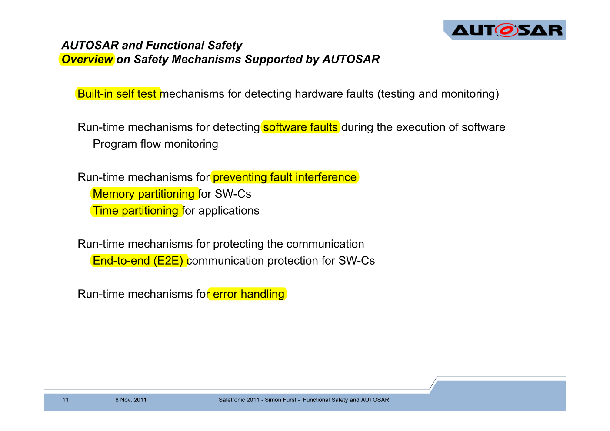
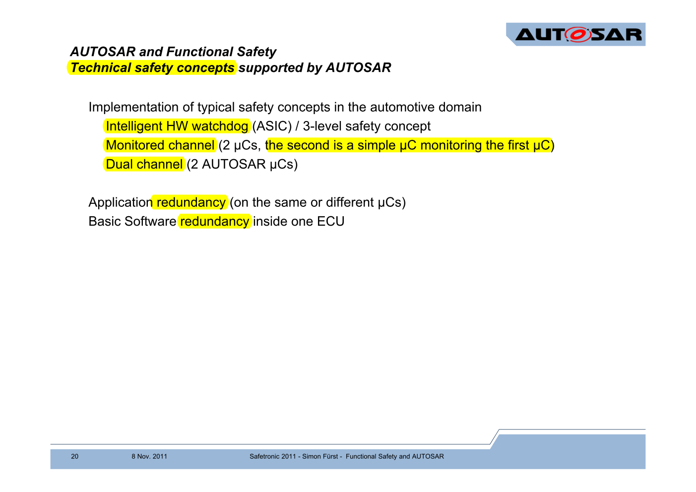
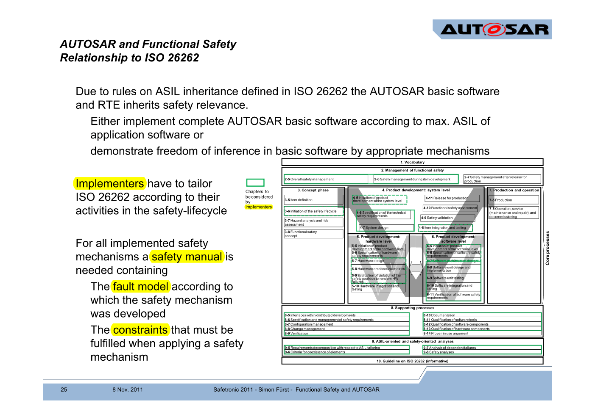
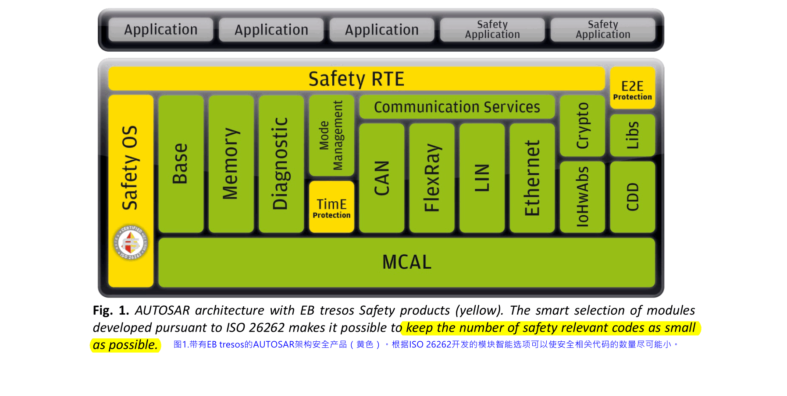
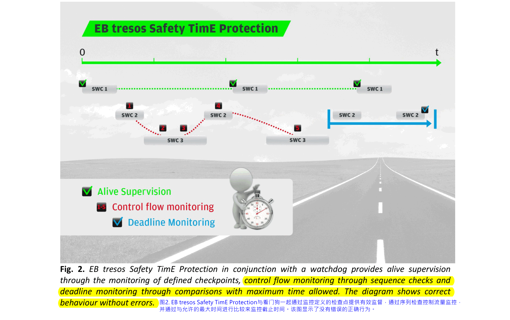
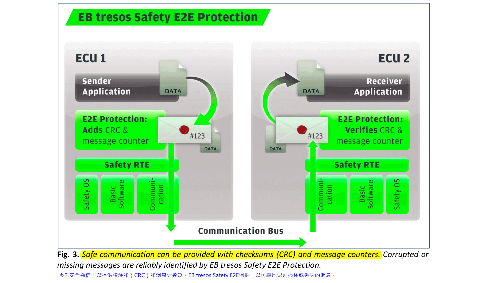
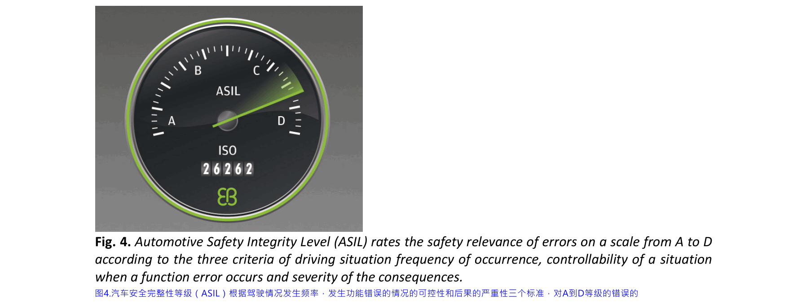

# 10. AUTOSAR

## 10.1. AUTOSAR功能安全机制

现在AUTOSAR事实上已经成为一个功能安全软件框架，很多ECU开发已经抛弃了已有的方案而使用AUTOSAR框架。

AUTOSAR利用MCU提供的某些硬件功能覆盖了大部分安全机制。目前很多厂商拿到车规级MCU并不理解如何利用内部的安全机制，而AUTOSAR通过芯片商提供的MCAL层隐藏了大部分这些看上去"难用"的功能，因而开发更加便利。

处理使用安全机制，一些安全设计模式，所需的软硬件隔离，监控机制等等，这些基础安全概念，AUTOSAR都有支持

AUTOSAR很好的覆盖了ISO26262的大部分Part。

## 10.2. AUTOSAR与功能安全相互排斥吗？

这是一篇文章很好的讨论了AUTOSAR与功能安全之间的关系

虽然简单性是安全关键应用的一个因素，但AUTOSAR拥有超过6,000个配置参数和超过100,000行代码，提供了无法想象的选项范围。这种范围广泛的配置变体使安全性分析和高安全性关键应用（ASIL-C，D）中必需的验证措施的实施几乎不可能。但是，这种困境有一个解决方案：**将软件分为安全相关和非安全相关组件，并确保两者严格分开**。

越来越多的电子控制单元（ECU）采用基于AUTOSAR的软件实现的安全机制。它们依赖于AUTOSAR Basic Software（BSW）提供的功能。但是，这些通常**仅根据质量管理（QM）指南制定**。**那么我们如何在此基础上构建安全的软件架构呢？**唯一可行的解​​决方案是将**整个软件分成小单元**。因此，只有少数软件组件必须满足安全要求，大大减少了要根据最高安全完整性级别验证的代码数量。这简化了开发过程，降低了复杂性并提高了安全性。

AUTOSAR堆栈本身也可以分解为安全相关和非安全相关的组件。困难在于确保ISO 26262标准要求的**各种组件之间不受干扰**。必须确保安全相关组件与软件的其余部分之间不存在干扰和/或可靠地检测到任何可能的干扰。当具有不同ASIL（汽车安全完整性等级）的软件组件集成在一个ECU中时，这种严格分区原则也适用。只有在防止干扰的情况下，安全相关组件才能保持尽可能小并严格封装。

## 10.3. 免受干扰是ISO 26262关键

区分三种免受干扰的关键：
- 空间免受干扰
- 时间免受干扰
- 信息交换

**空间免受干扰**的方面是指ECU的**存储器**。必须保护安全相关组件中的数据不被其他组件访问。**为了始终获得正确的数据**，安全相关组件可以例如将其数据**双重存储**（正常的和位反转的）在存储器中，并在每次访问数据时检查一致性。但是，这仅允许识别修改的数据。它不会阻止数据被修改。或者，可以借助现代处理器中提供的**存储器保护单元MPU**来保护数据。它识别并阻止被禁止的访问，因此应用程序可以在操作系统内核的帮助下对错误做出反应。这是**保护大量数据的首选方案**，特别是对于更高的ASIL。

**时间免受干扰**与timing domain有关。有必要确保安全相关软件具有**必要的计算时间并按预期顺序执行**。通常，这是在**外部智能看门狗**的帮助下确保的。如果在给定时间未按规定顺序到达某些检查点，则将其识别为错误。应用程序任务的激活也属于这种免受干扰的范围：基于优先级的调度对于在预定义序列中正确执行任务至关重要。但是，操作系统可以因此影响安全相关的应用程序，这意味着它“继承”应用程序的ASIL。

必须根据ISO 26262确保的第三个免受干扰的方面是**信息交换**。必须以这样的方式保护安全相关的数据和信号，以便识别出损坏或丢失的数据。

然而，所有这些功能的一个重要先决条件是**软件可以依赖于处理器**（即处理器是可信任的）。处理器必须能够使用要求的ASIL诊断覆盖范围来识别自身的错误。**对于诸如A或B的较低ASIL，由处理器制造商提供并且定期调用的自测试软件通常就足够了**。**对于更高的ASIL，通常使用具有ECC存储器的锁步处理器。这涉及两个处理器内核自动并行执行所有计算，并在结果相互偏离时报告错误**。当CPU在内存访问时检测到错误的ECC校验和时，会识别内存错误。**一个重要的基本规则是，如果处理器不满足所需ASIL的先决条件，则软件无法对其进行补偿**。

## 10.4. 操作系统内核作为中心组件
利用所描述的无干扰机制，AUTOSAR基础软件也可以与ECU上的其他软件分离。然后基础软件运行在一个单独的存储器分区中，并且在MPU的帮助下，ECU上的各种软件组件相互保护。此设置的核心组件是操作系统内核（参见图1）。

由于内核知道必须激活哪个任务，因此这是MPU管理的最佳位置。如果任务和中断处理与MPU编程相结合并根据系统中最高的ASIL进行开发，则可以将安全机制直接放在该内核上。然后，通过适当的MPU配置保护它们免受未经授权的数据访问。诸如EB tresos Safety OS等安全系统提供操作系统的基本功能以及灵活的内存分区，所有这些都完全按照ASIL-D开发。由于内核基于系统调用接口并且还通过内存保护来保护自身，因此它与应用程序完全分离。内核区分特权和权限减少的非特权CPU模式，例如现代处理器提供的权限。这种设计使其对所有类型的应用程序错误都非常好的鲁棒性。

但是，操作系统仅仅是通过任务和中断管理以及内存保护的结合不能保证安全。复杂的软件体系结构使用必须受到保护以防止同时访问的共享数据区域以及向其他休眠软件组件通知发生的任何事件的通知机制。特别是当软件组件相互通信时，AUTOSAR运行时环境（RTE）经常使用这些机制。这就是EB tresos Safety OS还提供OSEK资源机制的原因，该机制在优先级上限协议的帮助下实现了锁定机制的无死锁实现。OSEK事件提供根据ASIL-D通知休眠任务的功能。这为应用程序开发人员提供了优势，即复杂软件体系结构功能所需的所有基本机制都可在ASIL-D变体中获得，并且在应用程序中无需进一步保护。特别是操作系统经常隐式假定的基本功能 - 上下文切换和中断处理 - 是ASIL-D内核的一部分。然后，应用程序开发人员可以专注于基本要素，即应用程序的功能。

基础软件也受益于这种方法。它也可以被视为由小型操作系统内核“锁定”的应用程序。由于现代处理器通常允许在非特权模式下选择性地访问外围设备，因此没有理由不应该以降低的权限和主动内存保护来操作BSW。这确保了不受其他系统组件的干扰，同时，软件的安全相关部分因此仅是内核和应用程序中的安全机制。

如何在实践中实施？许多汽车制造商为使用AUTOSAR堆栈的OEM特定功能提供软件组件。例如，EB提供BMW专用的AUTOSAR软件包，其中基本软件和BMW组件在CPU的非特权模式下运行，并具有主动内存保护。在飞思卡尔和意法半导体的Leopard处理器上已经进行了参考实施，现在将在ASIL-D项目中进行批量生产，集成的外围保护模块也提供了额外的支持。这允许选择性地使外围设备在非特权模式下进行访问。与内存保护相结合，基础软件，应用程序和操作系统在此设置中严格分开。

## 10.5. 控制流程和时间监控

保护安全相关软件的另一个重要方面是**时间上免受干扰**。内核仅处理任务激活，但不照顾时序约束。由于这些与应用程序的安全要求密切相关，**因此在单独的软件组件中或直接在应用程序中监视它们比在内核中直接监视它们要好得多**。

在安全开发中，时间监控通常必须满足**三个基本要求**。首先，它**必须识别软件是否正常运行**。这被称为“alive  supervision”。另一个关键的监控任务是“deadline monitoring”，即**确保在规定的时间范围内执行与安全相关的操作**。最后，**必须识别与预定义执行序列的偏差**。这称为“control flow monitoring”。在某些情况下，两者都需要比操作系统内核及其任务激活机制所提供的更精细的粒度。这是支持委托服务到自己的模块的另一个论点。

在EB tresos产品系列中，EB tresos Safety TimE Protection提供了必要的功能（见图2）。

它实现了AUTOSAR看门狗堆栈，并且在外部硬件看门狗的帮助下，它确保任何与预定义调用序列的偏差或任何截止期限违规都会启动切换到安全模式。为此，模块使用由应用程序开发人员或操作系统内核提供的时间戳。

对于仅有少量安全相关数据或低ASIL的应用，可以通过**单独的控制流量监控**来论证没有干扰。如果没有直接分配给操作系统的安全需求，则可以使用**校验和或冗余存储**来确保数据完整性。开发人员可以通过适当位置的检查点和控制流监控机制来监控安全机制的正确执行。然而，一旦安全机制的复杂性和要保护的数据量增加，这种方法就会达到极限。此外，高安全要求和相关的更高ASIL值需要更强大的系统，因此控制流监控作为唯一的保护手段已不够。因此，**使用ASIL-C或D的项目使用Safety OS进行内存分区和控制流监控，以确保时间不受干扰**。

## 10.6. 运行时环境和通信

在现代ECU中，应用程序通常不直接在操作系统内核上运行，而是使用AUTOSAR运行时环境（RTE）开发为AUTOSAR软件组件（SWC）。通过RTE抽象出基本软件和处理器硬件，以实现应用程序的简单移植。虽然RTE只是放置在内核和BSW-API上的抽象层从而在应用程序中提供其他AUTOSAR模块的功能，但它有助于ECU内部和网络上各个软件组件之间的通信。如果要传达的数据与安全相关，则有两种不同的保护选项。

**在ECU内，可以通过RTE直接实现保护**。在EB tresos产品系列中，这是由EB tresos Safety RTE执行的。这里最重要的安全相关功能是信息交换，因为RTE本身执行此任务而不是将其委托给其他模块。RTE使用操作系统来激活其他软件组件或保护数据，因此只需要验证OS API是否已正确使用。当然，其基础是根据适当的ASIL开发的操作系统。

对于**跨ECU的通信**，存在许多可能导致数据传输失败的错误源。这些源通常在ECU之外，这意味着特有的软件开发不能防止这种情况下的错误。**错误识别是唯一的解决方案，这就是AUTOSAR指定E2E模块（端到端保护）的原因**（见图3）。在**校验和和消息计数器的帮助下，该模块可识别丢失，传输两次或传输错误的数据包**。

## 10.7. AUTOSAR and safe ECUs 

如果您将自己限制在绝对必要的AUTOSAR模块,并“锁定”高度复杂的AUTOSAR基本软件和应用软件，AUTOSAR允许开发最高的ASIL。虽然应用程序和安全机制两者仍然负责验证和控制读入的数据，但AUTOSAR，特别是EB tresos Safety产品系列提供了确保功能完整性的机制。可以通过操作系统内核识别和防止数据完整性的丢失，同时可以通过**alive supervision,  deadline monitoring and control flow monitoring**来识别timing错误。安全的RTE和E2E保护通过保护通信来补充package。将安全组件减少到其基本功能以及从其他AUTOSAR功能中进行封装可确保这些模块尽可能小巧简单。因此，尽管AUTOSAR的高度复杂性，但可以找到简单的解决方案并开发安全的ECU。

## 参考资料
- [AUTOSAR Safety Solutions for Multicore ECUs and ADAS Systems](https://d23rjziej2pu9i.cloudfront.net/wp-content/uploads/2015/06/22092859/AUTOSAR-Safety-Solutions-for-Multicore-ECUs-and-ADAS-Systems.pdf)
- [Do AUTOSAR and functional safety rule each other out? ](https://d23rjziej2pu9i.cloudfront.net/wp-content/uploads/2014/11/28025218/AUTOSAR_Functional_Safety_Do_they_rule_each_other_out.pdf)
- [AUTOSAR and Functional Safety](https://automotivetechis.files.wordpress.com/2013/04/autosar-and-functional-safety1.pdf)
- [Overview of Functional Safety Measures in AUTOSAR](https://www.autosar.org/fileadmin/user_upload/standards/classic/4-3/AUTOSAR_EXP_FunctionalSafetyMeasures.pdf)