# Zynq UltraScale+ MPSoC Safety Manual

# Ch1 Introduction
## Overview
本手册是与Xilinx®Zynq®UltraScale+™MPSoC相关的安全文档的一部分，其目的是描述在安全相关系统中使用Zynq UltraScale + MPSoC器件，指定用户在自己的安全系统中安装和操作这些设备的责任。以保持保持所需的安全完整性等级。

本安全手册的编写符合汽车安全标准ISO-26262，2011/2012版，同时考虑了2016年4月提供的ISO-26262第11部分草案版本的指导（第11部分，以及完整版）ISO-26262的修订版2将于2018年正式发布。

本安全手册的一般假设是项目集成商将实现与应用程序相关的所有要求，包括使用假设的实现，包括Zynq UltraScale + MPSoC软件安全用户指南（UG1220）中描述的软件测试库[ 参考文献8]并启用所有硬件安全机制。通过应用相关要求，Zynq UltraScale + MPSoC器件可以支持高达SIL3和ASIL-C的安全等级（参见表4-1：安全配置）。如果实现了该项目的安全目标，任何深思熟虑的非应用程序需求都是可接受的。当安全目标的安全完整性等级低于ASIL-C或通过系统级别的不同措施或两者的组合实现安全目标时，可能会发生这种情况。此外，如果项目集成商故意没有满足本安全手册中规定的某些要求，则应提供出现这种偏差的原因。理由应与项目安全目标的实现一致，只要符合ISO 26262-10：2011第9.2.2条（见附录C），即可视为可接受。

## Safety-Related Deliverables
下面列出的大多数安全专用材料可供注册用户通过Xilinx Functional Safety Lounge访问。

https://www.xilinx.com/support/quality.html

该Lounge还提供具有更广泛吸引力的参考和链接，例如隔离设计流程，适用于安全和安全设计

https://www.xilinx.com/applications/isolation-design-flow.html

1. Zynq UltraScale+ MPSoC Safety Manual (UG1226)
2. Zynq UltraScale+ MPSoC Software Safety User Guide (UG1220)
3. Zynq UltraScale+ Software Test Libraries (STL) Source
4. Zynq UltraScale+ MPSoC FMEDA Report
5. Vivado Safety Manual (UG1187)
6. Xilinx Quality Manual (QAP0002)
7. Device Reliability Report (UG116)
8. Isolation Design Flow for Xilinx 7Series FPGAs or Zynq-7000 AP SoCs (Vivado Tools) (XAPP1222) 
9. Soft Error Mitigation (SEM) Core 

## Definitions
本节标识了本安全手册中使用的所有定义：
- 系统/项目（System/Item）：集成了Zynq UltraScale + MPSoC器件的最终HW ECU（电子控制单元）或ECU。
- 用户/最终用户（User / End User）：Zynq UltraScale + MPSoC的最终用户，负责将设备集成到实际应用中。
- 应用/应用软件（Application/Application Software）：该软件在Zynq UltraScale + MPSoC和其他可编程元件上运行，负责安全功能的实际实施。
- 安全应用（Safety Application）：应用软件的子集，专用于满足项目的安全目标。安全应用程序通常分布在整个系统中，以利用独立性并便于模块的交叉检查。安全应用程序可能直接有助于安全功能，但它将执行测试以验证Zynq UltraScale + MPSoC的运行适应性以及构成应用软件所依赖的项目的其他元素。

# Ch2 Faults and Failure Handling Procedures
## Origin of Faults
典型的技术系统生命周期包括三个阶段：设计，生产，操作和维护，如图2-1所示。

**注意**：图2-1是指产品生命周期，而不是安全生命周期，它由16个阶段组成，如IEC61508-1中所述。

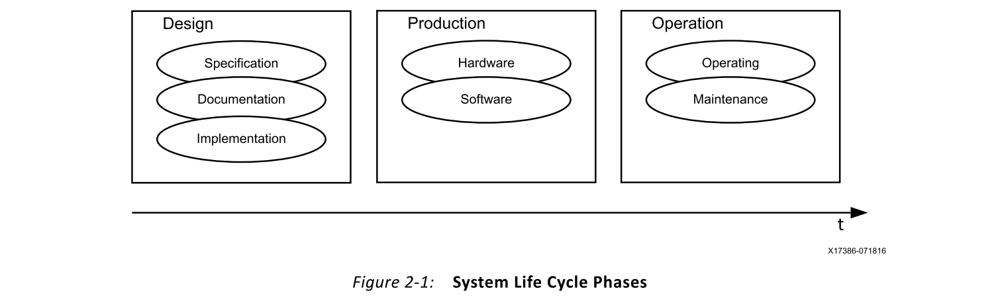

在这些任何生命周期阶段都可能发生故障：
- Design：specification, implementation, and documentation。
  - specification（例如操作条件的错误定义），implementation（例如忽视正确规格发生的软件错误）和documentation（可能误导并因此导致错误使用）都会出现故障。
- Production：包括硬件制造和软件编译。
  - 还必须考虑在制造硬件和安装软件期间发生的故障。
- Operation and Maintenance: 包括操作和维护方面。
  - 在运行阶段，必须考虑由干扰（例如机械或电气影响），磨损或物理影响引起的故障之间的进一步区分。
  
### Types of Faults
表2-1列出了电子系统中可能遇到的典型故障和故障处理责任。在适用的情况下，提供了Xilinx故障处理能力的摘要。

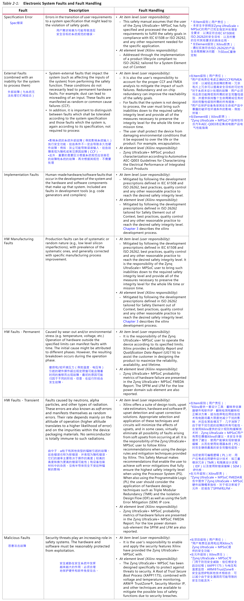

# Ch3 Zynq UltraScale+ MPSoC Development Process - Systematic Fault Management
## Hardware Development Process
Xilinx器件可用于广泛的应用，包括火星探测器，机器人手术系统，有线和无线网络基础设施，高清视频摄像机和显示器，工业制造和自动化系统以及汽车。Xilinx开发流程是一个分阶段开发流程，旨在满足每个服务市场的最严格要求，同时提供控制系统故障所需的基础设施。

Zynq UltraScale + MPSoC开发流程是一个质量管理（QM）流程。Xilinx质量管理体系是一个成熟的系统，拥有悠久的第三方认证历史。Xilinx目前自2004年起通过TL9000质量管理体系认证，并于2004年之前获得ISO9001认证.Xilinx供应链要求包括TS16969 / ISO9001认证。这些认证要求确保整个产品生命周期中的所有流程都要接受年度第三方认证审核，以确认符合Xilinx内部要求以及ISO9001 / TS16949 / TL9000标准的要求。Xilinx质量手册（QAP0002）以及质量认证信息可在线获取：http://www.xilinx.com/support/quality.html

绝对的质量通过开发控制计划，DFMEA和制造PFMEA来定义Xilinx对卓越的承诺。严格的控制流程和特立独行控制的重点是防止制造的各个阶段出现质量问题。Xilinx通过使用创新的统计技术和近实时控制，消除了重要的可变性来源，以提供最高水平的产品质量和可靠性。Xilinx通过使用全面的根本原因分析来解决和预防问题，从而不断改进。Xilinx与Xilinx供应商一起利用基于团队的八守则（8D）调查方法，使用数据驱动的验证方法开发永久有效的解决方案。如前所述，Xilinx定期计划并执行管理系统所有方面的审核，以验证和验证有效性并遵守既定程序和标准。管理层致力于及时纠正缺陷并展示持续改进的文化。

## Hardware Development and Production Process

## Software Development Process

## Safety Element Out of Context Approach
Zynq UltraScale + MPSoC不是ISO 26262意义上的Item，而是由最终用户开发的Element of an item（由Xilinx开发），即Xilinx客户稍后开发的产品。由于这个原因，Zynq UltraScale + MPSoC产品遵循ISO-26262第10部分第9条的ISO-26262标准的正确定制，遵循Safety Element out of Context（SEooC）开发周期。独立的功能安全评估员（EXIDA）已对验证进行了检查。

根据这种SEooC方法，Zynq UltraScale + MPSoC产品的开发旨在满足一系列功能和安全要求，这些要求假定由集成Zynq UltraScale + MPSoC的项目生成（见图3-3）。

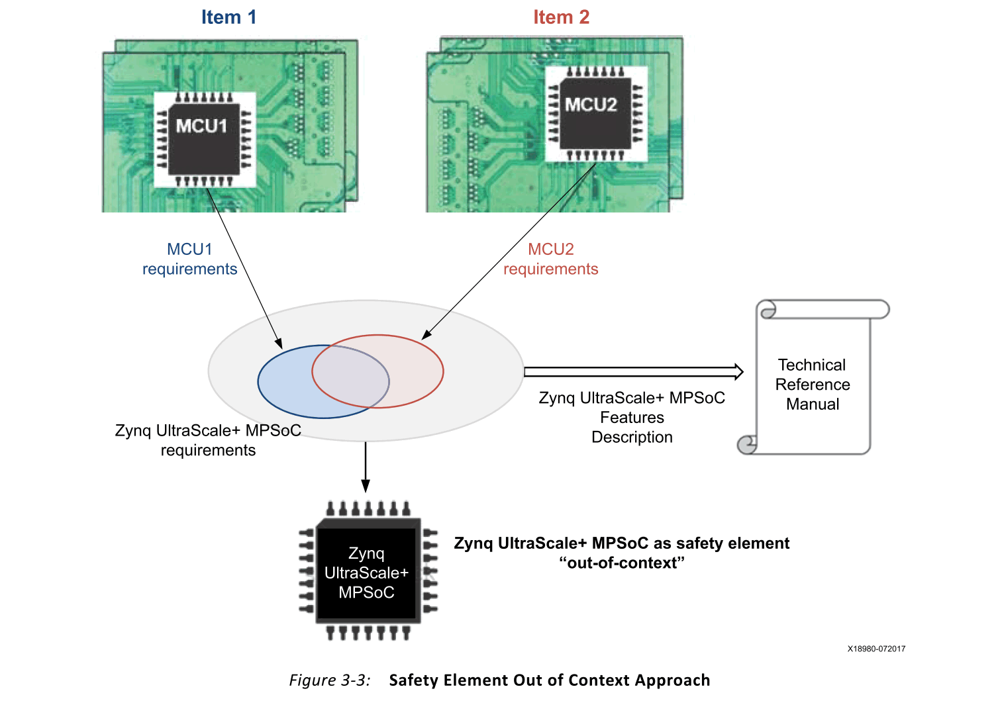

### Assumptions of Use Generated from Safety Concept and Safety  Analyses
安全概念对如何使用Zynq UltraScale + MPSoC做出了一些假设，这些软件将在集成到项目中时在Zynq UltraScale + MPSoC上实施和运行，以及项目的其他组件。此外，基于Zynq UltraScale + MPSoC详细设计执行的安全分析还对Zynq UltraScale + MPSoC使用，软件和外部组件进行了假设。这些假设称为使用假设（AoU），见图3-4。

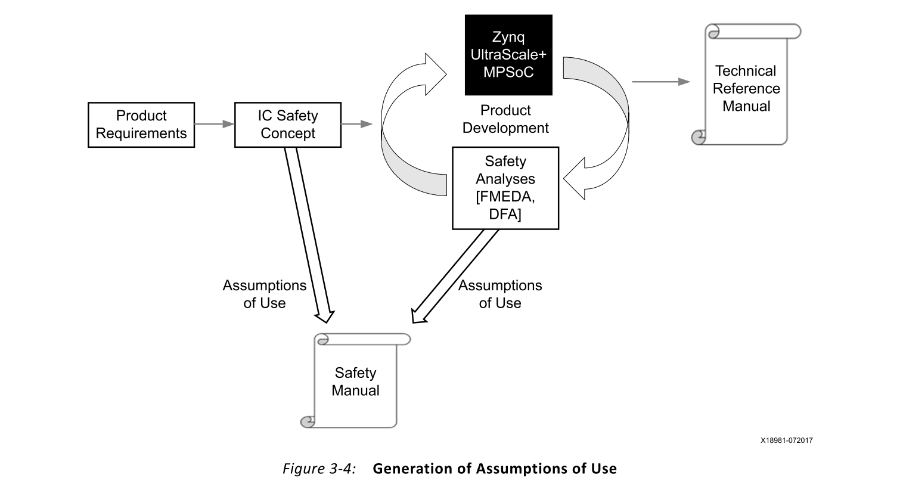

这些假设记录在案并通过本安全手册提供给项目集成商（见第5章）。这些假设意味着任何后续软件开发和系统集成的要求。故障模式影响和诊断分析（FMEDA）证实，当遵循所有使用假设时，Zynq UltraScale + MPSoC器件支持高达并包括SIL3和ASIL-C的安全等级（参见表4-1，第22页）。

与Zynq UltraScale + MPSoC硬件元素一起，产品描述文档（技术参考手册，数据表，勘误表）和安全相关文档（安全手册）将提供给将Zynq UltraScale + MPSoC集成到一起安全相关项目的各方（即项目集成商）。

# Ch4 Zynq UltraScale+ MPSoC Safety Concept 
## Architecture Description
如图4-1所示，Zynq UltraScale + MPSoC可分为三个主要子系统：
- 低功耗域（LPD），基于两个ARM Cortex-R5处理器
- 全功率域（FPD），基于四个ARMCortex-A53处理器
- 可编程逻辑（PL），基于Xilinx可编程技术。

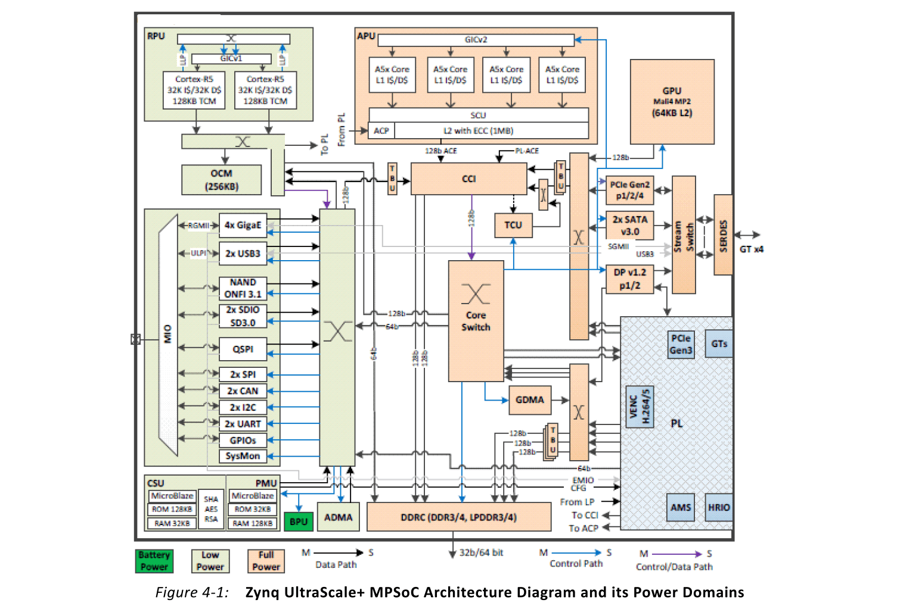

对于功能安全相关的应用，Zynq UltraScale + MPSoC被定义为（见图4-2）SEooC扮演处理元素（或其一部分）的角色。Zynq UltraScale + MPSoC应该通过通信总线连接到远程控制器。通信总线直接或间接连接到传感器和致动器。

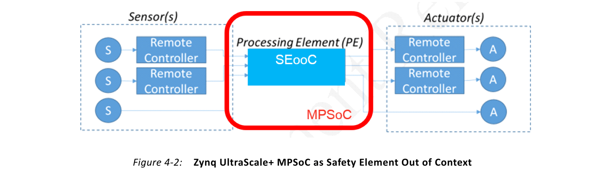

Zynq UltraScale + MPSoC的三个子系统/电源域中的每一个都可能在SEooC中具有不同的作用。例如，在汽车ADAS应用的情况下（例如，自动紧急制动），考虑图4-3所示的结构。

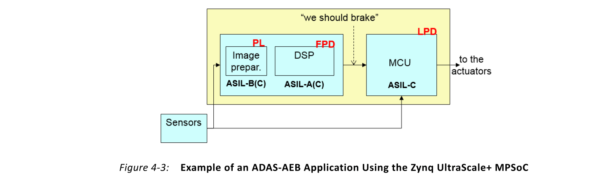

在这种架构中：
- 图像准备（可能是依赖于传感器或最终用户的功能）可以在PL中实现
- DSP（需要非常高的处理能力）可以在FPD中实现
- MCU（需要非常高的安全性，因为它控制执行器）可以在LPD中实现。

在具有极高安全关键I/O控制功能的工业应用中，请考虑图4-4所示的架构。

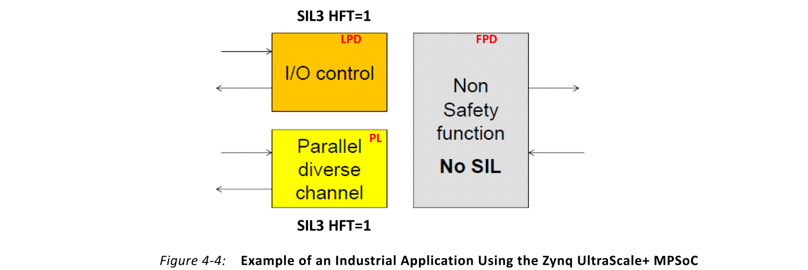

在这种架构中：
- 安全相关的I/O控制可以在LPD中实现
- 并行多样化通道可以在PL中实现
- 非安全功能可以在FPD中实现

## Possible Sub-system Configurations for Safety Related Applications
Zynq UltraScale + MPSoC可能支持的安全配置。列在表4-1。

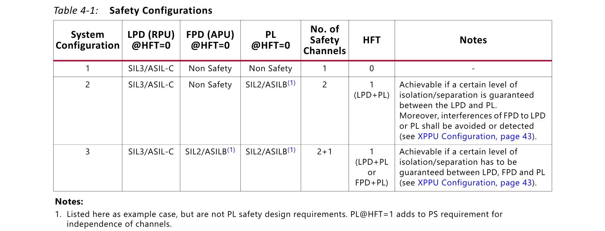

对于本安全概念文档中当前提供的使用假设，下图描述了使用Zynq UltraScale + MPSoC分区的可能组合以及各自的合规级别：

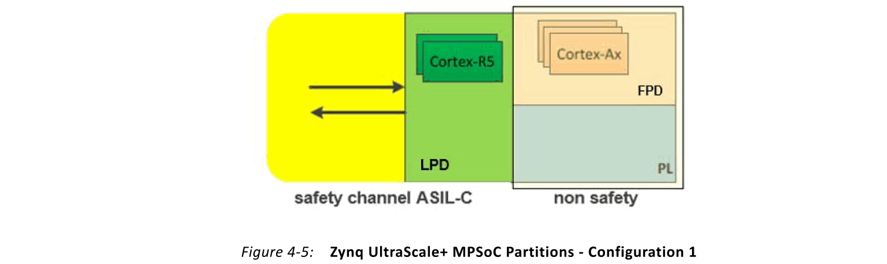

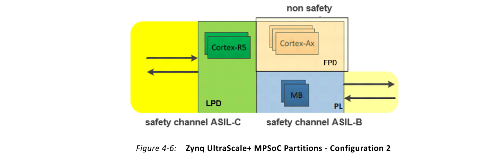

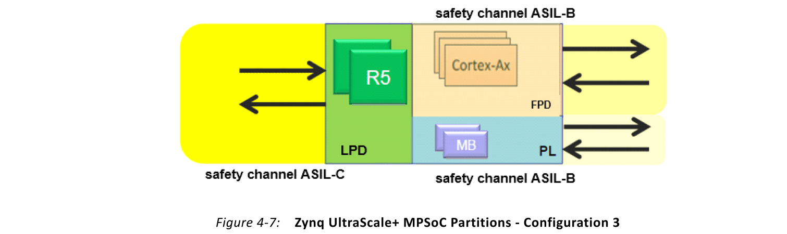

## Assumed Zynq UltraScale+ MPSoC SEooC Safety Goal and General Assumptions of Use 

本节定义了Zynq UltraScale + MPSoC的安全目标以及高级别的使用假设。

### Safety Goal
本节定义了Zynq UltraScale + MPSoC的安全目标，由硬件故障引起的LPD子系统中失效不应导致LPD进入不安全状态的时间超过FTTI MRD_SG001。

> 注意：Xilinx使用格式为MRD_xxx，SM_xxx和SC_xxx的标签来满足需求可追溯性，读者应该深思。

不安全状态是未在运行状态中列为安全状态的任何状态 - 安全状态，第25页。

这意味着对于此安全概念的范围，我们仅针对配置1（图4-5）。

如果使用Zynq UltraScale + MPSoC的项目集成商想要实现配置2或3，则安全概念应扩展到PL分区或PL和FPD分区MRD_AOU001。

> 注意：如果Xilinx客户想要采用这两个选项中的一个，Xilinx将支持安全概念的扩展，但这将在本文档范围之外进行。使用级别假设。

### ASIL level
Zynq UltraScale + MPSoC的LPD子系统应被视为ASIL-C SEooC。这意味着根据ISO-26262 ASIL-C开发的汽车应用程序可以将Xilinx发布的LPD硬件和LPD上运行的软件视为SEooC。

## Operating States – Safe States
图4-8中标识了Zynq UltraScale + MPSoC的安全和非安全操作状态。

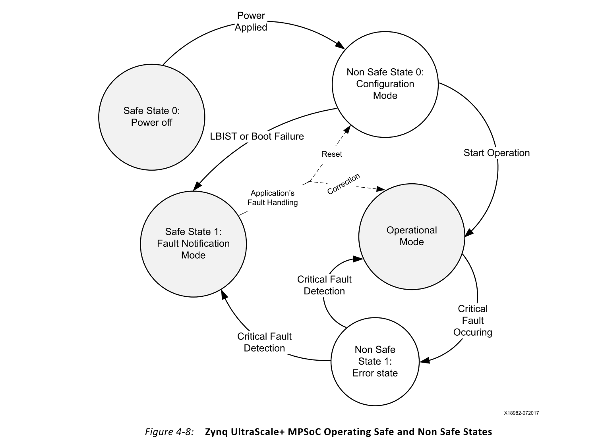

与图4-8相关的注意事项：
- 安全状态0：设备断电。
- 非安全状态_0（配置模式）：设备已通电且处于启动阶段。
  - 该状态应视为非安全状态。用户应用程序软件正在配置设备，执行诊断检查，校准和系统设置时，假设Zynq UltraScale + MPSoC器件无法执行与安全相关的功能。从Item的角度来看，这种状态通常发生在不需要安全相关功能的时候（例如，当车辆在接通阶段期间静止时）。
- 工作模式：器件根据Zynq UltraScale + MPSoC数据手册（DS925）[参考文献5]中规定的功能规范工作，PS_ERROR_OUT信号为低电平。
  - 从配置模式到操作模式的转换应由用户应用程序处理，用户应用程序管理item配置，并且可以看到配置何时完成以及何时可以开始操作。
- 非安全状态1（错误模式）：如果发生严重故障，LPD将进入未定义状态，直到检测到故障。这是由于安全对策而将要防止或快速跳过的错误状态。
- 安全状态1（故障通知模式）：PMU错误处理和传播逻辑电路被告知存在设备故障，并且向外界指示存在故障。
  - 逻辑内置自检（LBIST）检测到的故障或在配置过程中使用的任何电路中检测到的致命错误都会导致PS_ERROR_OUT引脚，PS_ERROR_STATUS引脚或两者都置为有效，并且器件将无法启动。
  - 报告在操作期间检测到的故障的方法由用户应用程序定义。值得注意的是，与传播ERROR_STATUS_1和ERROR_STATUS_2寄存器中包含的错误状态位相关的使能和掩码将定义每个错误源所需的PS_ERROR_OUT引脚的中断，复位或置位的产生。
  - 配置模式期间与错误报告关联的掩码的默认设置如表4-2，第34页（错误处理逻辑中的错误列表和掩码的复位状态）所示。必须在转换到操作模式之前由用户应用程序调整掩码

## Fault Tolerant Time Interval (FTTI) – Process Safety Time (PST)
由于Zynq UltraScale + MPSoC是作为SEooC开发，因此故障处理程序因系统而异。但是，必须指定系统必须检测并响应故障的时间。

单点容错时间间隔（FTTI）（即ISO 26262）或等效过程安全时间（PST）（即IEC 61508）是一个时间跨度，表示在一个Item上危险事件发生到故障发生之前不能有安全机制被激活（见图4-9和图4-10）。关于在Zynq UltraScale + MPSoC的LPD内实现的安全应用，假设项目的FTTI等于或大于100 ms。满足项目的FTTI要求是集成软件测试库和实现使用假设的用户责任。

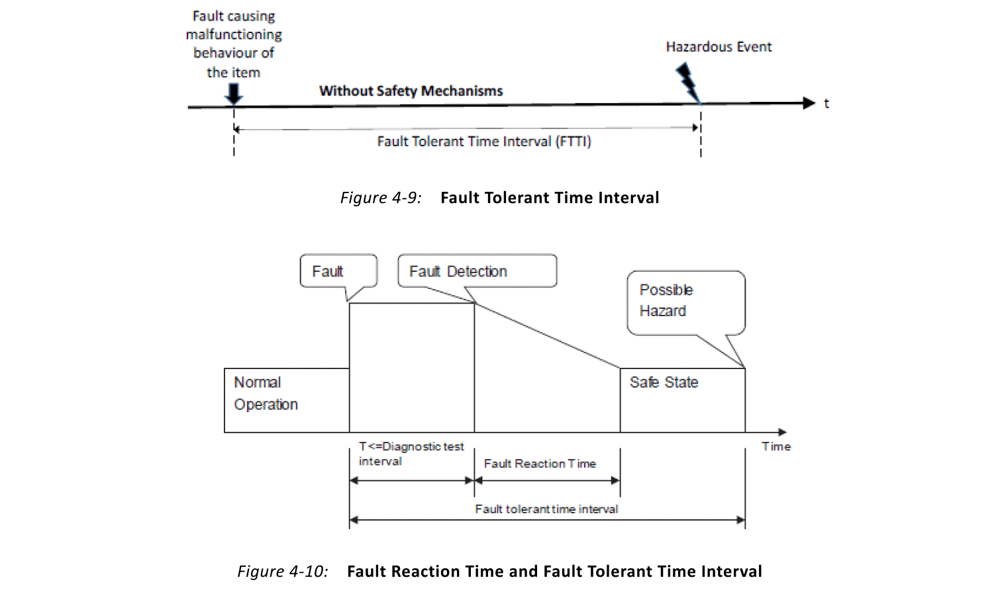

## Latent Faults and Multiple Point Faults Detection Interval
根据ISO-26262定义，潜在故障是多点故障，其存在不是由安全机制检测到的，也不是在多点故障检测间隔内由驾驶员/用户察觉的。后者是检测多点故障的时间跨度，它们可以显着地导致几个独立故障组合导致违反安全目标的概率。多点故障检测间隔时间应≤10小时。

> **注意**：该值被认为适用于汽车应用。基于当前估计，MPFDI≤10的值将对剩余FIT速率（即，PMHF度量）具有可忽略的影响。如果应用程序需要更高的MPFDI值（例如，用于卡车或工业应用），则将在本文档的未来版本中重新考虑对PMHF的影响。

由于多点故障的检测是在系统启动期间通过LBIST，MBIST和故障注入进行的，因此运行时间不得超过连续10小时。

## Overview of The Safety Mechanisms Implemented in the Zynq UltraScale+ MPSoC
本节概述了Zynq UltraScale + MPSoC中实现的安全机制。LPD详细架构和安全机制如图4-11所示。

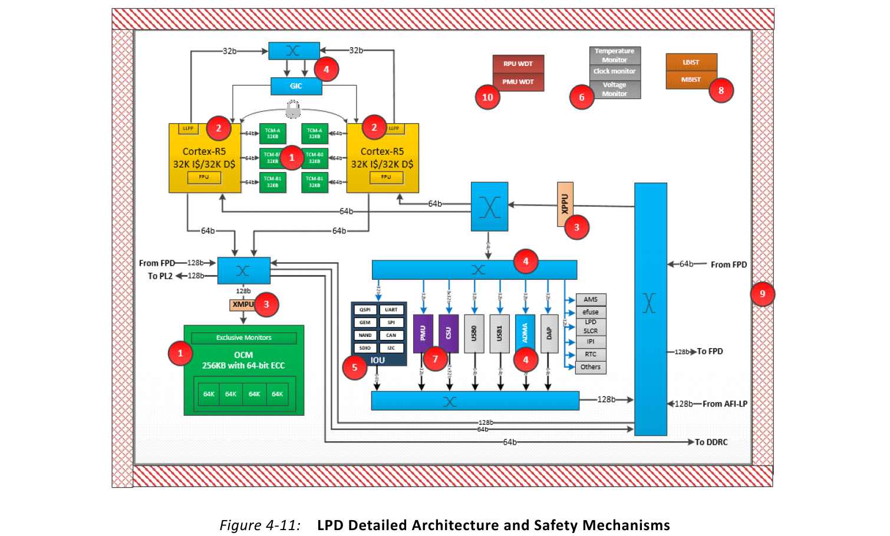

### Single Point Fault Detection Measures
- ECC涵盖OCM，PMU-RAM，CSU-RAM和RPU L1高速缓存和TCM存储器（见图4-11中的“1”）。
- ECC RAM解决了解码错误检测问题。
  - 用于ECC校正和数据的单独RAM  
- （4：1或更大）由ECC保护的存储器单元的交错。每个ECC都有助于检测和纠正它保护的数据字中的单个位错误。Interleaving将物理上相邻的存储器单元分配给不同的字，从而最小化发生不可纠正的错误的可能性，即使应该发生物理上相邻的存储器单元的多个位扰乱。例如，物理上相邻的存储器单元的双位翻转将导致两个不同的字，每个字包含单个位错误。将使用每个字的相应ECC来检测和校正这两个错误。
- 每次启动时CSU BootROM内容的哈希验证（参见图4-11中的“7”）
- 锁步和冗余覆盖R5（见图4-11中的“2”）
  - R5 Lockstep 与物理和时间多样性
  - 关键控制逻辑冗余，如R5锁步检查器
- PMU和CSU实现冗余（见图4-11中的“7”）
  - TMR（三重模块冗余）处理器内核，具有物理多样性
  - 三重冗余触发器，用于关键控制位，如安全状态
- XMPU和XPPU保护存储空间（见图4-11中的“3”）
- 看门狗定时器
  - LPD和FPD看门狗
  - PMU/RPU LPD看门狗定时器（见图4中的“10”）11）
- 软件测试库
  - 有关详细信息，请参阅Zynq UltraScale + MPSoC软件安全用户指南（UG1220）
- 端到端软件协议（参见图4-11中的“4”和“5”）
  - AXI互连，IOU和ADMA操作覆盖

### Common Cause Failure Measures
- 系统监控（参见图4-11中的“6”）
  - 电压监测
  - 温度监测
  - 时钟频率监测
- 错误管理（参见图4-11中的“7”）
  - 在PMU内处理和实施错误管理
  - 错误作为中断发出信号并复制到PL
  - ERROR_STATUS_1和ERROR_STATUS_2寄存器中捕获的所有硬件和软件错误对PMU，RPU，APU和PL都是可见的
- 监控PMU激活CCF（常见原因故障）
  - MBIST，LBIST，SCAN，复位，功率控制（见图4-11中的“7”和“8”）
- 挂起保护
  - 部分重置时清除未完成的交易
- Meta-stability 错误
  - PS在选定的时钟crossing中使用冗余flip-fops
- 老化错误
  - Large on-chip variation（OCV）余量可解释老化效应
- 机械错误
  - 包装质量经过高度测试
### Latent Fault Measures
- 所有检查逻辑（如XMPU，锁步和ECC检查器）在启动时由LBIST检查（参见图4-11中的“8”）
- 所有LPD存储器都可以在启动期间以MBIST的全速进行测试
  - 大多数存储器（不包括PMU） 和CSU程序RAM）可在执行期间按需测试
- TCM，OCM，PMU RAM，R5 Lockstep，PMU，XMPU，XPPU，时钟，电压和温度的功能和状态可在整个运行模式下定期测试和评估。
  - 有关详细信息，请参阅Zynq UltraScale + MPSoC软件安全用户指南（UG1220）

### Isolation Measures
（见图4-11中的“9”。）
- LPD支持与系统其余部分隔离
- 灵活的重置管理
  - 允许使用处理器进行冗余处理
  - 重置管理在PMU中实施
  - LPD，FPD，PL和PS-Only复位
- 独立电源域
  - LPD，FPD和PL
  - PL主接口上的内置AXI超时

### Additional Measures
non-LPD Zynq UltraScale + MPSoC组件的安全功能是可用于图4-6和图4-7中所示的配置2和3的附加措施，因此在LPD范围之外。

- SEU缓解用于外部存储器
  - DDR接口支持32位和64位字的ECC
    - 双重错误检测
    - 单一纠错
  - ECC支持APU L2，L1-D存储器
  - APU L1-I存储器的奇偶校验支持
  - QOS管理，以防止活锁
    - Master QOS控制
    - PS AXI中的QOS管理
    - PS DDR控制器中的QOS管理
- PL或多APU核心可提供冗余处理
- MBIST在启动过程中可以以完整的处理速度测试所有FPD存储器
- 利用PL实现安全功能
  - 提供HFT通道功能
  - 提供错误记录
  - 如果由于错误而重置PS，则PL可以保持活动状态

### Safety Measures Implemented in Software
某些错误检查需要在软件中实现。有关详细信息，请参阅Zynq UltraScale + MPSoC软件安全用户指南（UG1220）。

## Fault Handling Procedures
当安全机制检测到故障时，必须指示相应的错误状态。Zynq UltraScale+ MPSoC架构使用平台管理单元（PMU）提供内部安全机制的错误指示聚合，PMU包括专用于处理错误的外围逻辑。

**PMU负责捕获设备中的所有错误，将这些错误报告给外部世界，并针对每个错误采取适当的措施**。PMU包含必要的寄存器，逻辑和接口，用于处理这些功能（见图4-12）。

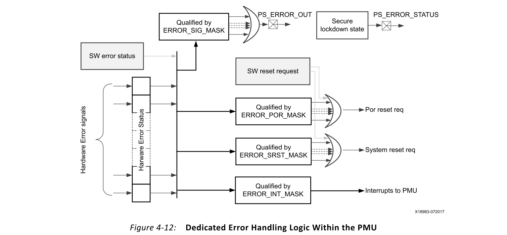

PMU提供一组错误输入信号，将所有系统级硬件错误路由到PMU以便捕获。这些错误记录在PMU内的错误状态寄存器（ERROR_STATUS_1和ERROR_STATUS_2）中，即使在系统复位或内部POR期间也不会被清除。只有在使用外部PS_POR_B引脚或PMU明确地将1写入错误状态寄存器中的每个相应错误状态位时，才会清除错误状态。所有错误都会对PMU产生中断。每个错误都可以屏蔽此中断。

通过使用PMU中错误使能寄存器（ERROR_EN_1和ERROR_EN_2）全局寄存器中的位，可以禁用所有错误传播到错误状态寄存器。请参阅UG1085 [参考文献4]第6章中的PMU错误处理和传播逻辑，其中包括这些寄存器及其复位状态的说明。

PMU还可以捕获四个软件生成的错误。CSU可以记录ROM预启动错误，PMU可以通过设置ERROR_STATUS_2寄存器中的相应位来记录预启动，服务和固件错误。与硬件错误类似，软件生成的错误可以在每个错误中被屏蔽，并且只能通过使用外部PS_POR_B引脚或通过向ERROR_STATUS_2寄存器中的相应位显式写入1来清除。除PMU预启动执行错误（PMU_PB）之外的所有错误都可以向PMU产生中断。

对于错误处理逻辑处理的每个错误，**用户可以决定发生错误时应采取的操作**。可能的情况是以下选项的组合之一：
- 设备上PS_ERROR_OUT信号的断言
- 产生发送给PMU处理器的中断
- 产生系统复位
- 产生上电复位

表4-2显示了路由到错误传播逻辑的错误及其掩码的默认状态。应该认识到，表4-2反映了ERROR_SIG_MASK_1 / 2，ERROR_INT_MASK_1 / 2，ERROR_SRST_MASK_1 / 2和ERROR_POR_MASK_1 / 2寄存器的复位状态，这些寄存器定义了报告给ERROR_STATUS_1 / 2寄存器的错误传播。从其源到ERRROR_STATUS_1 / 2寄存器中包含的大多数状态位的错误传播本身受到相应的特定于错误的屏蔽寄存器的复位状态的影响。

用户应用程序应根据应用安全概念对PMU进行编程并在PMU内配置错误处理逻辑。Xilinx SM tracking tag: [SC_AOU302]

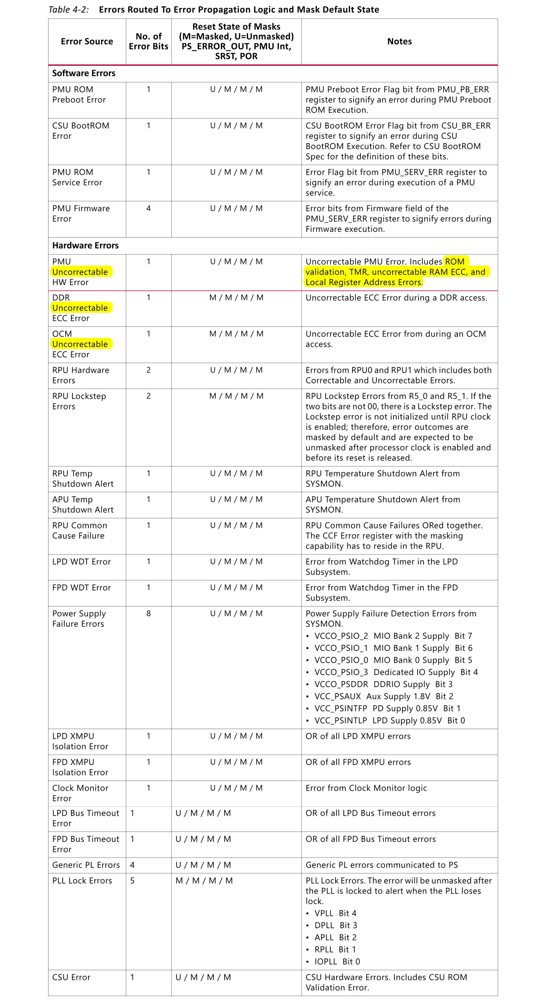

默认情况下，大多数PS_ERROR_OUT通知在外部POR后（即在设备启动期间）未被屏蔽。唯一的例外是系统尚未初始化时可能发生的通知（例如，只要内存未被应用程序初始化，ECC无法纠正的错误就会无限期发生），因此应用程序必须初始化相关逻辑/内存在取消屏蔽错误通知之前。有关详细信息，请参阅UG1085 [参考文献4]第6章中的PMU错误处理和传播逻辑。

# Ch5 Requirements Allocated To the Zynq UltraScale+ MPSoC Application (Assumptions Of Use)
## Overview
本章介绍了Zynq UltraScale + MPSoC（使用假设）上执行的项目应用程序的安全要求，源自Zynq UltraScale + MPSoC安全分析，以及Xilinx实施的软件安全机制（即软件测试库）。Zynq UltraScale + MPSoC FMEDA报告基于这两个类别显示固定配置的分析结果。附录A“外围设备保护安全机制”中进一步讨论了与外设使用和通信相关的注意事项。本章中的章节与表B-1，软件安全机制和使用假设进行了交叉参考，它们确定了建议，永久/瞬态故障的故障覆盖，启动/运行时的活动状态以及STL或AoU识别。

本章关于应用程序的一般假设是项目集成器将实现与应用程序相关的所有使用假设，使用与Zynq UltraScale + MPSoC软件安全用户指南（UG1220）中描述的应用程序相关的STL [参考资料] 8]并启用所有硬件安全机制。因此，must，will和shall这些词语，将在假设的描述中使用，确定项目集成商应该采取的措施，以实现最高水平的安全运行。任何使用假设的不适用，无论是故意选择还是通过错误的设计，都可能导致较低的安全水平。如果实现该项目的安全目标，则可以接受故意不应用某些需求。

关于FMEDA报告的注意事项：本安全手册与名为ZU + _FMEDA_report.xlsx的Microsoft Excel文档一起发布。FMEDA报告包含在Zynq UltraScale +系列最大器件上执行的FMEDA分析结果（Die：ZU19EG，封装：FFVE1924），因此报告了整个器件的永久性和瞬态FIT率的最坏情况，以及低功率域的单点故障度量。

关于温度曲线的注意事项：假设在器件寿命期间TJ = 85°C的平均结温，计算FMEDA报告中报告的永久FIT速率。假设在器件寿命期间平均结温TJ = 80℃，计算FMEDA报告中的瞬态（即单事件效应）FIT率。根据Xilinx的测量结果，当改变温度曲线时，瞬态FIT速率没有显着变化，因此在用户估计不同的温度曲线时不需要瞬态FIT重新计算。如果用户估计TJ的平均寿命更长，则需要重新计算永久FIT率，用户应联系Xilinx客户支持。

## Assumptions of Use from the Safety Concept and  the Safety Analyses（安全概念和安全分析中的使用假设）

### Peripherals, Interconnect, and Communication Channels Protection through CRC Protocols 

#### Description
**在LPD内的外围设备和互连中没有实现错误处理机制**。使用以下功能时，可通过应用**数据封装和端到端保护协议**实现诊断覆盖。
1. Multiplexed Input/Output (MIO)
2. Gigabit Ethernet MAC (GEM)
3. Not-AND Flash Memory Controller (NAND)
4. Secure Digital memory (SD3.0/SDIO/eMMC4.51) controller
5. Quad Serial Peripheral Interface (Quad-SPI) controller
6. Serial Peripheral Interface (SPI) controller
7. Controller Area Network (CAN) controller
8. Inter-Integrated Circuit (I2C) controller
9. Universal Asynchronous Receiver/Transmitter (UART)
10. Low Power Domain Direct Memory Access (LPD-DMA)
11. General Purpose Input/Output (GPIO)
12. LPD interconnect 

驻留在以锁步模式运行的RPU中的应用软件或PMU三冗余处理器应用程序应使用一种方案来**封装数据**，该方案为所传输的数据的性质和数量提供足够的覆盖。应用软件将在写入任何外设或存储器之前封装数据。应用程序软件将在从任何外围设备或内存中读取时**验证封装数据**，并标记安全应用程序应发生的任何错误。例如，可以使用由标题头，固定数量的字节和32位CRC组成的帧。应用软件将在将帧写入任何外设或存储器之前计算CRC。当从任何外设或存储器读取帧时，应用软件将重新计算CRC，并标记安全应用程序应发生的任何CRC错误。

如果数据封装实际上不可实现，则应实施以下机制的适当组合：
- 写入时的数据回读（即数据验证）。
- 使用内部或外部看门狗定时器进行通信超时管理。
- 当使用睡眠模式时，每隔FTTI的时间唤醒LPD外设并测试。
- 当执行存储于OCM的代码时，使用Watchdog观测RPU行为，
- 使用软件测试库（STL）定期验证功能。

#### Implementation 
UG1085中的图1-1 [参考文献4]定义了LPD中的外设和互连。编程步骤是特定于体系结构的，取决于使用哪些功能。附录A“外围设备保护安全机制”中进一步讨论了外围设备的使用。

### RPU Verification of Interrupts
#### Description
作为其**中断处理**例程的一部分，**RPU应在启动任何操作之前验证每个中断的完整性**。实施的验证过程将需要有关系统的正确和预期性质的知识，并利用该知识来识别无效中断。供考虑的计划如下：
- 如果RPU与特定发起者的预期优先级无关，则RPU可以立即拒绝来自特定发起者的中断。这可以识别错误行为而无需进一步通信，从而减少等待时间。
- 在接收到中断时，RPU可以与系统中的中断发起者通信，以独立地验证中断是否是预期的。理想情况下，通信将能够通过使用诸如时间戳或标识之类的唯一信息来隔离和验证每个中断，从而确保每个中断仅被处理一次。
- 如果RPU在收到同一发起者的先前中断或其他源发起的同样中断之后很快又发生，则RPU可能会立即拒绝来自特定发起者的中断。除了识别连续中断条件之外，这还可以识别错误行为而无需进一步通信，从而减少等待时间。
- 如果在来自同一发起者或其他合适参考的先前中断之后发生太长时间，则RPU可能立即拒绝来自特定发起者的中断。如果在特定时间限制到期之前没有从给定发起者收到中断，RPU也可能认为发生了错误。这些方案可以识别错误行为而无需进一步通信，从而减少等待时间。
- 在预期时间内未成功验证或未收到的任何中断将被标记到安全应用程序，而不执行通常与其相关的任何操作。

#### Implementation
- 包含特定于系统已知和预期操作的代码
- 可能使用定时器

### RPU Communication with GIC
#### Description 
实时处理单元（RPU）使用低延迟外设端口（LLPP）与通用中断控制器（GIC）通信。

应用程序软件将验证对GIC的每次**写入**。**每次写入GIC之后，都会读取GIC的读数并对两个值进行比较**。任何不匹配的Case都应标记在安全应用中。

应用程序软件将验证GIC的每次**读取**。**每次从GIC读取的内容将至少重复两次，并将值进行比较**。任何不匹配的Case都应标记在安全应用中。

#### Implementation
有关RPU的信息，请参阅UG1085 [参考文献4]中的第4章，有关GIC，请参阅第11章。UG1085中的图4第4章说明了锁定步骤中使用的R5处理器与GIC之间的LLPP连接。

### RPU AXI Communication
#### Description 
需要AXI ID压缩器模块（IDC）将系统其余部分中使用的较大AXI ID压缩为Cortex R5支持的8位AXI ID。

应用程序软件将验证对IDC的每次写入。**每次写入IDC之后都会读取IDC，并将比较两个值**。任何不匹配的案件都应标记在安全申请中。

应用程序软件将验证来自IDC的每次读取。**来自IDC的每次读取将重复至少两次并且比较值**。任何不匹配的案件都应标记在安全申请中。

#### Implementation
参考UG1085 [参考文献4]第4章中的图4-1，IDC位于XPPU之后的Switch和每个R5处理器之间的64位路径之间。

### LPD-DMA Usage
#### Description 
8通道LPD-DMA也称为ADMA。访问可编程逻辑（PL）时，不应使用流控制接口（FCI）。

先进先出（FIFO）模块也称为公共缓冲器，使用标准存储器单元实现，并且没有硬件逻辑来检测FIFO或缓冲器描述符的存储器单元的任何故障。

在启动DMA写入事务之前，驻留在以锁步模式运行的RPU或PMU三冗余处理器中的应用软件应将**数据封装**到固定大小的帧中，每个帧包含一个标头（或分隔符），一定数量的字节和一个计算CRC-32。在DMA读取事务之后，应用程序软件应验证每个帧的格式并重新计算每个帧的CRC并标记安全应用程序应发生的任何错误。

应用程序软件将包含一个负责配置DMA的LPD-DMA设备驱动程序。在安全任务期间，应**每隔FTTI检查LPD-DMA配置并标记任何错误给安全应用程序**。当使用Scatter Gather DMA模式时，DMA控制器的软件（驱动程序）应实现DMA缓冲区描述符的**CRC计算**，这些描述符存储在存储器中作为描述符的循环队列。控制器的软件应为每个描述符分配一个唯一的序列号。控制器软件负责根据分配的序列号验证DMA描述符的完成顺序。

#### Implementation 
参考UG1085第17章

### MBIST Usage 
#### Description 
在POR之后的引导阶段，PMU会自动启动内存自检（MBIST），并且必须将报告的任何错误标记到安全应用程序。在安全任务开始之前，必须确认MBIST已完成，然后必须根据需要初始化安全应用期间要使用的所有存储器。安全任务期间不得使用MBIST。

#### Implementation
UG1085中的第6章[参考文献4]描述了在POR之后和复位到CSU之前由PMU执行的MBIST。MBIST_DONE寄存器包含32个完成信号，MBIST_GOOD寄存器包含32个状态信号。

### XMPU Configuration
#### Description 
内存保护单元（XMPU）提供内存保护，防止所有Master的意外访问，包括FPD和PL中实现的Master以及LPD中包含的Master。

在启动阶段，与LPD XMPU相关联的寄存器应由FSBL配置为预定义的主从访问，将访问限制为所需的最小值，以便于引导和配置过程。

在引导和配置之后，但在安全任务开始之前，与LPD XMPU相关联的寄存器应根据安全任务期间的操作进行配置。LPD XMPU的配置应该是防止位于PL和/或FPD中的任何AXI主设备（在较低的ASIL级别分类）访问位于LPD内的OCM的任何部分的配置。应使用STL故障注入和标记到安全应用程序的任何错误来检查XMPU的配置和完整性。

在安全任务期间，应检查每个FTTI的XMPU配置以及标记给安全应用程序的任何错误。同样，XMPU检测到并处理的任何权限违规都应标记给安全应用程序。

#### Implementation
XMPU在UG1085 [参考文献4]的第16章的系统保护单元部分中有所描述。UG1085中的图16-1说明了XMPU提供系统级保护的多个点。

### XPPU Configuration
#### Description 
外设保护单元（XPPU）提供LPD外设隔离和处理器间互连（IPI）保护，防止来自所有Masters的非预期访问，包括FPD和PL中实现的以及LPD中包含的设备。

在启动阶段，与XPPU相关的寄存器应被FSBL配置为预定义的主从访问，限制访问所需的最小值，以便于启动和配置过程。

在引导和配置之后，但在安全任务开始之前，与XPPU相关联的寄存器应根据安全任务期间的操作进行配置。应使用STL故障注入和标记到安全应用程序的任何错误来检查XPPU的配置和完整性。

只要有可能，XPPU的配置应该是防止位于PL和/或FPD（分类为较低的ASIL级别）的任何AXI主设备访问位于LPD内的任何外围设备的配置。但是，XPPU可以配置为允许FPD或PL内的AXI主机访问LPD内的外围设备，前提是外围设备仅专用于该主设备（即不与位于LPD内的AXI Master共享）。**专用于位于PL和/或FPD中的AXI Master的任何外设都应归类为较低的ASIL级别**。

在安全任务期间，应检查每个FTTI的XPPU配置以及标记到安全应用程序的任何错误。同样，XPPU检测到并处理的任何权限违规都应标记给安全应用程序。

#### Implementation
在UG1085 [参考文献4]的第14章的系统保护单元部分中描述了XPPU。

UG1085中的图4-1,14-1,33-4,33-5和33-6说明了XPPU提供系统级保护的多个点。

### RPU WDT and PMU WDT Configuration in LPD
#### Description 
**必须使用看门狗来监视RPU和PMU的执行流程**。可以使用外部看门狗（也参见时钟故障检测）和/或可以利用LPD中可用的两个系统看门狗定时器（SWDT）。当使用SWDT时，应配置RPU SWDT并用于检查RPU执行流程，并配置PMU SWDT并用于检查PMU执行流程。

如果RPU无法更新RPU SWDT，则RPU SWDT的超时将根据RPU SWDT模块的配置触发系统重启或RPU重置。PMU SWDT的功能与RPU SWDT相同，也可用于触发系统重启或PMU重置。

在启动期间应启用**逻辑内置自测（LBIST）以验证PMU SWDT的功能完整性**。LBIST标记PMU SWDT硬件逻辑上的任何错误，并将其视为安全应用中的严重错误。

启动期间，**逻辑内置自检（LBIST）未验证RPU SWDT**。建议应用软件在启动过程中验证RPU SWDT的完整性。
#### Implementation
参见UG1085 [参考文献4]中的第12章。

SWDT错误注入STL可用于验证SWDT的完整性。

### LBIST Permanently Enabled
#### Description 
应通过适当设置eFUSE永久启用逻辑内置自测（LBIST）机制。eFUSE设置**应在安全任务开始之前确认**。

如果LBIST检测到故障，则PS_ERROR_STATUS引脚置为有效，PS将无法启动。系统应监控PS_ERROR_STATUS引脚并将故障标记给安全应用程序。

#### Implementation
参见UG1085 [参考文献4]和UG1191（包含在UG643 [参考文献14]中）中的第37章。PS DAP控制器支持PS eFUSE编程。LBIST_EN控制是MISC_USER_CTRL寄存器的bit10。除了读取eFUSE设置外，还可以通过观察启动时间来确认LBIST的激活。频率在142 MHz至220 MHz范围内的内环振荡器（IRO）的输出除以2并提供给LBIST电路。当LBIST使能时，它需要大约736,000个时钟周期来完成所有测试，从而将启动时间增加大约6.7 ms到10.4 ms。适合于定时测量的观察点是POR和与Quad-SPI闪存相关的信号。从POR释放到第一个Quad-SPI活动的时间也取决于IRO的频率，因此应在相关FUSE编程之前和之后进行时间测量。使用建议的观察点，测量的时间比较应清楚地显示启用LBIST后的额外延迟（启用LBIST之前约2毫秒和启用LBIST之后10毫秒）。

### Power Supplies
#### Description 
提供给器件的所有电源轨必须符合Zynq UltraScale + MPSoC数据手册（DS925）[参考文献5]表2中所列的推荐工作条件。安全应用应实施和监控外部电压监控器。

如果LPD和系统监视器运行所需的低功率域（VCC_PSINTLP）在建议的限制范围内，则系统监视器可用于验证外部监视器的测量。
#### Implementation
设备外部。外部监视器可以构成电源控制器的一部分（例如，使用PMBUS）。

### Integrity of the Configuration Registers
#### Description 
应用软件应至少每个FTTI检查一次LPD中所有安全关键配置寄存器的数据完整性，并向安全应用程序标记任何错误。与寄存器覆盖有关的软件测试库（STL）应在启动后立即用于创建安全关键寄存器（XStl_RegCheckInitTop）的黄金副本，然后在安全任务期间检查所有安全关键寄存器（XStl_RegCheckTop）。

#### Implementation
See Register Coverage in Chapter 2 of UG1085 [Ref 8].

### Triple-Timer Counters in LPD
#### Description 
在低功率域（LPD）中有四个三重定时器计数器（TTC）可用作外设。虽然每个TTC包含三个独立的定时器/计数器模块，但应该认识到**TTC不提供三模冗余**（TMR）方案。因此，需要定时器的安全感应应用软件需**采用一对TTC并实现双冗余方案**。

应用软件应使用**两个定时器/计数器模块，每个模块位于不同的TTC中**。应用软件将定期读取和比较两个计数器的输出值，并将任何错误标记到安全应用程序。

在实现双冗余定时器/计数器模块时，必须为它们所在的两个TTC**提供相同的参考时钟源**。

#### Implementation
See Chapter 12 in UG1085 [Ref 4].

### System Monitors
#### Description 
以锁步模式运行的RPU应使用LPD（PS-SYSMON）内的系统监视器来监视与LPD相关的内部电源电压以及与LPD和FPD相关的管芯温度。PS-SYSMON应配置为使通道序列器能够执行连续自主采样，限制检查和中断生成。应定义采样率，采样平均值和要排序的通道的配置，以使PS-SYSMON内状态寄存器的更新时间不超过FTTI的三分之一。与每个LPD电源电压通道相对应的上限和下限电压阈值应定义为在器件的推荐工作条件下或之内。与LPD和FPD温度通道相对应的过温（OT）阈值应设置为或低于器件的操作限值，常规温度阈值应设置为OT阈值或低于OT阈值。

当PS-SYSMON产生与任何LPD电源电压或任何LPD或FPD温度通道超过阈值相关的警报时，IMR_0和IMR_1寄存器定义的中断屏蔽应配置为向RPU产生AMS中断88。在接收到AMS中断时，RPU应首先读取ISR_0和ISR_1寄存器以确定源，然后读取与源相对应的状态寄存器以建立其当前值。应通知安全应用程序任何超出限制的参数及其当前值。如果LPD或FPD温度超过过热（OT）限制，安全应用应关闭设备的所有电源，并留出足够的时间让设备冷却，并使所有电源轨在尝试之前降至0.1v以下重启。如果LPD或FPD温度超过常规温度阈值，则可以启动热管理和/或监控方案。如果超过任何LPD电压限值，则应调整相应的电源以保持在设备的推荐条件下运行，或者应关闭设备的所有电源。

提供PS-SYSMON是为了增强整体系统完整性，但不包含任何硬件逻辑来检测块本身内的故障。驻留在以锁步模式运行的RPU中的应用软件或PMU三冗余处理器应在启动阶段和安全任务期间的每个FTTI验证PS-SYSMON的运行。

由于在使用PS-SYSMON外设时无法实现数据封装方案，因此应回读并验证写入配置寄存器的值。在AMS中断之后，RPU将读取相应的状态寄存器，并独立验证自治通道序列发生器用于产生报警和中断的值。

在启动阶段，应确认PS-SYSMON内模拟 - 数字转换器的完整性。应从PS-SYSMON内的相应状态寄存器中读取至少一个可以独立验证在容差范围内的参数。合适的候选者是固定参考电压或LPD电源，其电平已知使用独立的外部电源看门狗。连续自主采样电路的配置和操作应通过读取每个有序通道的相应状态寄存器并确认每个参数的值在其预期限值内来进行验证。

在安全任务期间，**RPU或PMU**应在每个FTTI期间读取与LPD和FPD温度通道相对应的状态寄存器三次。三次读取操作中的每一次之间的间隔不应小于PS-SYSMON中状态寄存器的更新时间。RPU或PMU应独立验证LPD和FPD温度值是否高于器件的操作下限且低于过温（OT）阈值。使用从LPD温度状态寄存器读取的完整16位值，应比较每组三个值，以确定它们是否相同或是否存在任何变化。同样，使用从FPD温度状态寄存器读取的完整16位值，应比较每组三个值，确定它们是否相同或是否存在任何变化。如果LPD和/或FPD温度超出操作限制或任何三个温度值相同，则应通知安全应用，安全应用应关闭设备的所有电源，并为设备留出足够的时间冷却，并在尝试重新启动之前使所有电源轨都降至0.1v以下。

位于可编程逻辑域（PL-SYSMON）内的系统监视器能够监视与PL相关的电源电压和温度以及多达17个外部模拟输入。PL-SYSMON既可以作为处理系统（PS）的外设，也可以作为可编程逻辑（PL）中实现的硬件设计的核心。要使PS或PL能够访问PL-SYSMON，需要满足各种条件。当条件允许PS或PL在安全任务期间访问PL-SYSMON时，应监控PL温度通道。与温度通道对应的状态寄存器应按通道定序器超过PL-SYSMON状态寄存器更新时间的间隔读取，每秒不少于一次。应验证每个温度值在设备的下限和上限之间。使用从温度状态寄存器读取的完整16位值，应比较每组三个值，以确定它们是否相同或是否存在任何变化。如果PL温度超出设备的运行极限或任何一组三个温度值相同，则应通知安全应用，安全应用应关闭设备的所有电源，并留出足够的时间让设备冷却并且在尝试重新启动之前所有电源轨都要低于0.1v。

#### Implementation
在RPU尝试访问PS-SYSMON之前，它必须检查MON_STATUS（AMS）寄存器中的jtag_locked位，以确认是否正在向用于访问PS-SYSMON的APB接口提供有效时钟。必须设置配置寄存器以定义采样速率，要排序的通道（必须包括所有LPD电源电压通道，以及LPD和FPD温度）和样本平均量。这些设置的组合将决定状态寄存器的更新速率，并且需要小于FTTI / 3。还必须启用每个有序通道的相应报警和相关中断。

PL（PL-SYSMON）中的系统监视器可以由PS中的处理器访问，也可以由PL中的设计访问。如果PL配置了包含SYSMONE4原语的设计，则只有PL设计可以访问PL-SYSMON，并且需要将与PL-SYSMON相关的安全要求作为PL设计的一部分来实现。如果未使用不包含SYSMONE4原语的设计配置或配置PL，则PS中的处理器有可能将PL-SYSMON用作外设。如果RPU用于通过APB接口控制和监视PL-SYSMON，则必须首先检查MON_STATUS（AMS）寄存器中的jtag_locked位，以确认是否正在向APB接口提供有效时钟并检查可访问位。PL_SYSMON_CONTROL_STATUS（AMS）寄存器用于确认所需的电源是否处于活动状态，PCAP隔离是否处于非活动状态，以及PL未配置包含SYSMONE4原语的设计。此外，为避免非确定性行为，必须避免与JTAG和I2C / PMBus与PL-SYSMON通信的任何冲突。在PL配置之前，JTAG和I2C / PMBus接口都可以使用，因此如果不能使用这些外部接口，RPU应该只尝试访问PL-SYSMON。使用set_property BITSTREAM.GENERAL.JTAG_SYSMON DISABLE [current_design]选项通过位流配置PL后，可以保证通过APB接口专门访问PL-SYSMON。PL的配置始终禁用I2C / PMBus接口。无论使用哪个接口访问PL-SYSMON中的控制和状态寄存器，其报警信号都通过PCAP永久连接到PS，因此只要PCAP隔离无效，PS就可以观察到PL-SYSMON报警。读取ISR_0（AMS）并且这些报警可能有助于产生中断。

每个系统监视器中的模数转换器生成16位采样。指定的10位分辨率与每个16位样本的10个最高有效位相关。每个样本的6个最低有效位可用于最小化量化效应或通过平均来提高分辨率。无论采用何种平均值，状态寄存器都保持16位值。在分析三个值温度值的集合时，必须比较所有16位。

LPD，FPD和PL电源电压的测量也可用于控制电源。微调电源电压有助于防止超出限制并在较低的有效电压下操作器件，从而降低功耗。记录系统监视器捕获的最小值和最大值可能会显示由于环境条件和/或老化导致的电源电压随时间的漂移，这些可用于抢占可在适当的产品维修间隔主动解决的问题。

每个温度传感器与一对上限和下限（阈值）相关联。常规限制和相关警报适合于实现维持在较低温度下操作的设备冷却方案（例如冷却风扇和/或负载减少）。过热（OT）限制和相关警报通常设置为或接近设备的最大推荐工作温度。OT警报将用于在错误操作或可能发生永久性损坏之前触发设备的立即但受控制的关闭。

请参阅UG1085 [参考4]和UltraScale架构系统监视器用户指南（UG580）[参考6]中的系统监视器章节。
### Quad-SPI for Boot and Configuration
#### Description 
Quad串行外设接口（quad-SPI）启动模式应用于从24或32位Quad-SPI闪存启动器件。quad-SPI 32位引导模式应用于大于16 MB的闪存和任何支持32位寻址的Quad-SPI闪存。

#### Implementation
See Chapter 9 in UG1085 [Ref 4].

### Quad-SPI Controller Protection
#### Description 
用作引导设备的Quad-SPI闪存也可用于介质的非易失性存储。使用具有安全引导模式的quad-SPI，SHA-3算法生成一个384位摘要，用于验证第一阶段引导加载程序（FSBL）映像。

在使用quad-SPI的所有其他情况下，硬件中没有实现错误处理机制。驻留在以锁步模式运行的RPU中的应用软件或PMU三冗余处理器应使用一种方案来封装数据，该方案为存储的数据的性质和数量提供足够的覆盖。应用程序软件将在写入内存之前封装数据。应用程序软件将在从内存中读取时验证封装数据，并标记安全应用程序应发生的任何错误。例如，可以使用由标题，固定数量的字节和32位CRC组成的帧。应用软件将在将帧写入存储器之前计算CRC。当从存储器读取帧时，应用软件将重新计算CRC，并标记安全应用程序应发生的任何CRC错误。

如果使用Quad-SPI DMA将数据从Quad-SPI闪存传输到DDR存储器，应用软件将包含一个负责配置Quad-SPI DMA的设备驱动程序，并将定期确认配置。有必要使用需要由设备驱动程序计算的描述符CRC来保护quad-SPI DMA缓冲区描述符。可以对缓冲区描述符执行CRC-16。应为每个缓冲区描述符分配序列号。在处理缓冲区描述符时，设备驱动程序应根据序列号验证缓冲区描述符的完成顺序。
#### Implementation
See Chapters 9, 10, and 22 in UG1085 [Ref 4].

### Non-safety Related Modules and Features in LPD
#### Description 
必须禁用LPD中从未使用的任何功能，并且每个FTTI都应检查禁用这些未使用功能的配置，并将任何错误标记为安全应用程序。所有禁用的模块都可以归类为非安全相关模块。

LPD中包含的以下模块可用于初始化，服务和支持应用程序，但在应用程序主动执行安全任务期间不得使用：
- AXI trace monitor (ATM) 
- AXI performance monitor (APM)
- Battery backed random access memory (BBRAM) 
- Real time clock (RTC) 
- JTAG
- ARM debug access port (ARM DAP)
- Crypto interface block (CIB)

应检查每个FTTI以及标记到安全应用程序的任何错误，以禁用所有这些功能的配置。

#### Implementation
请参阅UG1085 [参考文献4]中的第6,10和37章以及UG1220 [参考文献8]第2章中的寄存器覆盖范围。

### Non-safety Interfaces 
#### Description 
由于它们依赖于全功率域（FPD）和高速缓存一致性互连（CCI），因此在应用程序主动执行安全任务期间，LPD不得使用以下接口：
- 高性能PL主AXI接口（HPC）
- 高性能AXI接口（AXI-HP）
- 高性能PS主AXI接口（HPM）

禁用LPD使用这些接口的配置应在安全任务开始之前设置，并检查每个FTTI是否有任何标记到安全应用程序的错误。

LPD可以使用这些接口在安全任务之前初始化，服务和支持应用程序。

> 注意：此使用假设特别与LPD使用这些接口有关。FPD（在较低的ASIL级别分类）可以随时使用这些接口。

#### Implementation
参见UG1085 [参考文献4]中的第13章和UG1220 [参考文献8]第2章中的寄存器覆盖范围。

### Dynamic Power Management in LPD
#### Description 
**LPD不应使用动态电源管理。RPU应在运行模式下运行**，PMU将始终保持上电模式。在启动期间，外设将根据需要进行配置，并继续以分配给它们的功耗模式运行。应检查每个FTTI的此配置以及标记到安全应用程序的任何错误。
#### Implementation
有关RPU的信息，请参阅UG1085 [参考文献4]第4章中的电源管理模式表，以及PMU的UG1085中的第6章。

### Dynamic Power Management in FPD and PL
#### Description 
全部功率域（FPD）或可编程逻辑域（PL）的部分或全部功率管理必须仅以与维持项目的总体安全目标兼容的方式执行。

可以使用任何公认的技术来控制功耗，包括调整时钟频率，断言复位，启用/禁用功能以及关闭单个功能或整个域。无论技术如何，调用电源管理的主设备都应位于LPD（即PMU或RPU）内。同一Master必须监控电源状态之间的转换，并验证该过程是否已成功完成。此外，同一Master应验证所有其他域和功能的电源状态是否保持不变。任何错误都应标记在安全应用程序中。

#### Implementation
通过写入REQ_PWRDWN_TRIG和REQ_PWRUP_TRIG寄存器，向PMU发出断电和上电请求。通过读取REQ_PWRDWN_STATUS和REQ_PWRUP_STATUS寄存器可以验证提供给PMU的中断信号的状态。包含1的状态寄存器的字段表示请求处于挂起状态。一旦请求被服务，相应的字段将包含0.还可以通过及时将1写入状态寄存器的相应字段来取消请求。PWR_STATE寄存器的字段确认每个岛的断电（0）或上电（1）状态。

**在操作期间简单控制功能的电源管理技术将涉及写入相关寄存器，然后验证这些设置及其影响**。应用程序应注意确保故意修改控制寄存器的内容以用于电源管理目的不会混淆对其进行完整性检查。同样，应调整时钟监视器以验证对时钟频率的故意调整或区域断电的影响。

### DAP to be Turned Off
#### Description 
LPD中的调试访问端口（DAP）不得随时使用，必须关闭。每个FTTI都应检查禁用DAP的配置，并将任何错误标记到安全应用程序。

#### Implementation
CSU的JTAG_DAP_CFG寄存器中的“ssss_rpu_dbgen”位定义输入到RPU的DBGEN信号的状态。当此信号为低时，无论RPU的DBGDSCR寄存器中的MDBGen和HDBGen位的值如何，都将禁用调试。

CSU的JTAG_DAP_CFG寄存器中的“ssss_rpu_niden”位定义输入到RPU的NIDEN信号的状态。可以将此信号驱动为高电平，以便使用RPU_0_ISR和RPU_1_ISR寄存器监视RPU存储器ECC错误。NIDEN信号仅启用处理器的非侵入式调试功能，并且不会将处理器置于调试模式。

### USB 
#### Description 
通用串行总线（USB）控制器的默认配置应为未使用和关闭的配置（参见下面的注释）。应在每个FTTI检查禁用USB的配置，并将任何错误标记给安全应用程序。

注意：可以使用USB，前提是XPPU配置为将USB控制器专用于FPD或PL内的AXI Master（分类为较低的ASIL级别），并且不用于传递任何安全相关信息。将认识到USB 3.0还需要位于FPD内的PS-GTR模块。
#### Implementation
处理器配置向导（PCW）可用于生成禁用USB的配置文件（psu_init）。

### PMU Processor Usage
#### Description 
平台管理单元（PMU）是三冗余处理器。该处理器仅控制整个设备内的资源上电，复位和监控。PMU的使用可以包括捕获，处理和管理路由到它的错误信号以及专用PS_ERROR_OUT引脚的断言，以供外部安全应用程序观察。

**在任何时候都不能使用PMU直接实现构成安全应用的任何功能**，并且PMU不应处理源自LPD之外的中断。此外，AXI Masters，包括位于LPD内的AXI Master，不应具有对PMU的写访问权。

#### Implementation
参见UG1085 [参考文献4]中的第6章。PMU将需要监视或轮询FPD / PL以观察断电请求。

### Clock Faults Detection
#### Description 
必须确认低功率域（LPD）中使用的所有时钟的完整性。

LPD中提供了8个时钟监视器（CLKMON）。可以分配时钟监视器来监视LPD内的八个时钟中的任何一个，并评估所选时钟的相对于选择的两个参考时钟的频率。如果受监视时钟的频率偏离用户定义的范围，则每个时钟监视器都可以配置为产生中断。时钟监视器必须用于监视LPD中的每个使用时钟，并且任何故障都应标记给安全应用程序。在安全任务开始之前和安全任务期间的每个FTTI，应验证时钟监视器检测时钟故障和产生中断的能力。

PMU由iro_clk驱动，iro_clk由LPD内的振荡器产生。必须使用ps_ref_clk作为参考的时钟监视器来验证ro_clk是否在146 MHz至220 MHz的频率范围内。分配给该时钟的时钟监视器产生的中断必须由RPU处理，RPU必须向安全应用程序标记任何故障。

时钟监视器不监视占空比，抖动或时钟质量。此外，如果lpd_lsbus_clk（源自ps_ref_clk）处于活动状态，则时钟监视器才能够报告故障。因此，时钟监视器不能用于检测ps_ref_clk或lpd_lsbus_clk的完全故障。为了检测这些时钟的主要故障，必须提供位于低功率域（LPD）之外的独立看门狗，以监视LPD内的RPU和PMU的操作。由RPU和PMU执行的代码应生成具有可识别的非静态签名的心跳，每个FTTI重复至少两次。如果在可接受的时间窗口内未能观察到有效的心跳，则外部看门狗应观察心跳并向安全应用程序标记错误。
#### Implementation
独立看门狗可以在PL中实现，也可以在Zynq UltraScale + MPSoC器件外部实现。实现该方案的目的是检测LPD内的时钟的主要故障，包括提供给设备的ps_ref_clock的完全故障。

时钟监视器在UG1085 [参考文献4]的第37章中描述。时钟监视器使安全应用程序能够监视和检查每个要验证的时钟的频率。可以通过临时修改上和/或下频率阈值来验证每个时钟监视器和相关中断的功能，使得被监视的其他有效时钟不再落在限定的频率限制内。SM_STL_CLK软件测试库可用于使用此方法注入错误。

### RPU CPU Configuration
#### Description 
实时处理单元（RPU）包含一对Cortex-R5处理器，必须配置为在锁定模式下运行。这也称为锁步操作或安全模式。在RPU的启动阶段，应通过执行合适的代码来启用锁定模式。

#### Implementation
请参阅UG1085第6章中的Cortex-R5处理器中的锁步序列[参考4]

## Software Safety Mechanisms (Software Test Libraries)
表5-1列出了Xilinx发布的软件测试库。第一列列出了源自Zynq UltraScale + MPSoC FMEDA的STL标签。这意味着对于安全性分析，假设每个FTTI由用户应用程序提供并启动许多软件测试库。第二列标识了Xilinx实际开发和交付的STL。因此，该表给出了STL实现的安全性分析假设与实际STL软件之间的对应关系。

用户应忽略第一列中的标记，仅用于Xilinx内部可跟踪性。Zynq UltraScale + MPSoC的软件安全安全用户指南（UG1220）[参考文献8]中给出了STL软件的说明以及用户应用程序应如何集成它们。

> 注意：根据Xilinx的分析，每个STL可以被分类为强烈推荐，推荐或可选。此分类可在附录B中找到，软件安全机制列表和使用假设。

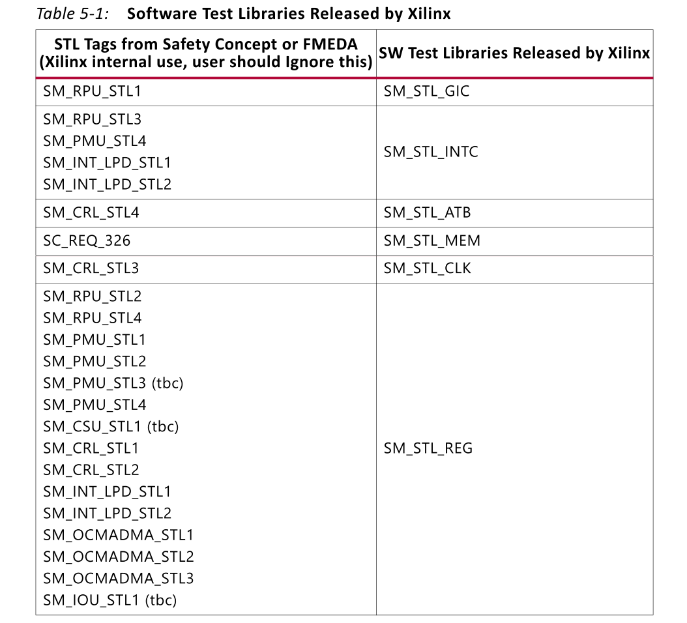

### Assumptions on STL Integration by the Application
PMU专为Zynq UltraScale + MPSoC服务而设计，因此建议尽可能使用PMU来运行STL。这反过来将释放更多RPU的处理能力来运行用户的应用程序，这与Zynq UltraScale + MPSoC的一般使用假设一致。Xilinx SM tracking tag：[SC_AOU300]

如果两个系统启动之间的经过时间大于10小时，则假定用户应用程序将在任务期间连续执行存储器清理例程SM_STL_MEM。Xilinx SM tracking tags: [SC_AOU301]

## Hardware Safety Mechanisms
本节介绍低功耗域（LPD）中的硬件机制，这些机制专门用于通过故障缓解和故障覆盖来增强安全性。硬件安全机制要么是永久有效的，要么必须由应用程序使用指示的控制寄存器启用，以实现最高级别的安全操作。

某些硬件安全机制可自动缓解故障，而其他硬件安全机制主要是活动监视器，其检测和报告错误可增强故障覆盖率。为了实现最高级别的安全操作，应使用所有指示的故障报告方案来标记安全应用程序的任何错误。**如果达到了项目的总体安全目标，则暂时或永久忽略某些故障报告可能是可接受的**。例如，当启用ECC保护以在使用之前校正读取值时，忽略与检测到对存储器内容的单个位扰乱相关联的报告可能被认为是可接受的。

> 注：Xilinx使用本节中指出的Xilinx SM跟踪标签来维护需求可追溯性。用户应忽略它们。

### ECC Protection of Memories
### Triple Modular Redundancy (TMR) Circuitry
使用TMR方法的电路的实现极大地增加了系统在软或硬件故障的情况下继续正常操作的能力。基本前提是，如果三个中的一个模块以某种方式出现故障，观察三个模块输出的Voter将允许系统继续以双模块冗余（DMR）模式运行，仅使用生成匹配结果对的模块。不匹配的结果表明发生故障的模块有可能在软错误之后启动尝试完全恢复到TMR模式的过程。只有在指示两个或三个模块发生故障的所有模块的不匹配结果时，才会停止正常操作。

LPD内的PMU处理器和PMU相关控制寄存器使用具有物理多样性和分离的TMR来实现。TMR技术通常使PMU能够继续正常运行，但是在MB_FAULT_STATUS寄存器中报告Voter对模块故障的检测。三个N_LSFail和三个R_LSFail状态位指示处理器对（模块）之间的锁步不匹配。例如，如果模块3出现故障，则模块1和2将继续匹配，但模块1和3以及模块2和3之间将断言锁步错误状态。还有三个N_FFail和三个R_FFail状态位，用于指示与每个处理器（模块）相关联的状态机之间的锁步不匹配，报告的方式相同。检查MB_FAULT_STATUS将显示PMU的TMR状态。

LPD内的CSU处理器和CSU相关控制寄存器使用具有物理多样性和分离的TMR来实现。TMR技术通常使CSU能够继续正常运行，但是在CSU_FT_STATUS寄存器中报告Voter对模块故障的检测。N_MISMATCH_12_B，N_MISMATCH_13_B和N_MISMATCH_23_B状态位以及R_MISMATCH_12_B，R_MISMATCH_13_B和R_MISMATCH_23_B状态位指示处理器对（模块）之间的锁步不匹配。N_MISMATCH_12_A，N_MISMATCH_13_A和N_MISMATCH_23_A状态位以及与每个处理器（模块）相关联的状态机之间的R_MISMATCH_12_A，R_MISMATCH_13_A和R_MISMATCH_23_A状态位锁步不匹配。检查CSU_FT_STATUS将显示CSU的TMR状态。

与时钟的产生和对各种元件的复位相关的电路对于操作是至关重要的，并且已经使用具有物理多样性和分离的TMR来实现。时钟和复位逻辑（CRL）作为LBIST的一部分进行测试，检测到任何导致'PS_ERROR_STATUS'引脚置位的故障，PS将无法启动。

### Dual Modular Redundancy (DMR) Circuitry
使用DMR方法的电路的实现主要用于增强故障的检测并因此改善故障覆盖。基本前提是，如果两个模块的输出不匹配，则一个或两个模块以某种方式失败。但是，在某些情况下，DMR可用于增强可靠性和可用性。

PMU使用TMR实现，这显着提高了PMU在存在模块故障的情况下继续运行的能力。然而，TMR依赖于Voter，比较三个模块的输出，因此DMR Voter已经实现。处理器（模块）输出有DMR Voter，DMRVoter用于与每个处理器相关的状态机的输出。在每种情况下，这对Voter被称为名义（N）Voter和Redundant（R）VOter。首先在MB_FAULT_STATUS寄存器中报告检测到Voter不匹配的情况。状态位N_FFail位8,11,12,13和14或R_FFail位8,11,12,13和14中的任何一个的断言将指示故障状况。这被视为致命错误，导致自动断言重置PMU。ERROR_EN_2和ERROR_SIG_MASK_2寄存器的默认设置将通过ERROR_STATUS_2寄存器的PMU_UC位进一步传播报告，并置位PS_ERROR_OUT引脚。

CSU使用TMR实现，这显着提高了CSU在存在模块故障的情况下继续运行的能力。然而，TMR依赖于Voter，比较三个模块的输出，因此DMR Voter已经实施。处理器（模块）输出有DMR Voter，DMR Voter用于与每个处理器相关的状态机的输出。在每种情况下，这对Voter被称为名义（N）Voter和Redundant（R）Voter。首先在CSU_FT_STATUS寄存器中报告检测到Voter不匹配的情况。状态位N_FT_ST_MISMATCH，N_COMP_ERR_12，N_COMP_ERR_13，N_COMP_ERR_23，N_VOTER_ERROR和状态位R_FT_ST_MISMATCH，R_COMP_ERR_12，R_COMP_ERR_13，R_COMP_ERR_23，R_VOTER_ERROR中的任何一个的断言将指示故障状况。这被视为致命错误，导致自动断言并释放复位到CSU。该CSU重启将减轻临时软错误，但是会导致外部监视器可能观察到的总执行时间增加。CSU的任何致命错误（包括不可纠正的ECC错误）也将由CSU_ISR寄存器中的TMR_FATAL位以及CSU_RAM_ECC_ERROR位报告的可纠正错误记录。CSU_IMR寄存器可以配置为向RPU和APU生成中断117，以在操作期间监视这些状态位。

当形成RPU的两个R5处理器配置为以锁步模式操作时，它成为具有Voter的DMR处理器实现。该Voter也是DMR实现，产生两个锁步（LS）状态位。如果两个Voter状态位都被断言，则两个Voter都检测到一个或两个处理器的故障。通过状态位的差异来指示Voter的失败（即，仅断言一个状态位）。可以将ERROR_EN_1寄存器配置为将两位RPU_LS状态位传播到ERROR_STATUS_1寄存器。可以将ERROR_INT_MASK_1，ERROR_SIG_MASK_1，ERROR_POR_MASK_1和ERROR_SRST_MASK_1配置为根据需要进一步传播或处理错误。

eFUSE是一次性可编程单元，在编程时，应根据定义永久地导致静态逻辑状态。为了提高可靠性，每个一次性可编程单元都是使用eFUSE DMR Pair物理实现的。只有在标称和冗余保险丝都出现故障时才会发生实际故障。两个eFUSE的失败将反映在与失败的eFUSE相关联的功能的意外行为上（例如，由于错误的键值导致的安全性问题）。

逻辑内置自检（LBIST）用于在启动时检测潜在故障。LBIST由eFUSE启用，只应在启动阶段发生。为了防止在操作期间无意中激活LBIST，使用DMR实现启用测试的电路。只有当标称和冗余电路都同意时才会调用该测试。

### Clock Monitors
LPD中提供了8个时钟监视器（CLKMON），应配置为验证各种时钟的频率。每个CLKMON可配置为通过设置相应CHKRx_CTRL寄存器中的clka_mux_ctrl位来选择要监视的8个时钟之一（其中“x”是CLKMON在0到7范围内的编号）。当与CHKRx_CLKB_CNT中定义的值相关的时间内的CLKMON测量值落在CHKRx_CLKA_LOWER和CHKRx_CLKA_UPPER寄存器中定义的下限和上限阈值内时，所选时钟将有效。

应监视以增加故障覆盖范围的时钟如下。
- cpu_r5_clk  -  RPU使用的时钟
- ocm_r5_clk  -  OCM使用的时钟
- lpd_switch_clk  - 互连使用的时钟
- lpd_lsbus_clk。- 低速总线互连使用的时钟
- pmu_clk  -  PMU使用的时钟。
- csu_pll_clk。-  CSU使用的时钟

注意，PMU和CSU都由内部环形振荡器（IRO）计时，其具有相对大的潜在频率范围以用于有效操作（例如，146MHz至220MHz）。虽然使用相同的时钟，但CLKMON正在对物理上位于PMU和CSU所占区域内的不同节点的时钟进行采样，以进行测量，从而分别验证与源的每个连接。

当CLKMON检测到时钟超出定义的范围或者CLKMON测量导致内部计数器溢出时，CLKMON_STATUS寄存器中包含的相应状态位将被置位。可以定期检查CLKMON_STATUS寄存器，或者可以将CLKMON_MASK和ERROR_EN_1寄存器配置为将CLK_MON错误传播到ERROR_STATUS_1寄存器。可以将ERROR_INT_MASK_1，ERROR_SIG_MASK_1，ERROR_POR_MASK_1和ERROR_SRST_MASK_1配置为根据需要进一步传播或处理错误。CLKMON_MASK寄存器也可以配置为RPU和APU产生中断60。

### Watchdog Timers
低功率域（LPD）中提供了多个看门狗定时器，应该用于检测系统故障并从中恢复。在正常操作中，CPU会在定时器倒计时到零之前定期重新启动看门狗。如果定时器确实达到零且看门狗使能，则根据看门狗定时器及其配置，产生系统复位或中断或断言外部引脚或SLVERR信号。

PMUCSU看门狗在上电复位后自动使能，并从最大（24位）值开始递减计数。此监视程序的目的是防止系统锁定，即使软件在引导阶段陷入死锁。超时将导致POR，EMIOWDTRSTO MIO引脚和中断85的置位。

低功耗域系统看门狗定时器（LPD SWDT）由两个三重定时器计数器（TTC）组成。超时行为由XWDTPS_ZMR_OFFSET寄存器定义，其中XWDTPS_ZMR_WDEN_MASK是看门狗使能，然后XWDTPS_ZMR_IRQEN_MASK和XWDTPS_ZMR_RSTEN_MASK位定义产生中断或复位。ERROR_EN_1寄存器可配置为通过ERROR_STATUS_1寄存器中的LPD SWDT位传播超时。可以将ERROR_INT_MASK_1，ERROR_SIG_MASK_1，ERROR_POR_MASK_1和ERROR_SRST_MASK_1配置为根据需要进一步传播或处理错误。LPD_SWDT是RPU和APU的中断84。

形成RPU的Cortex-R5 MPCore具有专用系统看门狗定时器（RPU SWDT）和双三重定时器计数器。该**看门狗旨在检测导致程序流错误的系统和随机故障**

AXI超时模块（ATB）充当看门狗定时器，用于通过Switch和外设接口检测挂起通信的互连。ATB_RESP_EN寄存器用于启用ATB响应。ATB Err LPD是RPU和APU的中断84。ATB_RESP_TYPE寄存器用于定义是否生成本地SLVERR。

OCM有自己的看门狗定时器。forceeventforerrintsts 与 ForceEventforAUTOCMDErrorStatus寄存器用于启用中断。

### Memory Built-In Self Test (MBIST)
内存自检（MBIST）由PMU在POR之后和复位到CSU之前**自动执行**。MBIST实际上由处理系统（PS）中的一组MBIST控制器组成。在它们之间，这些控制器测试所有存在潜在故障的存储器。覆盖范围包括外围设备和RPU以及OCM中的存储器。每个MBIST控制器测试的完成由MBIST_DONE寄存器中包含的32个状态位之一表示，每个测试的结果由MBIST_GOOD寄存器中包含的相应32个状态位报告。

### Logic Built-In Self Test (LBIST)
逻辑内置自检（LBIST）用于在启动时通过eFUSE检测潜在故障，如果在eFUSE使能的话。这些**自动化测试**侧重于验证**基本控制电路的完整性**以及与时钟和复位逻辑（CRL），RPU，PMU，CSU，OCM，LPD，DMA和互连（例如，总线开关）相关的连接性。如果任何逻辑未通过测试且PS将无法启动，则PS_ERROR_STATUS引脚将被置位。

### ROM Validation
CSU和PMU处理器每个都有一个ROM，其中包含最初在引导阶段执行的代码，并且有可能在操作期间进一步使用。除了在引导设备之前调用ROM验证之外，控制电路还包括用于最小化在引导和操作阶段期间无意激活ROM验证过程的可能性的措施。每个ROM的内容由在制造过程中制造硅时使用的掩模限定。ROM验证电路在POR之后和复位到CSU之前自动检查ROM内容的有效性。验证过程使用SHA-3/238引擎计算哈希值，该哈希值与预期的哈希值进行比较，从而同时验证SHA-3/238引擎。错误的散列值导致PS_ERROR_OUT引脚被置位并且CSU保持在复位状态，从而中止引导过程。

### eFUSE and eFuse Cache Validation
存储在eFUSE存储器中的每个字都带有一个奇偶校验位。在释放POR之后，eFUSE存储器的内容在被CSU用于实现安全引导之前被复制到高速缓存中。如果在复制过程中检测到奇偶校验错误，则CSU会置位BR_ERROR状态位，并在CSU_BR_ERROR寄存器的ERR_TYPE字段中设置错误代码0x14。ERROR_EN_2和ERROR_SIG_MASK_2寄存器的默认设置通过ERROR_STATUS_2寄存器的PMU_PB位传播此错误，并置位PS_ERROR_OUT引脚。

使用EFUSE_CACHE_LOAD寄存器也可以在操作期间重新加载eFUSE缓存。如果在复制过程中检测到奇偶校验错误，则会在EFUSE_ISR寄存器中置位CACHE_ERROR状态位。EFUSE_IMR寄存器也可以配置为向RPU和APU生成中断119。

### PLL Lock Monitoring
通过检查PLL_STATUS（CRF_APB）寄存器中的VPLL，DPLL和APLL状态位以及PLL_STATUS（CRL_APB）寄存器中的RPLL和IOPLL状态位，可以监视LPD中五个PLL的锁定状态。ERROR_EN_2寄存器可配置为将任何PLL锁定状态位传播到ERROR_STATUS_2寄存器中的五个PLL_LOCK位。可以将ERROR_INT_MASK_2，ERROR_SIG_MASK_2，ERROR_POR_MASK_2和ERROR_SRST_MASK_2配置为根据需要进一步传播或处理错误。

### Isolation Self-Check
AXI隔离模块（AIB）负责在功能上将AXI/APB主设备与AXI/APB从设备隔离。AIB内的控制电路包括最小化任何接口的无意激活的措施。此外，这些控制电路确认隔离何时处于活动状态，并检查这是否与当前隔离请求一致，从而在发生时**自动**取消无意激活。

### Address Decode Error Detection
物理资源在存储器映射中分配已知地址或地址范围。已经实现了附加的地址解码器以检测Master何时产生使用范围之外的地址。如果Master发出的其他有效地址在传递过程中损坏，这些电路也会检测硬件故障。

如果尝试访问PMU或CSU内不与物理资源相对应的地址，则未解码的位置将被检测到。该错误首先由ADDR_ERROR_STATUS寄存器中的状态位报告。这被视为致命错误，导致**自动**断言PMU的复位。ERROR_EN_2和ERROR_SIG_MASK_2寄存器的默认设置通过ERROR_STATUS_2寄存器的PMU_UC位进一步传播此错误，并置位PS_ERROR_OUT引脚。

## Assumptions of Use of Non-LPD Modules
除了LPD之外，用户还可能希望在FPD和PL中实现应用软件的子系统。在这种情况下，与用户应用程序相关的项目安全概念应定义和实现分配给这些子系统的技术安全要求。

下一章第6章，Zynq UltraScale + MPSoC子系统隔离，描述了如何配置Zynq UltraScale + MPSoC隔离功能以保证三个模块之间不受干扰，从而允许ASIL分解或HFT = 1。

# Ch6 Zynq UltraScale+ MPSoC Subsystems Isolation
## Isolation Among Zynq UltraScale+ MPSoC Power Domains
Zynq Ultrascale + MPSoC有三个主要的电源域，PS FPD，PS LPD和PL。通过设计，这些电源域使用基于电平移位器的垫片彼此分离，该垫片支持来自隔离域的信号的钳位值。可以从PS PMU控制每个域的隔离，并且可以定制隔离以满足系统运行时要求。

所有系统控制都位于LPD电源域内。该域的失效应被视为主要故障。LPD电源域中的失效可能导致FPD失效，因为两个电源域构成PS并且共享来自LPD的一些资源。PL使用PS Only Reset机制（参见UG1085 [Ref 4]中的第36章），可以通过更加不受FPD和LPD电源域故障影响的方式实现。

### Power Supply
电源设计为三个外部电源Rail，必须由用户提供。设备内的所有三个电源域都被认为是独立的，并且使用电平移位器垫片彼此隔离。LPD电源故障可能会导致FPD出现故障，因为POR复位和FPD的REF_CLK来自LPD。假设使用PROG门，PL功率域对LPD功率域的依赖性较小。

### Clock (Separate PLL in FPD and LPD)
PS_REF_CLK来自LPD并通过FPD-LPD电平转换器垫片发送到FPD。即使功能隔离应用于其他FPD-LPD接口，PS_REF_CLK也将继续传播到FPD。FPD也可以设置为从PL获取时钟。PL应设计为在设计安全用例时从独立源获取时钟。

### Reset Activation
主系统复位PS_POR_B进入LPD电源域。无法将此复位失败与FPD隔离。使用PROG门，PL可以与LPD中的复位控制隔离。

### Test Mode Activation (Scan)
无意中激活测试模式是不可能的，因为它需要在测试模式下启动Zynq UltraScale + MPSoC，然后使用JTAG来请求扫描。或者，可以在时钟复位LPD控制器中设置图像调试寄存器以请求扫描模式。如果需要，可以通过将SAFETY_GATE（PMU_GLOBAL）寄存器的Scan_Enable位设置为0来阻止进入测试模式。

### Debug Activation
有连接到PL的调试/测试接口，供Xilinx在Zynq UltraScale + MPSoC器件的制造和测试期间使用。已采取特定措施以确保这些接口在正常操作期间对PS没有影响。Vivado设计工具中没有接触此接口。测试针位于单独的垫片上，应保持隔离状态。如果该垫圈应该是非隔离的，则PS中未连接的信号将被拉高，这是它们的非激活状态。

### Over Temperature
位于LPD（PS-SYSMON）中的系统监视器即使在隔离时也能完全正常工作。FPD温度传感器未隔离。FPD中对温度过高的响应可能会受到隔离级别的限制。位于可编程逻辑（PL-SYSMON）中的系统监视器也可以用（例如，监视PL温度）并且可以以两种方式访问​​; 通过与PL-SYSMON的直接APB连接或通过PL设计中实现的用户定义的通信路径。在这两种情况下，LPD-FPD-PL隔离均适用。

### LPD–FPD–PL Isolation
表6-1列出了通过寄存器REQ_ISO_TRIG位字段实现的不同隔离组合。

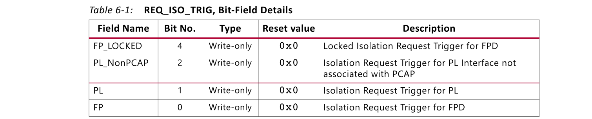

位＃4和＃0的断言应互斥。位＃2和＃1的断言应互斥。这使得一些可能的组合不被允许，如表6-2中所示。

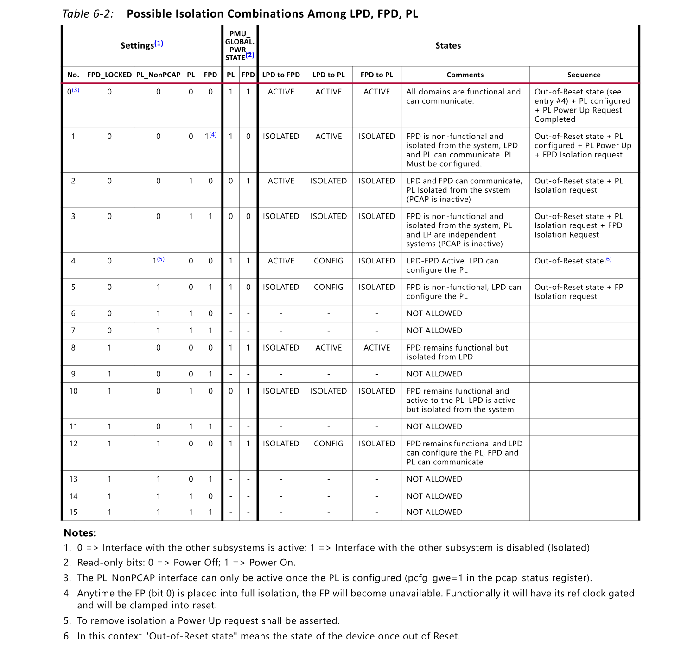

由于Zynq UltraScale + MPSoC无法复位，因此其默认配置为No.4。为了达到配置No.0，在配置PL之后，应发出PL上电请求。

除控制，时钟和复位信号外，配置No.8，No.10和No.12的所有LPD-FPD信号都被钳位。配置No.1，No.3和No.5也有控制，时钟和复位信号被钳位，FPD处于复位状态。

## Isolation with Arm TrustZone
ARM®TrustZone®技术是一种全系统的Security方法。它紧密集成到Cortex®-A53处理器中，并通过AMBA®AXI™总线扩展到整个系统，并支持TrustZone IP块。TrustZone硬件架构旨在提供一个框架，允许保护资产的机密性和完整性免受特定攻击。除了Security威胁的缓解之外，TrustZone特性还可以在Safety设计中用作解耦层，从而不受Safety和non-safety应用之间或Safety应用通道之间的干扰。

TrustZone使单个物理处理器内核能够从Normal世界和Secure世界安全有效地执行代码（见图6-1）。当更改当前运行的虚拟处理器时，两个虚拟处理器上下文通过称为监视器模式的新处理器模式切换。

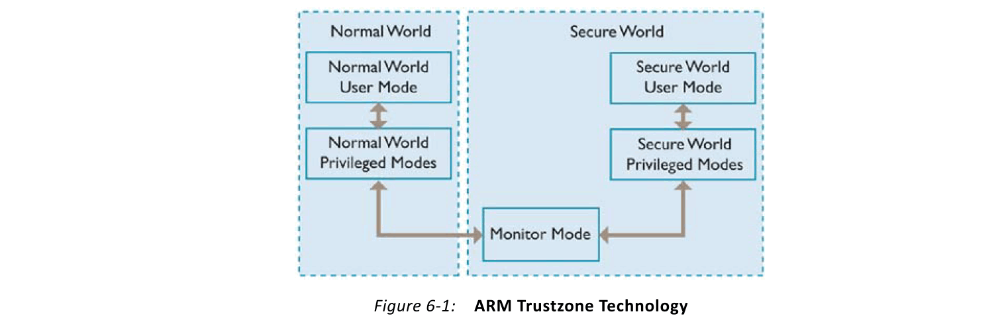

物理处理器可以从Normal世界进入监控模式的机制受到严格控制，并且都被视为监控模式软件的异常。执行专用指令的软件可以通过安全监视器调用（SMC）指令或硬件异常机制的子集触发进入monitor

在监视模式下执行的软件是实现定义的。Zynq可编程逻辑的访问可以设置为TrustZone的一部分，允许实现监视器和附加诊断，以协助TrustZone中的安全功能。

## Isolation with Xilinx Isolation Design Flow 
隔离设计流程（IDF）是一种设计方法，可确保在Zynq UltraScale + MPSoC的可编程逻辑中控制故障传播。它是实现无干扰（FFI）和消除常见原因故障（CCF）的关键技术。它最初是政府密码系统的先驱，现在已成为Xilinx IEC61508认证工具链中不可或缺的一部分。

IDF是一种利用先进的floor-planning技术物理隔离PL中的功能的方法。功能由未使用的逻辑和可编程互连的小栅栏隔离。隔离函数的逻辑和路由完全包含在隔离区域内。Xilinx将大量资源投入到栅栏的分析中，确保确实提供了所需的隔离。设计完成后，工作产品的验证由一个名为Vivado Isolation Verifier（VIV）的独立工具完成。使用IDF的高级设计流程如图6-2所示。

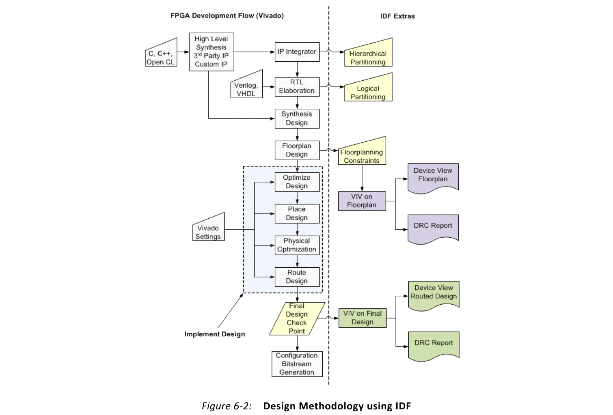

需要隔离的示例安全关键应用程序框图以及最终实现如图6-3所示。

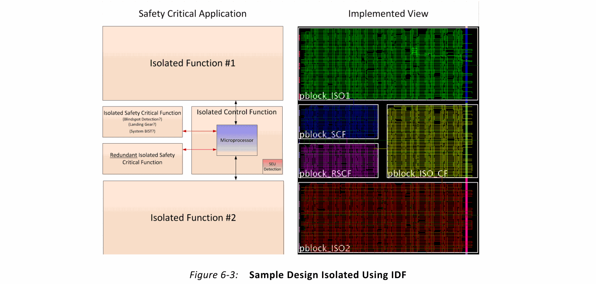

提供以下详细文档以帮助客户使用和实施IDF：
- Isolation Design Flow for Xilinx 7Series FPGAs or Zynq-7000 AP SoCs (Vivado Tools) (XAPP1222) [Ref 11]
- Zynq-7000 AP SoC Isolation Design Flow Lab (Vivado Design Suite 2015.1) (XAPP1256) [Ref 12]
- IDF website: http://www.xilinx.com/applications/isolation-design-flow.html

# Appendix A: Safety Mechanisms for Peripherals Protection
通常，外围设备通过混合应用级别度量（即通过使用假设）和HW级别的Hooks来解决，以简化那些应用级别度量。
这些措施包括：
- 使用空间冗余（即使用相同外设的两个通道并比较结果）
- 使用时间冗余（例如，重复某个操作两次并比较结果）
- 使用应用程序循环（例如，检测到故障） 通过回读输出并通过SW评估正确性）
- 使用loopback（例如CAN发送器环回CAN接收器）
- 使用端到端（E / E）安全协议

举一个具体的例子，考虑LPD中的CAN接口。CAN协议引擎可以通过三种主要安全机制的组合进行监督：
- 执行环回测试的可能性
- CAN基本数据帧中默认包含CRC
- 在标准CAN数据帧之上添加额外的CRC，以考虑片外功能安全的要求数据通讯

事实上，IEC 61508和ISO 26262都要求至少涵盖以下故障模式：
- 重复信息
- 信息丢失
- 信息延迟
- 插入信息
- 伪装或错误处理信息
- 错误的信息序列
- 信息损坏
- 从发送方发送到多个接收方的非对称信息
- 来自发送者的信息仅由接收者的子集接收
- 阻止访问通信渠道

通常采用由以下功能组成的端到端（E / E）安全协议来满足这些要求。在实现通信标准时，可能已经存在一个或多个这些功能：
- 标题或分隔符
- 在数据帧的数据字段中添加额外的CRC（见图A-1）
- 在数据字段内添加帧计数器
- 对到达的数据包执行定时检查（基于窗口）。

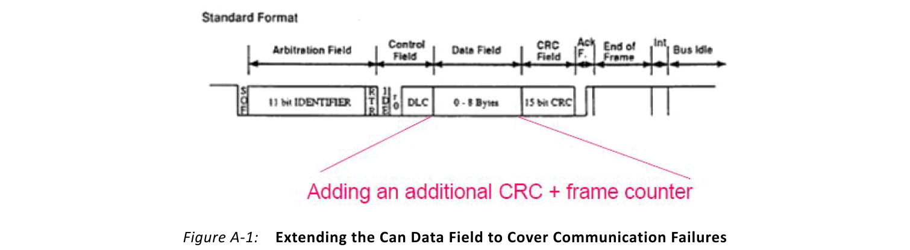

E / E安全协议还将涵盖其他数字逻辑，如预分频器，CAN邮箱（RAM）等，如图A-2所示。

通常，外围存储器（例如CAN和RAM）由E / E安全协议覆盖，除了存储配置数据的部分，由专用STL覆盖。

可以为所有其他安全相关的外围设备实施类似的方法。例如，结合应用程序覆盖PWM故障的一种简单方法是通过GPIO实现环回测试，如图A-3所示。该方案也可用于其他外设，当然也可用于GPIO本身。

在通信接口之上建立的E / E安全协议，如图A-4所示，也能够覆盖相应CPU的外围设备之间的部分互连。

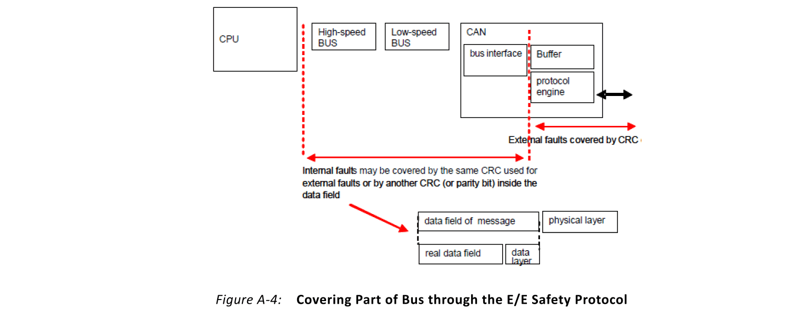

# Appendix B: List of Software Safety Mechanisms and Assumptions Of Use
表B-1报告了以下信息：

- STL或AoU的名称：软件测试库的名称或使用假设。这是MPSoC安全分析中使用的标签（由Xilinx完成），并在此处作为标签报告。
  - 建议：
    - ++：强烈推荐实施。如果未实施，则会影响MPSoC安全指标（SPFM> 2％，潜在指标> 10％，PMHF> 1 FIT）
    - +：建议实施：如果未实施，则会略微影响MPSoC安全性度量
    - o：可选。如果未实施，则不应影响MPSoC安全指标。此选项仅用于某些STL，用户可能有特殊理由在其应用程序中实现
- 永久性/瞬态故障的故障覆盖：
  - 是/否：SM或AoU 有效/无效控制永久性/瞬态故障
  - NA：不适用于此特定SM或AoU
- 在启动/运行时激活
  - 是：在启动/运行期间SM或AoU应处于活动状态。
    - 如果是 SM，用户应将SM配置为在启动/运行期间有效
    - 如果是 AoU，用户应在应用程序中实现AoU，以便在启动/运行时有效
    - 如果是 STL，用户应将STL作为应用程序启动过程的一部分来实现
- STL or AoU: 
  - STL：用户应该在软件应用程序中集成STL（由Xilinx提供）
  - AoU：用户应该在软件应用程序中实现使用假设

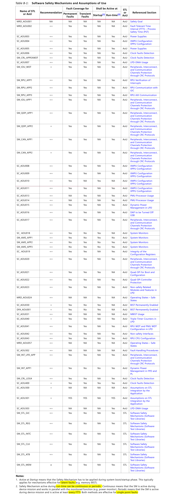

# Appendix C: ISO 26262-10:2011, Clause 9.2.2 

第4步 - 将SEooC集成到项目中

在Item开发期间，规定了安全目标和功能安全要求。该Item的功能安全要求与SEooC假定的功能安全要求相匹配，以确定其有效性。

在SEooC假设不匹配的情况下，根据ISO 26262-8：2011第8章（变更管理）中的描述，开始以影响分析开始的变更管理活动。可能的结果包括： 
- 在实现安全目标方面，差异可被视为可接受，并且不采取任何行动;
- 差异可以被视为影响安全目标的实现，并且可能需要对Item定义或功能安全概念进行更改;
- 可以认为差异会影响安全目标的实现，并且需要对SEooC组件进行更改（包括可能更改组件）。

