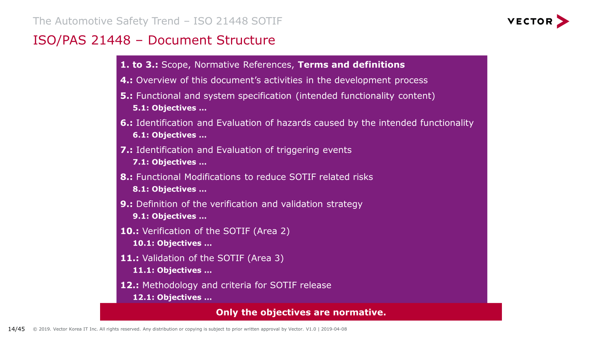

# 2. 预期功能安全SOTIF

## 2.1. 介绍
对于某些依赖于感测外部或内部环境的系统，**可能存在由系统的预期功能或性能限制引起的潜在危险行为，ISO 26262系列中没有解决这类故障**。此类限制的示例包括：
- 功能无法正确理解路况并安全运行;这还包括使用机器学习算法的功能;
- 功能相对于传感器输入变化或不同环境条件的鲁棒性不足。

预期功能的安全性（SOTIF）：The  absence of unreasonable risk due to these **potentially hazardous behaviours related to such limitations**。功能安全（由ISO 26262系列解决）和SOTIF在安全方面是有区别并互补的。

表1说明了危险事件的可能原因如何映射到现有标准。

下图概要的说明了，这两个标准如何对应到软硬件开发上

## 2.2. 范围
SOTIF定义：The absence of unreasonable risk due to hazards resulting from functional insufficiencies of the intended functionality or by reasonably foreseeable misuse by persons is referred to as the **Safety Of The Intended Functionality (SOTIF)**. 

由于预期功能的功能不足或者可合理预见的人员滥用导致的危险而导致的不合理风险被称为预期功能的安全性（SOTIF）。ISO21448提供了实现SOTIF所需的适用设计，验证和确认措施的指导。ISO21448不适用于ISO 26262系列所涵盖的故障或由系统技术直接引起的危险（例如激光传感器造成的眼睛损伤）。

ISO21448旨在应用于**预期的功能**，其中适当的情景感知对安全至关重要，并且情境意识来自复杂的传感器和处理算法; 尤其是在OICA/SAE标准J3016自动操作度量上具有1级和2级的紧急干预系统（例如紧急制动系统）和高级驾驶员辅助系统（ADAS）。**可以考虑将此版本的文档用于自动操作更高级别**，但可能需要采取其他措施。**本文件不适用于现有系统的功能，这些系统功能为在发布时存在公认的和值得信赖的设计，验证和确认（V＆V）措施（例如动态稳定性控制（DSC）系统，安全气囊等）**。如果源自复杂传感器和处理算法的情景感知是创新的一部分，则ISO21448中描述的一些措施适用于此类系统的创新功能。

在识别危险事件时，故意使用和合理可预见的误用与**潜在危险**系统行为相结合。

可合理预见的误用可能直接导致潜在危险的系统行为，也被认为是可能直接触发与SOTIF相关的危险事件的可能事件。

故意更改系统操作被视为功能滥用。**功能滥用不在ISO21448的范围内**。

## 2.3. 概要

在ISO21448中，作为相关用例一部分的场景因此分为四个区域（参见图7）。

区域1,2和3用作构建该文档的心智模型。为了完整性引用了区域4，但是为了ISO21448的目的不需要区域4，因此不再使用。在考虑模型中的区域时，将其大小想象为表示每个区域内每种类型的场景的比例可能是有用的。

给定的用例可以包括已知和未知的场景。

在开发初期，区域2和区域3可能太大，导致不可接受的残余风险。**SOTIF活动的最终目标是评估2区和3区的SOTIF，并提供论据证明这些区域足够小，因此，产生的残余风险是可接受的**。
- 虽然可以明确评估区域2的已知场景和相应的用例，
- 但是区域3的场景和相应的用例通过行业最佳实践或其他方法（例如设计测量，系统分析或专用实验）来评估。
  
这些评估的结果提供了一个论据，即区域3足够小，区域2通过SOTIF改进来管理，因此遇到这些场景的概率足够低。

期望区域2和区域3将减少，区域1将在开发期间增长（见图8）。

SOTIF流程相对于Area 1，Area 2和Area 3以及相关场景的目标是： 
- 区域1：最大化或维护区域，同时最小化区域2和3.这保留或改进了安全功能。
- 区域2：将技术措施的面积降至可接受的较小水平，该水平的统计显着性与技术措施的相对影响相适应; 评估潜在风险，并在必要时通过改进功能或限制功能的使用/性能将危险情景转移到区域1。
- 区域3：尽可能以最小的努力使区域（未知的风险）最小化（每个检测到的危险场景都移至区域2）。

图9描述了**用于改进预期功能以确保其安全性的流程图**。带圆圈的数字表示本文件中的相应条款。

## 2.4. 文档结构

## 参考资料

- [PD ISOPAS 214482019 Road vehicles — Safety of the intended functionality](https://dl-download.csdn.net/down11/20190407/4b6401ef6d86df2f0a24127534fe8a42.pdf?response-content-disposition=attachment%3Bfilename%3D%22PD%20ISOPAS%20214482019%20Road%20vehicles%20%E2%80%94%20Safety%20of%20the%20intended%20functionality.pdf%22&OSSAccessKeyId=9q6nvzoJGowBj4q1&Expires=1557931692&Signature=Gke1KED4aGPImljxtf3e2cBBhOY%3D&user=skd2278&sourceid=11094821&sourcescore=5&isvip=0)
- [The Automotive Safety Trends – ISO26262 2 nd Edition, SOTIF, Security and Agile](https://assets.vector.com/cms/content/consulting/publications/SafetyTrends_KeynoteKorea.pdf)
- [自动驾驶护身符之一：SOTIF及其应用](https://www.zhihu.com/search?type=content&q=SOTIF)
