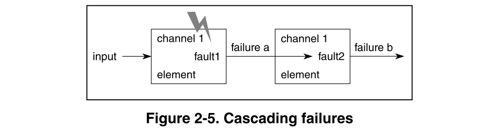

# 3. 故障处理

## 3.1. Errors, Faults and Failures!
术语error, fault, failure类似，但具有不同的含义：
- Error：当测量的，观察的或计算的信号或状态与预期的信号或状态之间存在差异时（例如，偏离理论上正确的结果）。这可能由于fault或由于意外操作条件而发生，并且可能导致failure。
- Fault: 可能导致系统或功能组件failure的异常情况。
- Failure: 终止系统或功能组件的正确行为。

### 3.1.1. Failure types（失效类型）
失效是对功能安全的主要有害影响:
- **系统性失效**以**确定性方式**表现为某种原因（系统故障），只能通过改变设计过程，制造过程，操作程序，文档或其他相关因素来消除。因此，针对系统故障的措施可以减少系统失效（例如，实施和遵循适当的过程）。
- **随机硬件失效**可能在硬件元件的寿命期间**不可预测地发生并且遵循概率分布**。**降低硬件的固有失效率将降低发生随机硬件故障的可能性**。**检测和控制**将在其发生时减轻随机硬件失效的影响。随机硬件失效是由**永久性故障（例如，物理损坏），间歇性故障或瞬态故障**引起的。永久性故障是不可恢复的。例如，间歇性故障是与特定操作条件或噪声相关的故障。瞬态故障例如是粒子（α，中子）或EMI辐射。可以通过设置所需的值或通过反复开关电源来恢复受影响的配置寄存器。由于瞬态故障，元件可能切换到自毁状态（例如，单事件闭锁），因此可能导致永久性破坏。

【注】: 有的资料上也定义为**系统性故障**和**随机故障**，个人认为**这两个名词**里故障和失效是同义词。

### 3.1.2. Faults (故障)

以下随机故障可能会导致失效，从而导致违反功能安全目标。引文符合ISO 26262-1。随机硬件故障在随机时间发生，这是由硬件中的一个或多个可能的降级机制引起的。
- **单点故障（SPF）**：元件中的故障，**未被安全机制覆盖**，并导致单点故障。这**直接导致违反安全目标**。图2-2中的“a”表示元素内部的SPF，它会生成错误的输出。IEC 61508中对单点故障的等效是随机故障。提到SPF时，它应被视为IEC 61508应用程序的随机故障。
- **潜在故障（LF）**：一种故障，其存在**未被安全机构检测到，也未被汽车驾驶员察觉**。LF是一种**不违反功能安全目标**本身的故障，但当**与至少一个额外的独立故障相结合时会导致双点或多点故障，从而直接导致功能的违反安全目标**。图2-2中的'b'显示元素内部的LF，它仍然生成正确的输出。IEC 61508与LF中没有相同的名称。
- **双点故障（DPF**）：单个故障，与另一个独立故障相结合，导致双点故障。这直接导致违反功能安全目标。图2-2中的'd'显示元素内部的两个LF，它们产生错误的输出。
- **多点故障（MPF）**：单个故障，与其他独立故障一起导致多点故障。这直接导致违反功能安全目标。除非另有说明，否则多点故障被视为安全故障。
- **残余故障（RF）**：故障的**一部分独立导致违反功能安全目标**，其中故障的**该部分未被功能安全机制覆盖**。图2-2中的“c”表示元件内部的RF，虽然功能安全机制设置到位，但会产生错误的输出，因为功能安全机制未涵盖此特定故障。
- **安全故障（SF）**：一种故障，其发生不会显着增加违反功能安全目标的可能性。SPF，RF或DPF不是安全故障。

应在容错时间间隔（FTTI）内检测到SPF。应在潜在容错时间间隔（L-FTTI）内检测LF（DPF）。在汽车应用中，L-FTTI通常被接受为每个典型的汽车$T_{trip}$发生一次，并且潜在故障通常通过在**启动时**的系统测试期间执行的安全机制来检测。**每$T_{trip}$检测一次DPF**可将产品Tlife中潜在故障的累积时间减少到$T_{trip}$的最大时间段。

【注】： $T_{trip}$是指从启动到灭火一些使用车的平均时间，目前家用轿车一般用时比较短，很多潜在故障并不会影响汽车的运行。但是如果是货车，可能一次运行就长达十几个小时，那么潜在故障就值得更深入的评估

**多点故障**的一个例子：RAM和ECC(纠错代码)机制。
- ECC纠正位翻转。如果RAM由于位翻转而包含错误，ECC将纠正该翻转。如果ECC因为软件错误而失败，RAM仍然可以正常工作。如果有位翻转并且ECC失败，则会出现多点故障，因为位翻转不会得到纠正。RAM和ECC都将失败。
- 循环冗余检查(CRC)将检测ECC机制中的故障。如果没有CRC，故障将无法检测到，因此是**潜在的**（Latent multiple point fault）。使用CRC，故障将成为**检测到的多点故障**（detected multiple point fault）。如果司机被用类似于警告灯的方式告知故障，那么这是一个**感知到的多点故障**（perceived multiple-point fault）。

### 3.1.3. Dependent failures (依赖失效)
- **共因失效（CCF）**：由于共同原因导致两个或多个组件故障状态同时存在或在短时间间隔内存在的相关故障子集（参见图2-3）。CCF是一个冗余元件的分离通道上的两个或更多元件的随机故障状态**恰好同时发生**，其导致所定义的元件未能执行其预期的安全功能，这是由单个事件或root cause引起的（chance cause, non-assignable cause，噪音，natural pattern等）。
CCF使得多个通道（N）的概率具有大于$\lambda_{\text { single channel }}^{\mathrm{N}}$的故障率（**$\lambda_{\text { redundant element }}>\lambda_{\text { single channel }} \mathrm{N}$**）。

  共因故障是单点故障。典型的共因故障源头为：
  - Common weakness in design redundancy
        - Example – close proximity of hydraulic lines
  - The use of identical components in multiple subsystems
  - Common software design
  - Common manufacturing errors
  - Common requirements errors
  - Common production process errors
  - Common maintenance errors
  - Common installation errors
  - Common environmental factor vulnerabilities

  

- **共模失效（CMF）**：单个root cause导致冗余通道中两个或更多（不一定相同）元件的类似巧合错误行为（相对于安全功能），导致无法检测到失效。图2-4显示了两个冗余通道中的三个元素。单个Root Cause（CMFA或CMFB）导致**主通道**和**冗余通道的一个元件**中未检测到的失效。

  

- **级联失效（CF）**：当系统中元件的本地故障通过互连元件传播时，会发生CF，从而导致同一系统中的另一个元件或同一通道内的其他元件发生失效。级联失效是相关失效，不是共因失效。图2-5显示了单个通道中的两个元素，其中一个root cause导致一个元素中的故障（故障1）从而导致失效（失效a）。然后，该失效级联到第二个元件，导致第二个故障（故障2）从而导致失效（失效b）。

  

### 3.1.4. 故障度量
随机硬件故障肯定会发生，没有办法绕过它。例如，由于热膨胀硅可能会磨损或连接会断裂，宇宙辐射和磁场也会导致硬件失效。给定的时间段内允许的故障次数，将取决于 ASIL。例如 ASIL D系统每1亿个小时出现的故障次数不到一次。

除了这些硬件故障目标值之外，功能安全标准还定义了一些称为**架构安全度量标准的随机硬件度量**。这些指标包括单点故障指标，潜在故障指标和随机硬件故障的概率度量，每个ASIL对于这三个度量具有不同的允许阈值，我们不会详细说明如何计算，不过 你可以在功能安全标准的第五部分找到更多信息。

请注意，architectural metrics具有独立于实现的值，并表示为速率。硬件故障概率度量(Probabilistic Metric for Hardware Failures [PMHF])的绝对单位表示为每$10^9$小时的故障。因此，PMHF本身并不是一个architectural metric，而是与hardware failure metrics的讨论相关。

**硅磨损是`Systematic failure`而不是`Random hardware failure`，这也是有争议的，所以它可能不被认为是`Random hardware failure`的一部分**。

本质上，这些度量着眼于**安全机制覆盖的硬件故障的百分比**。**安全机制**是在**发生故障或检测到故障已经发生时**保持车辆安全的一些功能。这意味着在一个安全的系统中，大多数硬件故障都会被检测到。

这里有一个例子。如果RAM因为UV辐射引起位翻转而失败，则需要一个安全机制来修复位翻转，使系统处于安全状态，并/或警告驱动程序发生故障。

标准认为硬件故障是不可避免的。但如果它们真的发生了，那么理想情况下它们不应该导致安全问题。ASIL D的单点故障度量大于99%，而ASIL B仅大于90%。换句话说，对于ASIL D, 99%的单点故障都应该被检测到，或者对于特定的安全目标来说是安全的。

要计算这些指标，您必须确定哪些硬件故障会导致危险情况，哪些故障不会。该标准实际上将硬件故障分为六类。

### 3.1.5. ASIL故障度量表

## 3.2. Faults, Errors and Failures处理
我们可以根据第3.1节中给出的术语fault，error和failure的定义，总结系统对Fault及其可能后果的不同反应方式。

### 3.2.1. Faults and Errors
如果Fault处理完全嵌入到设计中，则可以在Fault发生时检测到Fault，并采取适当的措施来补偿Fault。因此，可以立即将发生Fault的组件恢复到正确操作的状态，并且以这种方式防止Fault导致组件Failure。这很重要，因为这意味着Fault不能传播到其他组件并导致更大规模的问题（如果处理不当，单个Fault最终可能导致系统整体Failure）。

我们还定义了可能由于内部Fault（我们假设尚未检测到并纠正）或由于意外操作条件（可能称为外部Fault）而发生Error。如果组件包括用于检测和纠正Errors的逻辑，则这还具有将组件恢复到其正确操作状态的效果，从而防止对系统的其他部分的任何不利的连锁效应。

这些可能的操作响应系统组件中的Faults和Errors，如图9.2所示。以这种方式补偿Faults和Errors的系统通常被称为“容错 fault-tolerant”。

### 3.2.2. 元件与系统失效
如上所述，组件内的Fault或Error可能导致其Failure。例如，考虑一个组件的例子，该组件将输入信号N除以存储器中保持的值D.如果随机位错误（例如由于辐射）导致D的值从有意义的值变为零，那么它会导致零除错误。这导致组件Failure，因为它不按要求运行。

一个组件的Failure可能导致另一个组件Failure - 例如，如果组件A没有向组件B提供所需的输入（在我们的示例中，分区操作的结果），这可能导致组件B的Failure，甚至是整个系统Failure。此外，如果没有适当地处理系统Fault，可能导致安全隐患，并且对操作员或周围环境造成有害后果。

另一方面，如果可以检测到组件的Failure，则可以减轻其影响以确保整个系统的安全性。这可以通过以下两种方式之一实现：
- 如果检测到的Failure **CANNOT**得到补偿，那么系统可以通过转移到已知的安全状态并停止正常操作来对问题作出反应（这种安全状态的性质将取决于所涉及的系统类型 - 这可能意味着它关闭系统并显示通知消息，或者回退到基本功能级别）。然后，操作员需要进行干预以解决问题，然后才能正常重启系统。这种方法通常称为“Fault安全 fail-safe”。
- 如果**CAN**补偿检测到的组件Failure，则可以清除Failure的影响，并且可以恢复正确的系统操作。这需要更复杂的设计，但具有系统可以在不中断的情况下继续安全运行的益处，并且实际上操作员可能不知道系统内部件的Failure发生。这被称为“Fail-operational 损坏仍正常工作”。

对组件Failure的可能响应如图9.3所示。如果未检测到组件Failure，并且未执行任何操作，则Failure将传播到系统中的下一个组件（简化 - 可能不止一个），从而导致Fail。结果是整个系统Failure，可能导致Safety Hazard。总之，设计是不安全的，因为如果发生组件Failure，它不会采取措施来确保安全。这由图中的一组橙色和红色状态显示。

如果系统能够检测到组件的Failure，而不是为了对其进行补偿，则系统仍然可以通过进入安全状态来做出反应。这意味着系统也会Fail，但它会以安全的方式完成。该序列显示在图9.3的顶部。

更好的选择是系统可以补偿组件Failure，如果它检测到组件Failure。在我们的示例中，这意味着已经更正了提供给组件B的输入，然后它可以正常运行。该系统被认为是`fail-operational`的，因为即使组件A发生Failure，它也可以继续安全运行。

显示的最终序列是组件A内部Fault或Error的更正。这意味着组件A不会Fail，并且后续操作可以按预期继续。这被称为“fault tolerant”，反映了可以克服低级Fault。

值得注意的是，“fault-tolerant”系统也可能是“fail-safe”或“fail-operational”。fault-tolerant对应于系统容忍低级Faults或Errors的能力，而两种Failure模式指的是系统在存在组件Failure时的行为方式。优选方案涉及处理低级Faults/Errors，同时还包括检测和响应或补偿组件Failure的功能。

可以记录Faults，Errors，组件Failures等以进行诊断分析，从而实现未来的安全改进。

## 3.3. Fail-Safe vs Fail-Operational

这两个术语都指的是系统响应其中发生的单个Failure的响应。在`fail-operational`的情况下，系统**继续安全运行**，而`fail-safe`意味着系统**停止正常操作，并进入已知的安全状态**。最重要的相似性以及两者的最重要方面是对Failure的反应会导致安全的结果。但是，某些系统可能需要能够进行`fail-operational`而不是`fail-safe`。

涉及的一些因素包括：
- 1.达到安全状态所需的时间，以及此期间的潜在Hazards。
  > 示例：在运输系统中，车辆可能在发生Fault时高速行驶。在达到安全状态期间，可能会继续遇到安全隐患。这种情况下`fail-operational`功能将提高安全性。
- 2.容忍停机时间。
  > 示例：如果飞机安全系统发生Faillure需要维护，则可能意味着飞机将停飞一段时间，无法运行。这可能对乘客造成不便，对其他服务产生潜在的连锁反应以及航空公司的收入损失产生相当大的影响。
- 3.成本因素。
  > 示例：将冗余和高度指定的组件合并到某些对成本敏感的产品中将不被视为合理。例如，买家倾向于以非常高的可靠性来评价一个廉价的咖啡机。因此，`fail-safe`可能更合适。

在所有情况下，功能安全的方法应确保Risk降低到可接受的应用程序的水平。但是，不可能完全消除risk。注意预测Risk来源，约束Faults，Errors和Failurs，使其以可检测和可分类的方式发生，并设计能够成功处理这些事件的系统，这些都是可以采取的措施，以最大限度地降低Safety Hazards的Risk发生。

## 3.4. 不同ASIL等级对软硬件的要求

汽车中不同E/E系统对安全等级需求各不相同。

但是对应到自动驾驶，毫无疑问的是ASIL D。虽然是ASIL D，但是不是要求所有的软硬件都必须是D，可以通过功能安全分解把安全关键系统分解出来，从而降低开发成本。

不同ASIL等级所需的软硬件机制各不相同，对应自动驾驶需要在软硬件上做冗余。

在软硬件冗余有很多通用解决方案可以使用

## 3.5. BLOG: Automotive functional safety: The evolution of fail safe to fail operational architecture

功能安全是确保产品安全运行的关键，即使产品出现故障，也能进入受控的安全运行模式。比方说，你想用你的电动方向盘左转，而控制装置出了故障。功能安全，足够的冗余，汽车将给你降级的协助，在方向盘上移动它在一个安全的地方。

想想现代汽车。它比以往任何时候都要复杂，因为电子产品越来越多，运行它的代码也越来越多。随着我们的汽车越来越自动化，复杂性将继续上升。

这使得功能性安全对汽车制造商来说更加重要。他们不能选择忽视它。

今天，汽车使用传统的故障安全发动机控制单元结构。这可以检测到故障，将系统转换到安全状态，但最终，驾驶员仍然能够重新控制车辆。

随着电子系统逐渐发展到第4级和第5级，对驾驶员的依赖逐渐减少，因为车辆有足够的冗余和多样性，即使检测到故障，也能继续全面运行。

### 3.5.1. System failure prevention: from fail-safe system architectures
在故障安全体系结构中，电源向微控制器和其他外围设备发送和监视过压和欠压。并通过看门狗和HW误差监测功能，对单片机的安全运行进行传感和评估。如果检测到故障，系统进入安全状态(由安全电源驱动)，保证功能保持在已知和定义的状态(不受控制)。

### 3.5.2. To fail-operational system architectures: How do they work?
随着车辆越过自动化的第一层，新的fail-operational系统体系结构需要为车辆添加更多的功能。即使发生故障，fail-operational系统也保证功能的完整或降级操作。在这种情况下，目标应用程序的特征是需要高性能、高安全完整性和高可用性。故障检测和响应由独立的硬件控制，因为故障操作系统包含至少两个fail-silent单元。为了消除常见的故障原因，甚至供电都由冗余和独立的电池(VBAT1和VBAT2)保证。

根据汽车制造商的SAE目标水平，备份功能可以使用几秒钟到几分钟。**对于3级自动化，系统会通知驾驶员发生故障，并收回对车辆的控制。从L4开始，驾驶员不再被告知故障，因此机器人(汽车)很可能将车辆停在一个安全区域，供车辆的使用者和其他道路使用者使用**。

## 3.6. Fail-Safe to Fail-Operational 的一个解决方案
这是来自EB的一个解决方案的介绍，下面介绍了Fail-Safe/Fail-Operational/Fault-Tolerant/Not-Safe这几个概念之间的关系

目前的传统的ECU几乎都是Fail-Safe，当失效后，一般通过降级、关闭功能，通知司机，报告错误等方式来达到Fail-Safe

但是针对自动驾驶，这些远远不够的，自动驾驶要做到Fail-Operational。即发生失效后，应该可以使自动驾驶车继续工作。所以提出的安全状态为持续驾驶直到司机接管，或者让自动驾驶车自动达到安全靠停。

传统的方案时1oo2，这也在MCU级别体现为lock-step。这种模式，可以检测到故障，但是并不能恢复，所以只能达到关闭系统的安全状态。

然后介绍了2oo3，通过投票机制来决策安全状态，当其中一个失效时，另两个还能继续工作，所以还能达到2/3的概率。其实这两种系统如果深究都有失效的风险，比如共因失效等。在第4章都会介绍。

即使2oo3可以满足fail-operational的要求，但是实在时太昂贵了，那么有没有便宜的方式呢？

EB介绍了这种1oo2D的系统方案，在1oo2基础上加入了诊断。类似后面第六章介绍的东芝芯片，通过加入诊断代替了lock-step.那么这个1oo2D系就类似于两片lock-step。所以达到fail-oprational也是必然的。

## 参考资料
- ISO 26262 - Part 5: Product development at the hardware level
- [Autonomous Driving – From Fail-Safe to Fail-Operational Systems](https://d23rjziej2pu9i.cloudfront.net/wp-content/uploads/2015/12/09163552/Autonomous-Driving-From-Fail-Safe-to-Fail-Operational-Systems_TechDay_December2015.pdf)
- [Automotive functional safety: The evolution of fail safe to fail operational architecture](https://blog.nxp.com/automotive/automotive-functional-safety-the-evolution-of-fail-safe-to-fail-operational-architecture)
- Safety Manual for S32V234
- [Safety and security for automotive SoC design](https://www.arm.com/files/pdf/20160628_B02_ATF_Korea_Chris_Turner.pdf)
- Udacity Self Driving Car - Functional Safety
- [ARM的汽车功能安全](http://www.armtechforum.com.cn/attached/article/B_7_Jerry20181109164847.pdf)
- [Exploring Zynq® MPSoC](https://www.zynq-mpsoc-book.com/wp-content/uploads/2019/04/MPSoC_ebook_web_v1.0.pdf)
- [Experience with ISO 26262 ASIL Decomposition](http://www.automotive-spin.it/uploads/8/8W_favaro.pdf)
- [Keys to Making Level-3 Autonomous Drive Safe and Secure](https://www.avnet.com/wps/wcm/connect/onesite/fa45bf83-53b7-4e9a-8a0d-d4f0f12ed0f6/NXP-Safe+%26+Secure+Mobility+Keynote.pdf?MOD=AJPERES&CVID=lWjZhJF&CVID=lWjZhJF)

