# 4. 安全可靠的嵌入式系统设计
## 4.1. 常见技术

下图是实现功能安全常用的技术，功能安全属于可靠性设计的范畴，可靠性设计有很多现成的模式可以直接用于安全关键系统的设计。每种设计方法都有不同的优缺点，所以需要根据具体应用做出取舍。

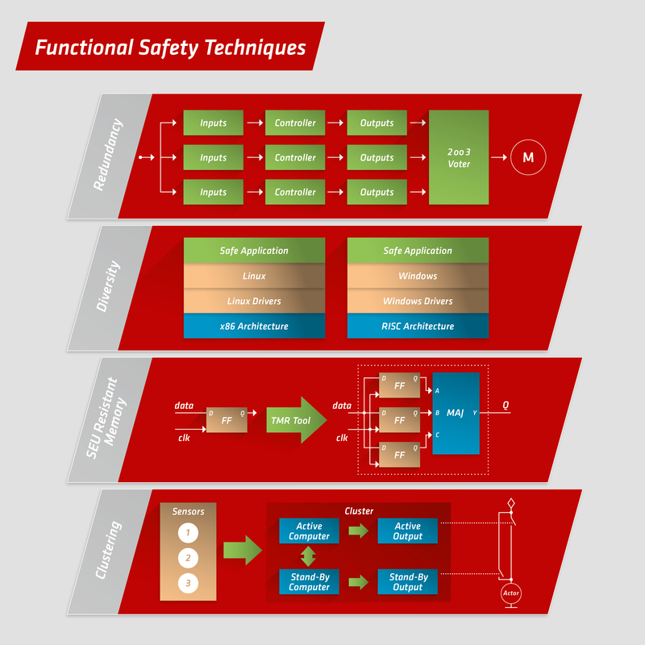

## 4.2. 硬件模式
### 4.2.1. Homogeneous Duplex Pattern

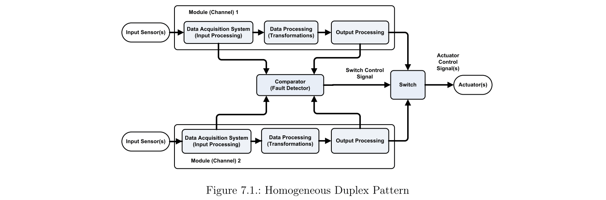

- 概要：它是一种硬件模式，用于通过提供**相同模块的复制**（Modular redundancy）来处理随机故障，从而提高系统的安全性和可靠性。Homogeneous Duplex Pattern由**两个相同的模块**（通道）组成;主（Active）模块和辅助（Standby）模块。此模式可应用于系统设计中从完整系统（通道）到单个组件的任何级别。这种模式的想法是基于这样的假设，即**两个相同的组件不太可能同时出现随机故障**。
- 可解决的问题：如何处理**随机故障**以及如何使系统在其中一个系统组件出现故障时继续运行，以提高系统的安全性和可靠性。
- 缺点与副作用：
  - 这种模式的主要缺点是它**不适合系统故障处理**，因为两个通道是相同的并且具有相同的可能故障。在系统故障的情况下，设计用于在两个通道之间进行选择的Switch电路将切换到两个故障通道中的一个，这将导致完全的系统故障。
  - 当在主通道中检测到故障时，开关电路切换到辅助通道，这可能包括计算步骤的丢失，并且可能包括**输入数据的丢失**，特别是如果没有恢复时间来重做计算。

### 4.2.2. Heterogeneous Duplex Pattern

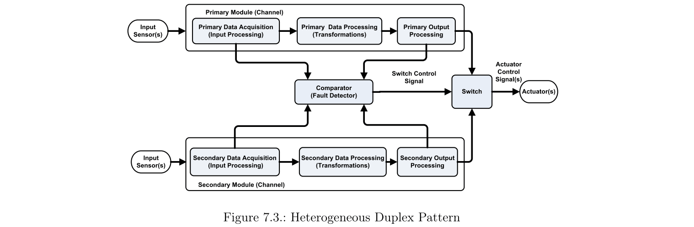

- 概要：它是一种硬件模式，用于通过为所需模块提供异构复制来处理随机和系统故障，从而提高系统的安全性和可靠性。Heterogeneous Duplex Pattern由两个独立的不同模块（通道）组成;主（活动）模块和辅助（备用）模块。由于高开发成本，该模式是**最昂贵的模式**之一。它可以应用于系统设计中从完整系统（通道）到单个组件的任何级别。这两个模块应该彼此独立地设计和实现。
- 可解决的问题：如何处理**系统故障以及随机故障**，以及如何使系统在其中一个系统组件出现故障时继续运行，以提高系统的安全性和可靠性。
- 缺点与副作用：
  - 主要缺点是此模式的重复和开发成本非常高。
  - 当在主通道中检测到故障时，Switch电路切换到辅助通道，这可能包括计算步骤损失，并且可能包括**输入数据丢失**，特别是如果没有恢复时间来重做计算。

### 4.2.3. Triple Modular Redundancy Pattern

- 别名
  - 2-oo-3 Redundancy Pattern
  - Homogeneous Triplex Pattern

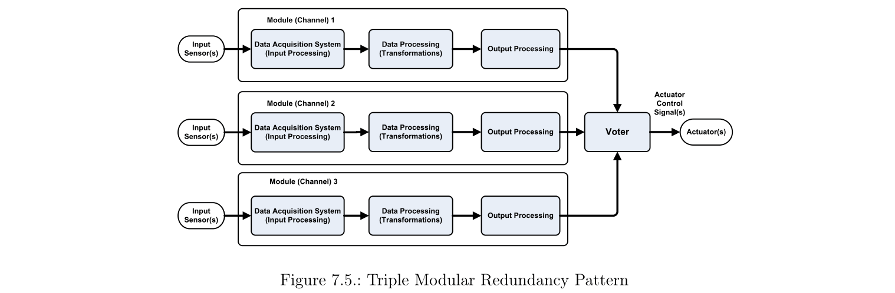

- 概要：该模式是homogeneous hot redundancy的变体，由**三个相同的模块并行操作以检测随机故障**，以增强no fail-safe-state的系统的可靠性和安全性。这些模块并行运行以产生三个结果，只要两个或更多个通道具有相同的结果，就可以使用投票系统进行比较以产生共同的结果。这种结构允许**系统在存在随机故障的情况下运行并提供功能，而不会丢失输入数据**。
- 可解决的问题：如何处理**随机故障和单点故障**，以提高系统的安全性和可靠性，而**不会在出现故障时丢失输入数据**。
- 缺点与副作用：
  - 此模式的主要缺点是它**不适合系统故障处理**。在这种情况下，三个通道是相同的并且具有相同的可能故障，并且系统将继续工作以产生无效数据。
  - 要处理输入传感器中的**单点故障**，可以使用三个独立的传感器。此选项可能会导致问题，尤其是对于响应速度不同的不同传感器。

### 4.2.4. M-Out-Of-N Pattern

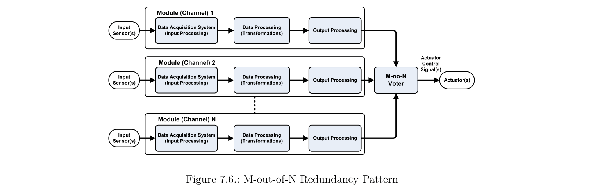

- 概要：M-oo-N模式包括homogeneous hot redundancy。它由**N个相同的模块**（通道）组成，它们并行工作以屏蔽随机故障，并增强系统的安全性和可靠性。M-oo-N冗余要求至少M个组件在N个并行模块中成功，以使系统成功。在Voter组件中使用M-out-of-N投票算法以允许系统操作并在存在**随机故障**的情况下提供所需功能而**不丢失输入数据**。
- 可解决的问题：如何处理**随机故障**，以提高系统的安全性和可靠性，而**不会丢失输入数据**。
- 缺点与副作用：
  - 此模式的主要缺点是它**不适合系统故障处理**，因为通道相同且具有相同的可能故障。因此，M-oo-N模式不能检测到这种类型的故障，这意味着系统继续产生无效数据。
  - 如果使用多个传感器来处理输入传感器中的**单点故障**，则此解决方案可能会导致问题，尤其是对于响应速度不同的不同传感器。

### 4.2.5. Monitor-Actuator Pattern

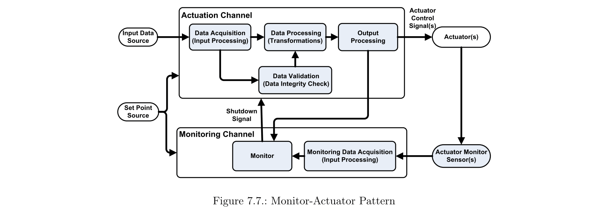

- 概要：Monitor-Actuator模式是一种特殊类型的**异构冗余**，适用于**具有low availability需求和故障安全状态**的安全关键系统，这是已知系统始终安全的条件。MA模式由两个不同的通道（模块）组成：一个称为actuation通道的主通道，它执行主要动作，如控制一些执行器，以及一个monitoring通道，它提供对驱动通道的监控，以便检测和执行识别可能的故障，然后使驱动通道进入故障安全状态。monitoring通道从actuation通道分离，使得如果它包含任何故障，则actuation通道继续正确地操作。
- 可解决的问题：如何在系统中出现**单点故障**时提高嵌入式系统的安全性，该系统包括故障安全状态和合理成本的低可用性要求。
- 缺点与副作用：此模式的主要缺点是它不适合具有**高可用性要求**的应用程序。

### 4.2.6. Watchdog Pattern 

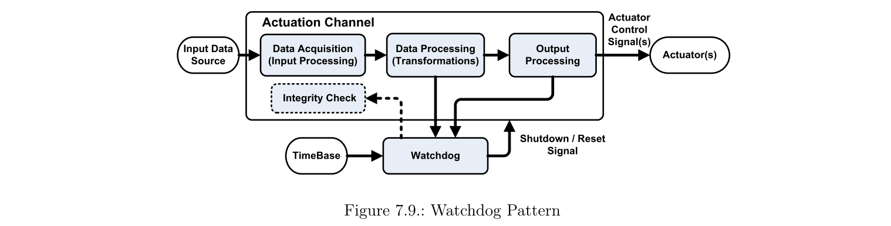

- 概要：看门狗模式是一种非常轻便且价格低廉的模式，覆盖范围最小，用于检查执行通道的内部计算执行。它被广泛用于嵌入式系统中，以确保依赖于时间的计算处理按照预定的顺序正常进行[37]。该模式包括一个称为看门狗的组件，它从被监视的通道接收周期性消息。如果事件发生得太晚或无序，则看门狗发出关闭信号或纠正措施，以避免失去对系统的控制。**看门狗模式很少单独用于安全关键系统，并且通常与其他模式一起使用以提高系统安全性**。
- 可解决的问题：
  - 如何通过提供在执行期间观察，检测和处理故障的简单且低成本的方式来为系统增加额外的安全性。
  - 如何确保执行通道的内部计算处理按预期正常进行。
  - 如何识别基于时间的故障。
  - 如何使用“Keyed Watchdog”改进死锁检测。
- 缺点与副作用：这种模式的主要缺点是看门狗的覆盖范围最小;因此，它很少单独用于安全关键系统。它可以与其他安全模式结合使用。

## 4.3. 软件模式
### 4.3.1. N-Version Programming Pattern

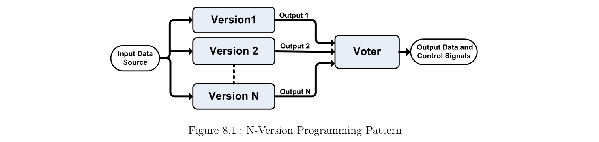

- 概要：N版本编程是一种众所周知的基于**软件多样性**和故障屏蔽的容错软件方法。它被定义为独立生成的N≥2个功能等效的软件模块，称为“版本”来自相同的初始规范。该模式包括**并行运行的N个程序**，以在同一输入上执行相同的任务以产生N个输出。在这种模式中使用**Voter**来产生正确的输出；它接受N个结果作为输入，并使用这些结果根据特定的投票方案确定正确的输出。
- 可解决的问题：如何克服软件开发后可能存在的软件故障，以提高软件的可靠性和安全性。
- 缺点和副作用：NVP模式的主要缺点是开**发独立N版本的复杂性**以及高开发成本和对初始规范的高度依赖性，**初始规范**可能将相关故障传播到所有版本。所有版本中的相关故障问题对于系统安全性和可靠性的这种模式至关重要。

### 4.3.2. Recovery Block Pattern

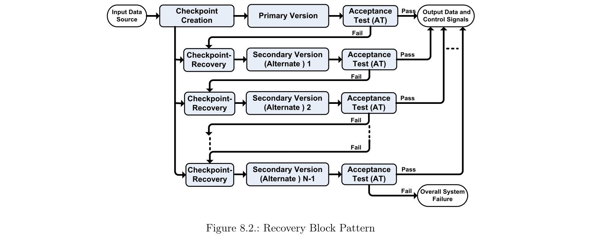

- 概要：Recovery Block 是一种众所周知的容错软件方法。它基于故障检测，具有**验收测试和反向错误恢复**，以避免系统故障。与在N版本编程中一样，恢复块模式包括**N个不同的，独立的，功能相同的软件模块**，称为“版本”，来自相同的初始规范。这些模块分为主要版本和N-1次要版本，其中任何版本的执行之后都是验收测试。**主要版本（Block）首先执行，然后进行验收测试。测试失败将导致执行辅助备用版本（恢复块），然后进行验收测试**。重复最后一步，直到其中一个备用通过其验收测试，或者所有备用项执行而不通过测试，并报告整个系统故障。
- 可解决的问题：如何克服软件开发后可能存在的软件故障，以提高软件的可靠性和安全性。
- 缺点和副作用：RB的主要缺点是高度依赖于**验收测试的质量**以及**顺序执行的影响时间**，其可能包括在恢复期间服务中断的情况。此外，它具有NVP模式的共同缺点，例如开发独立N版本的复杂性，高开发成本以及对可能将软件错误传播到所有版本的初始规范的高度依赖性。

### 4.3.3. Acceptance Voting Pattern

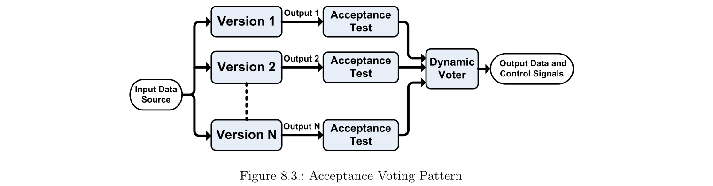

- 概要：验收投票模式是一种混合模式，它将**NVP模式与RB模式使用的验收测试相结合**。与NVP类似，此模式基于独立生成N≥2功能等效的软件模块，称为“版本”来自相同的初始规范[13]。该模式包括并行运行的N个程序，以在相同输入上执行相同的任务产生N个输出。每个版本的输出都会**通过验收测试以检查其是否正确**。通过验收测试的输出用作动态Voter的输入，根据投票方案执行该投票以产生正确的输出。
- 可解决的问题：如何克服软件开发后可能存在的软件故障，以提高软件的可靠性和安全性。
- 缺点和副作用：与最初的N版编程方法类似，除了高度依赖于可能将故障传播到所有版本的初始规范之外，还可以看到开发N种不同软件版本的AV模式的缺点。关于安全性，所有版本中的相关故障问题在该模式中不太重要，因为验收测试代表了检测这些故障的附加措施。

### 4.3.4. N-Self Checking Programming Pattern

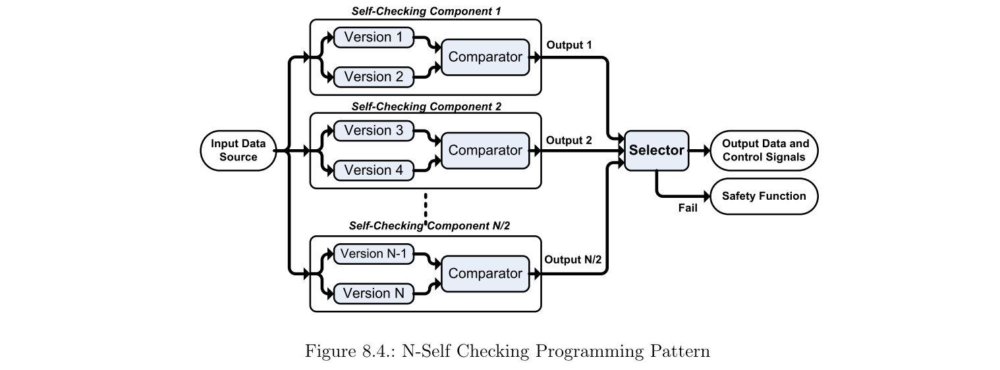

- 概要：N-Self Checking Programming是最昂贵的容错软件方法之一。它基于软件设计多样性和通过向程序添加冗余而提供的自检，以便它可以在执行期间检查自己的动态行为。该模式包括独立生成的**N≥4个功能等效的软件模块**，称为“版本”来自相同的初始规范。这些版本被安排在称为组件的组中，其中**每个组件由两个版本和一个比较算法组成**，以比较两个版本的结果的正确性。在执行期间，一个组件作为活动组件工作以提供所需服务，而其他组件是热备件。**为了为单个故障提供容错，必须在4个硬件单元上执行至少4个版本**，这代表与其他方法相比最高的成本。
- 可解决的问题：如何克服软件开发后可能存在的软件故障，以提高软件的可靠性和安全性。
- 缺点与副作用：
  - 高度依赖可能将故障传播到所有版本的**初始规范**。
  - 与容许相同故障数量的其他模式相比，使用了大量不同版本和硬件模块。
  - **开发N个独立**且功能相同的版本的复杂性。

### 4.3.5. Recovery Block with Backup Voting Pattern

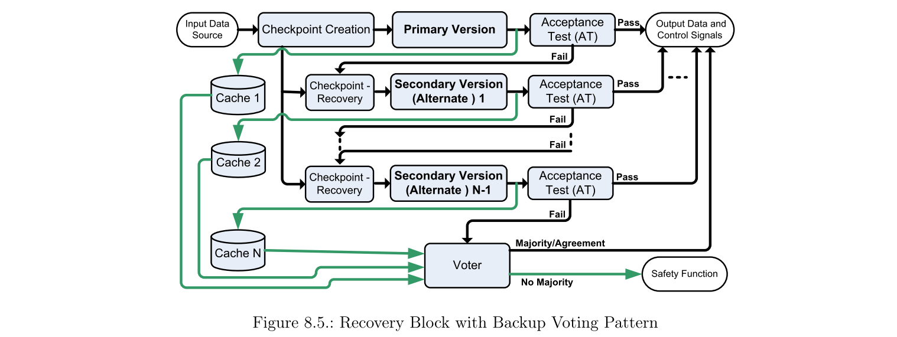

- 概要：具有备份投票功能的恢复模块是一种混合模式，它将经典RB与NVP的概念结合在一起，以提高经典RB在很难构建有效验收测试的情况下的可靠性。该软件模式包括N个不同的，独立的，功能相同的软件模块，称为“版本”，来自相同的初始规范。它解决了false negative case的问题，其中包括通过验收测试错误地将正确输出视为错误输出。主要版本首先执行，然后进行验收测试。当第一个版本未通过验收测试时，结果的副本将作为备份存储在高速缓存中，并调用下一个备用版本以执行所需的功能。重复到最后一步，直到任一替代品通过其验收测试。如果在未通过验收测试的情况下执行所有替换项，则存储的值将用作投票方法的输入，作为提供有效结果的最后尝试。
- 可解决的问题：如何克服软件开发后可能存在的软件故障，以提高软件可靠性，以及如何解决弱验收测试中的false negative cases问题。
- 缺点和副作用：与经典RB类似，这种模式的主要缺点是开发独立N版本的复杂性以及高开发成本和对可能将故障传播到所有版本的初始规范的高度依赖性。

## 4.4. 复合模式

### 4.4.1. Protected Single Channel Pattern

- 概要：受保护的单通道模式是一种轻量级模式，用于通过在通道中的不同点添加检查和监控来增强安全性和可靠性。它通常用于**处理瞬态故障**。
- 可解决的问题：如何处理瞬态故障，以便宜的方式为嵌入式系统提供一定程度的安全性和可靠性。
- 缺点和副作用：这种模式的主要缺点是它**不适合处理持久性故障**，因为它无法继续安全运行，有时会导致整个系统的丢失。

### 4.4.2. 3-Level Safety Monitoring Pattern（E-Gas)

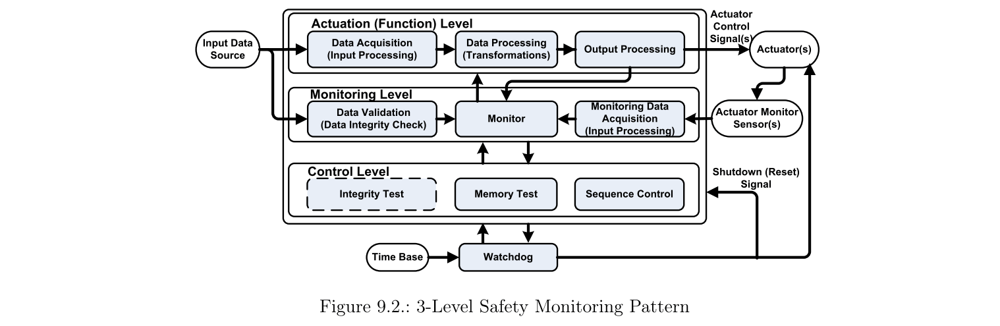

- 概要：3级安全监控模式被认为是**监控执行器模式和看门狗模式的组合**，**适用于需要连续安全监控的应用，并且包括无需高硬件冗余的故障安全状态**。它由一个硬件通道组成，包括3个级别：执行（功能），监控和控制级别。功能级执行子程序以执行预期功能，而监控级监控第一级，控制级控制监控级和整个硬件通道。此外，通过周期性消息与控制级别通信的看门狗用于在**发生失效时将系统重置为其故障安全状态**。
- 可解决的问题：如果在具有故障安全状态的系统中出现故障，如何以**低合理的成本**提高嵌入式系统的安全性。此外，当执行器输出与指令设定点之间存在任何偏差时，如何继续提供所需的安全等级并确保系统不会造成伤害或损害。
- 缺点和副作用：这种模式的主要缺点是它包括单个硬件通道；因此，它不能用于容忍具有高可靠性和可用性要求的应用中的硬件故障。

### 4.4.3. 再次解释E-Gas

这里有一个更好的文档解释E-Gas系统

设计模式是被证明的，成熟的架构。汽车行业最常见的软件模式之一称为 E-Gas，E-Gas 模式定义了三个软件级别。
- 第一级是包含系统预期功能的**功能级别**。对于车道辅助示例，预期功能将是将车轮转向中心，并根据摄像机数据调整方向盘。**二级和三级 E-Gas 模式用于监控**
- 二级模式指的是**监控第一级的任何安全目标违规**的**功能性监控**。例如，二级软件将监视车道辅助系统的时间和扭矩请求。
- 三级模式用于主要**硬件组件的处理器监控**。例如，三级软件启动监视 RAM ROM 和控制流

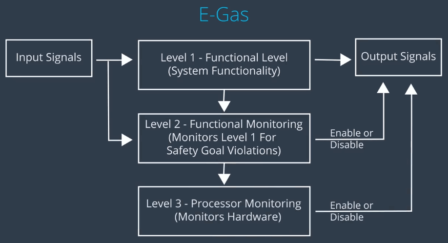

在车道辅助例子中，一级软件会向方向盘马达发送扭矩请求.

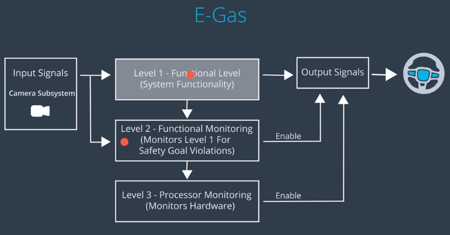

如果二级或三级软件检测到错误，那么一级软件被禁用，二级三级软件会使系统达到安全状态。在这种情况下 我们确定安全状态会发送零转矩输出。

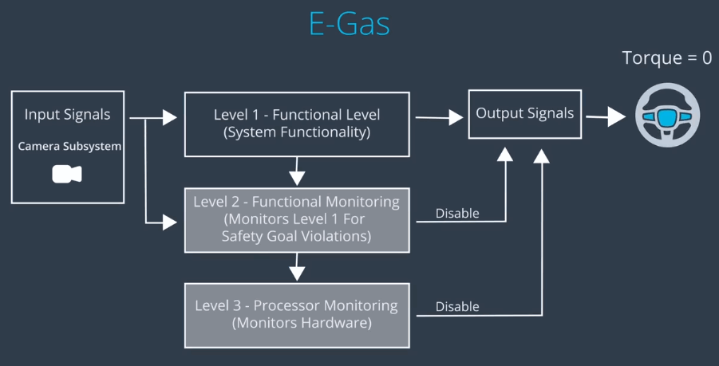

#### 4.4.3.1. E-gas这个名字从何而来?
E-gas的设计模式最初来自一个线控加速系统。最初，汽车上的油门踏板与发动机上的节流阀有直接的机械连接。节流阀调节进入发动机的空气量。在现代汽车中，油门踏板是一个电子传感器。当你踩下油门踏板时，软件会解释你想要加速多少。然后软件打开或关闭节流阀。开发了E-gas软件模式，用于监测线控加速度系统的故障。在汽油发动机系统故障的情况下，二级或三级监测功能可以降低油门。

#### 4.4.3.2. 软件分区和安全监控
**安全监视和软件分区**是通常使用设计模式解决的**软件机制**。对于安全监测，有一些特定的模式，如解释过的E-GAS概念。在软件分区的情况下，一种模式是使用称为**MPU的硬件特性和双数据存储**。

## 参考资料
- [Design Patterns for Safety-Critical Embedded Systems](http://darwin.bth.rwth-aachen.de/opus3/volltexte/2010/3273/pdf/3273.pdf)
- [Communication Patterns in Safety Critical Systems for ADAS and Autonomous Vehicles](https://www.visteon.com/wp-content/uploads/2019/01/communication-patterns-in-safety-critical-systems-for-adas-and-autonomous-vehicles.pdf)
- [Udacity Self Driving Car - Functional Safety]()
- [https://www.menmicro.com](https://www.menmicro.com/fileadmin/user_upload/content_images/competencies/infographics_functional-safety-techniques.jpg)