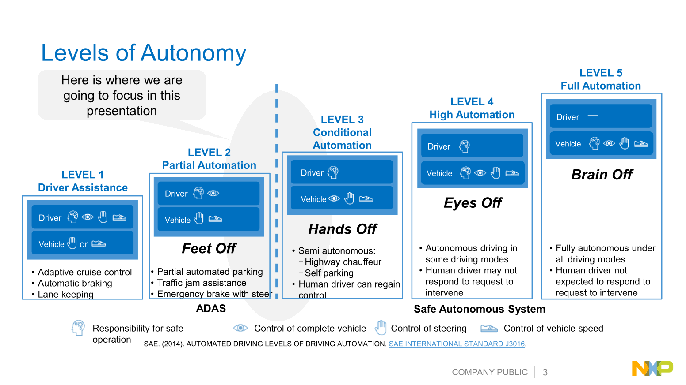
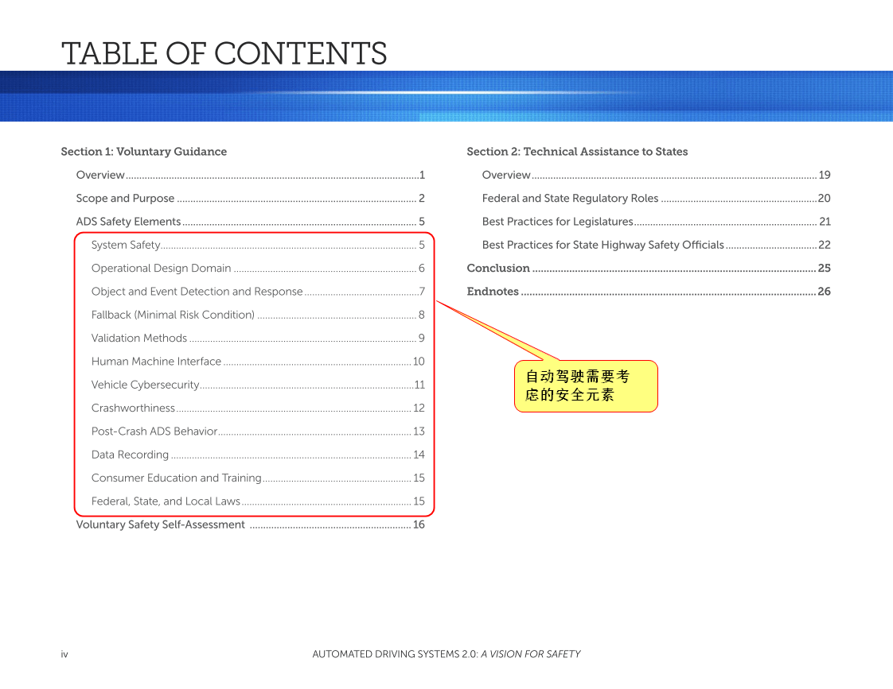
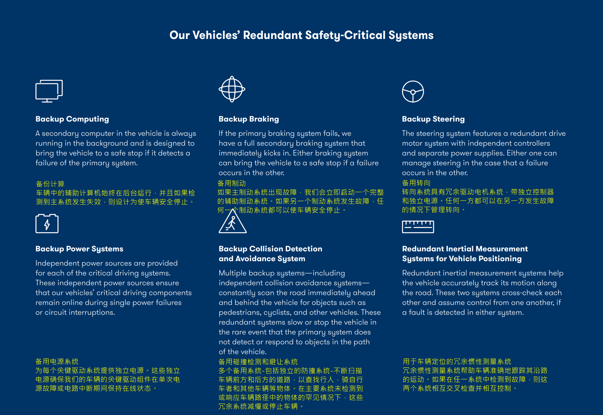
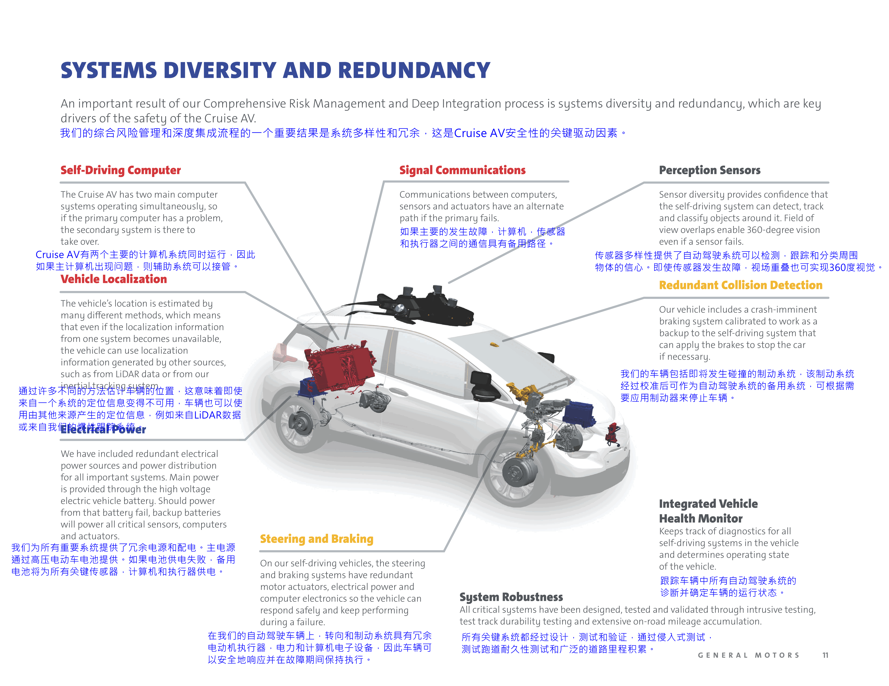
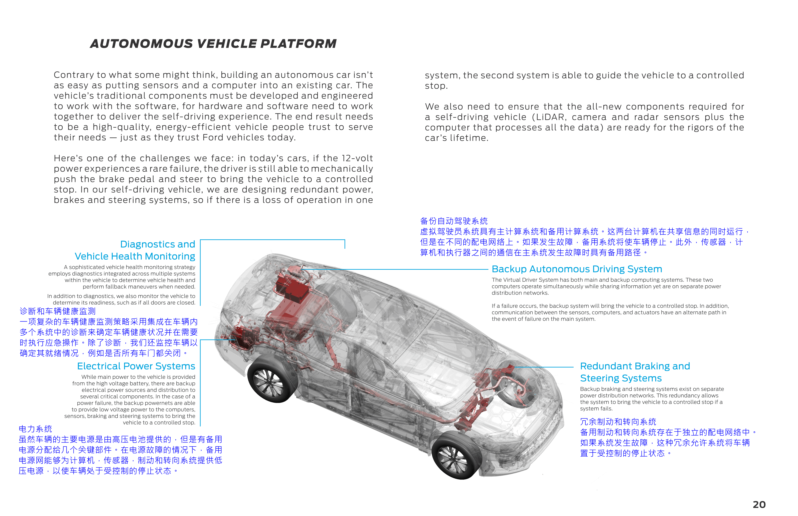
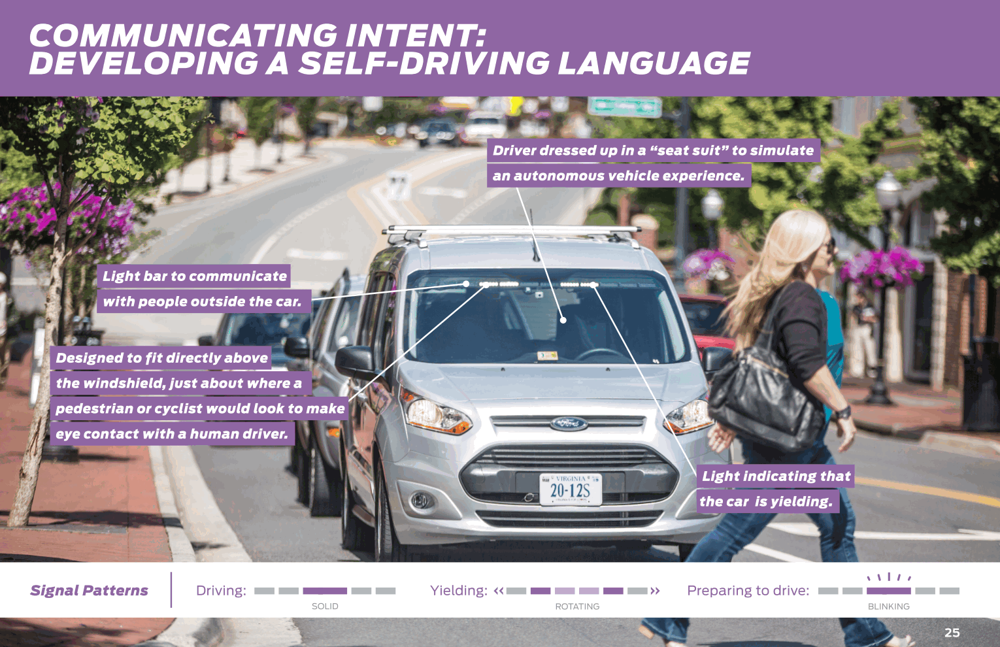
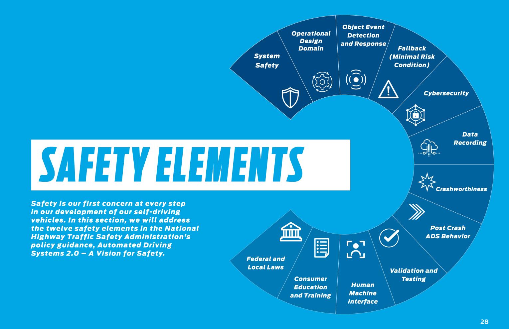
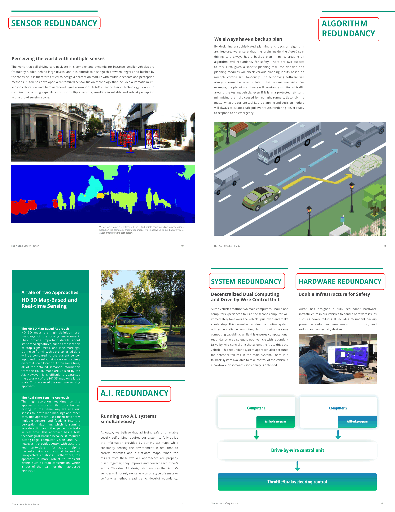

# 5. 自动驾驶安全报告

## 5.1. AUTOMATED DRIVING SYSTEMS - A Vision for Safety 

【注】：其实这份文档据说来自于Google提交的安全报告，然后总结为这12个元素。这份文档现在类似于一个提纲或者模板，介绍了12个安全设计元素，以下看到的各个自动驾驶公司的Safety Report基本上都讨论了在其公司实现的12个安全设计元素。

### 5.1.1. Overview

美国交通部(DOT)通过美国国家公路交通安全管理局(NHTSA)致力于通过部署创新的救生技术，实现无事故道路的时代。最近汽车碰撞事故的负面趋势凸显了开发和部署救生技术的紧迫性，这些技术可以显著减少我国道路上的伤亡人数。美国公路交通安全管理局认为，自动驾驶系统(ADSs)，包括那些考虑完全不需要驾驶员的系统，有可能显著改善美国的道路安全状况。

这项自愿指导的目的是支持汽车工业、各州和其他主要利益攸关方在考虑和设计与自动化车辆技术的测试和部署相关的最佳实践时提供支持。它更新了2016年9月发布的联邦自动车辆政策，并作为NHTSA当前对ADSs的操作指南。

自愿指导包含**12个优先安全设计元素**。这些元素是根据运输研究委员会(TRB)、大学和国家公路交通安全管理局的研究选出的。每个元素都包含可用于实现这些安全目标的安全目标和方法。鼓励实体在其系统的设计中考虑每个安全元素，并为各种元素的评估、测试和验证提供一个自文档化的过程。随着自动化驾驶技术的快速发展，没有一个单一的标准可以衡量一个实体考虑安全设计元素的方法。每个实体在为其系统开发最佳方法以适当降低与它们的方法相关的安全风险时，都可以自由地发挥创造性和创新性。

此外，为了帮助支持公众对ADSs安全的信任和信心，**这一自愿指南鼓励实体披露自愿安全自我评估，表明它们在测试和部署ADSs时实现安全的各种方法。鼓励各实体从本指南出版之日起开始使用本指南**。随着技术的不断发展和完善，NHTSA计划定期更新自愿指南，以反映经验教训、新数据和利益相关者的投入。

为了全面了解和确保分类法使用的一致性，NHTSA采用了SAE International的自动化水平和其他适用术语。

## 5.2. Google Waymo

## 5.3. GM

## 5.4. Ford

## 5.5. AutoX

## 5.6. Others Safety Report
- [Mercedes Benz](https://www.daimler.com/documents/innovation/other/2019-02-20-vssa-mercedes-benz-drive-pilot-a.pdf)
- [Uber](https://public.boxcloud.com/d/1/b1!sNxw8irGfUpmtj2EPdne9PxO-oFOb69tQt3cgb0fHHBj-E4b4Tcoa9PVB3kQI-96DZaxDDx3aZ8MFVLScKnKXNcjKSiebBVVy6a36vE-B63HVcRy5PghkAY7jNhClxsMsFa6dZKClvhLAK3a6p0O78e38Namd0cMtRbtPUtEn8FLIVVT8niOvgu5R66sdDDVcVQjzGXH5SXjkzK9VvuujXwMDpLnV-YJn5DTNeaaDIQczcW1IyAouI07cPmWGzkg5jQOFdNbpwl2s7iej2MkwVUtm5V8P9d4fCZ0Nuw8zwifY06X4M8k74eRgrEBDHh7aWPsPB5UQpmY6hyMhs2t11VTIPx2qL_FHTRQpEwQ-BP2EI2qmzokFWqyZyN79X-1oCcC6Tv4OjKK6uDSBZhxzm-aW2jHaJiyzyh4Eva82_KfwVY5GXO90iKAbln7pyalTqMV0RDnih5JSO1qfxZ6gJO2E_FN9KmU1IdTuq1vgY5ieRLLqc0Rsr9skvtywPA9CI0x6U0Oh7Xdc-PvWKDpuA3FNY6A0TA_mxoe2f55jGgFf02tp3cIPUSo-M8x_HIkMNSsdSDabIuFiELcmrEeVxx_vmTRAQ903tdwZAcDVRNjVQO5ih9uELzFLqDfzV90BZBc060zy4kVUO-zJ15CqaG74lZ-jrjq2di1JdoCouF20e0vajoK-oaQZ579mwK4GS3KgrDddDoYkqqi0YERIK_gRnxRQTd-mlfs6b9Umo74l0aI9hy9gocw_68-1uXzUtjXrZzeEzIuQ6jmf8hyCOxUiiCwy82cXfX-kPB5T_847O0c0p_MK9iRAkkZcpO2rw1nIE8TacgBun4aegLMtXOa07YO2FsF4UIjs8fI5pLQqGGDJ5XGUcGPOV6uH1TAlUt4MYrId4FO8m9vzhtS2XT5YL9OtorS_lQjAC6qr90TUp4tvLIH_-NfM8LuOGGH8Mh0Lm47hSfnM8rJMhlb5ajulcSkM279A0MMMiv5mU-CD4cnQFn8gzRiZp-D8RHgT3YlVsA_r9pFahEyi1oD661Yv0p8-koghDkCpiBIpwAc1nQ6swmizSFOP33E9G38MJkQUYoY4YaPrE2rPnyCh7Q3MB-Jre9qcpArSpOtdNPEVx80Uke_HugIktgomqiFDt2TscNPxh1IWDzAUkDOzy1AZvF6cnU96wmtbSWUUiQhi9mYphCOuLevg9qY8f58X4Cm2-OEm9fg-6r2wDZuZBVbiWB8Tf037F7FDUQ_KwBzwqbRntCNNktVBJdAUib8ntGPx8tcm_AhiMC-1co./download)
- [Nvidia](https://www.nvidia.com/content/dam/en-zz/Solutions/self-driving-cars/safety-report/NVIDIA-Self-Driving-Safety-Report-2018.pdf?cjevent=d8495e6b814c11e980a403740a18050f)
- [Aurora](http://aurora.tech/assets/images/Aurora_Safety_Report_.pdf)
- [Zoox](https://zoox.com/wp-content/uploads/2018/12/Safety_Report_12Dec2018.pdf)
- [Nuros](https://static1.squarespace.com/static/57bcb0e02994ca36c2ee746c/t/5b9a00848a922d8eaecf65a2/1536819358607/delivering_safety_nuros_approach.pdf)
- [Tusimple](https://www.tusimple.com/wp-content/uploads/2019/05/TuSimple-2019-Self-Driving-Safety-Report.pdf)
- [Baidu Apollo Pilot](http://apollo-homepage.bj.bcebos.com/Apollo-Pilot-Safety-Report-2018.pdf)
 
## 5.7. 结论
综上可以看出，一个安全的自动驾驶系统最重要的特点是**冗余**，并体现在以下几个方面：
- 刹车、转向
- 电源
- 计算系统
- Sensor：多样性传感器
- 监控
- 碰撞检测
- 车辆定位

## 参考资料
- [AUTOMATED DRIVING SYSTEMS - A Vision for Safety](https://www.nhtsa.gov/sites/nhtsa.dot.gov/files/documents/13069a-ads2.0_090617_v9a_tag.pdf)
- [Waymo无人车报告：通往自动驾驶之路](https://www.leiphone.com/news/201710/JknkYopJ14gVMSyK.html)
- [Waymo Safety Report 2018](https://storage.googleapis.com/sdc-prod/v1/safety-report/Safety%20Report%202018.pdf)
- [GM Safety Report](https://www.gm.com/content/dam/company/docs/us/en/gmcom/gmsafetyreport.pdf)
- [Ford Safety Report](https://media.ford.com/content/dam/fordmedia/pdf/Ford_AV_LLC_FINAL_HR_2.pdf)
- [AutoX Safety Report](https://autox.ai/files/safety_report_2018.pdf)
- https://corporate.ford.com/microsites/sustainability-report-2017-18/customers-products/improving-safety/performance.html