# 6. 常见车规级芯片提供的安全机制
微控制器的变迁

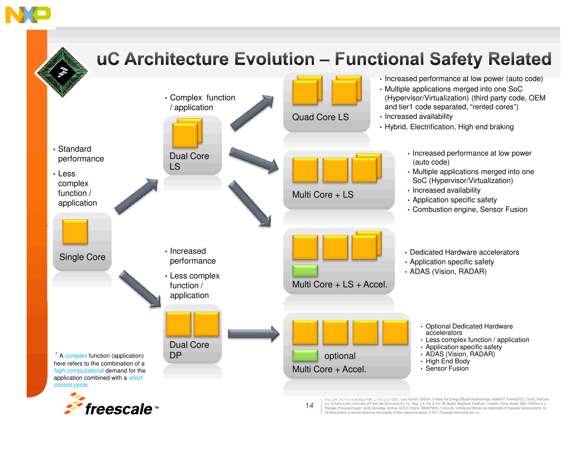

符合ISO26262和IEC61508标准的安全应用的实施需要通过一个独立可靠的安全监测芯片来完成对主微控制器的有效监视工作来完成。

因此，以微控制器为基础的安全系统必须由3个组件构成
- 主微控制器
- 带有强有力监测通道的独立监测芯片
- 支持安全软件

现代车规级处理器提供的硬件安全措施

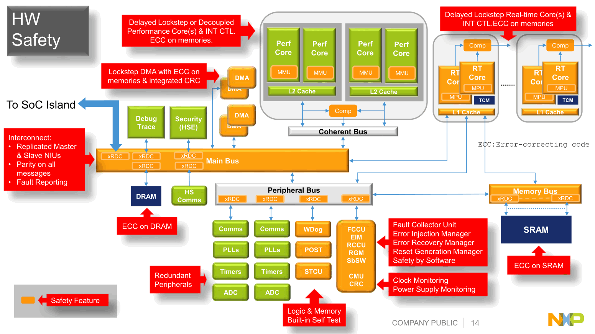

## 6.1. ARM-IP 
### 6.1.1. Hardware
这里有很多厂商直接使用ARM的IP来制作SoC。那么ARM-IP提供了哪些功能安全特性呢？

- 这是2017年不同ARM IP硬件上提供的安全机制
  
  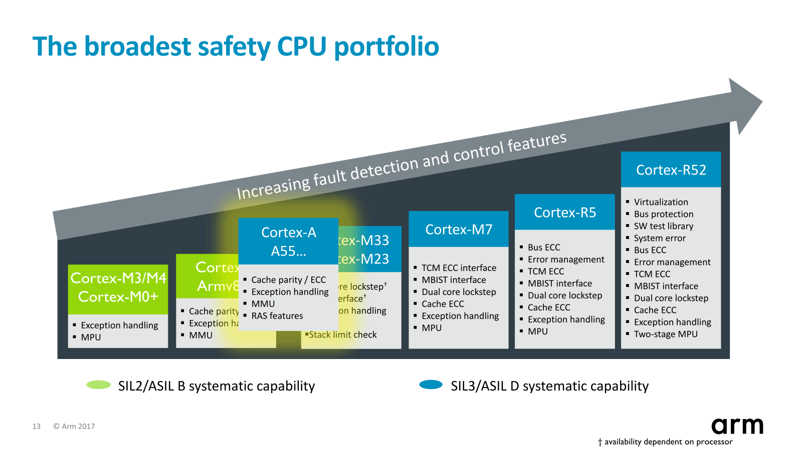

- 方案的变迁

  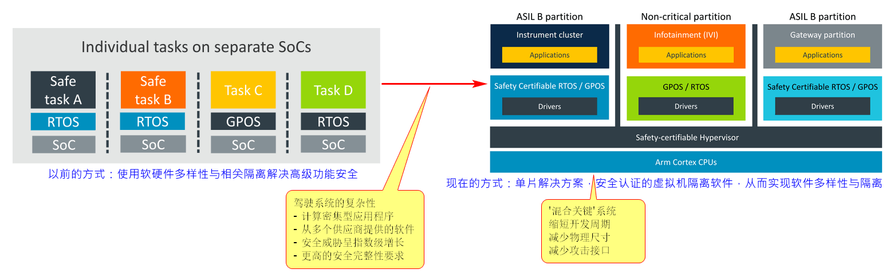 

- Cortex-R5 DCLS故障诊断与控制

  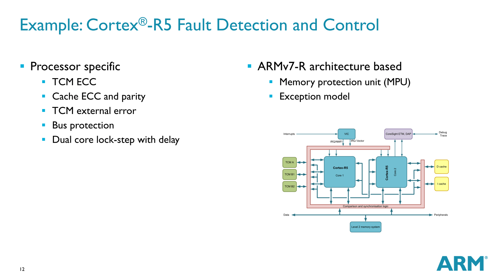

- Cortex-R5 TCLS

  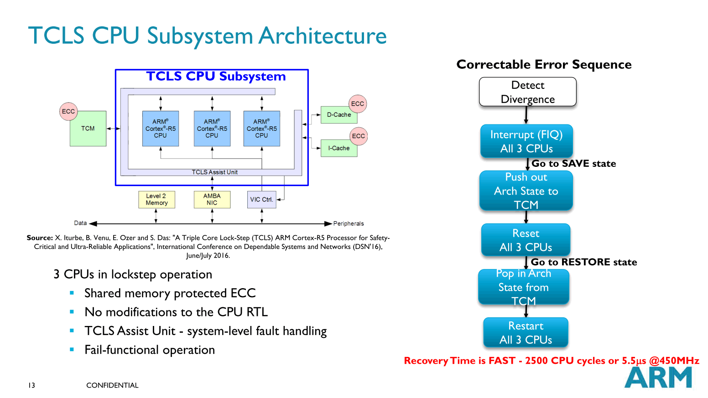

### 6.1.2. Cortex R5 功能安全机制

随着电子设备在汽车，工业自动化和医疗设备领域变得越来越普遍，容错电子子系统正成为标准要求。使用具有高级别容错能力的Cortex-R系列处理器设计这些系统可实现以下优势：
- 提高可靠性
- 增强故障检测和覆盖率
- 降低操作成本

功能安全支持正日益成为这些系统的重要组成部分。随着各种功能安全标准的复杂性不断发展，ARM开发了Cortex-R5安全文档包，以加快产品上市时间，简化认证工作并获得更高级别的认证。

支持ARM Cortex-R系列功能安全的关键技术

ARM Cortex-R系列处理器已经开发用于需要高可靠性和检测处理器或系统中可能出现的任何错误的应用程序。任何系统中可能发生的故障类型包括导致错误值的硬件故障（例如老化内存或温度引起的应力故障）和随机故障（例如随机的辐射击中硅片，或者“翻转”bit或门电路或者甚至造成永久硬件损坏）。如果系统具有安全隐患，任何故障都可能产生严重后果，则对于特定系统必须以适当的方式检测和处理任何错误。

为解决这个问题，存在两个关键策略：
- **检测内存中的错误**：在使用数据之前，将附加纠错码（ECC）附加到所有内存值并进行检查。这使得能够自动检测和校正单比特错误并且检测多个比特错误而不是校正。这需要使用具有额外位来存储ECC的更宽存储器，并且用于系统中的所有存储器，包括高速缓存和紧耦合存储器（TCM）。读入数据时，处理器会自动检查ECC代码，并自动纠正单个位错误，并在系统无法纠正时向系统发出错误信号。在写入存储器时，处理器自动创建ECC代码。Cortex-R5还可以检测将处理器连接到系统的所有总线上的错误。

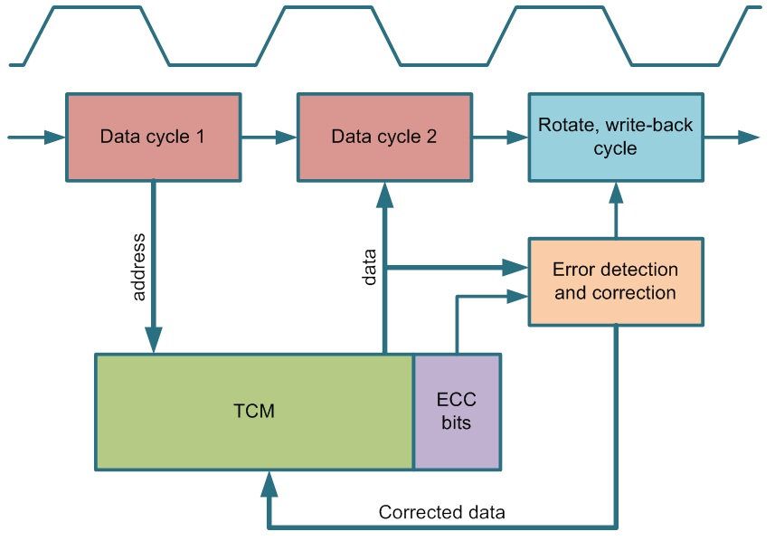

- **检测处理器中的错误**：辐射可能会触及系统中的任何门电路，如果这引起一个错误，不是在内存中而是在实际逻辑中，那么也必须检测到这一点。双核锁步（DCLS）实现两个具有相同输入的相同处理器，但有一个**稍微延迟**以确保检测到同时影响整个系统的事件，并检查两个处理器的输出是否相同。如果比较的输出不匹配，则系统中必定存在错误并且发出信号，以便系统采取适当的措施。

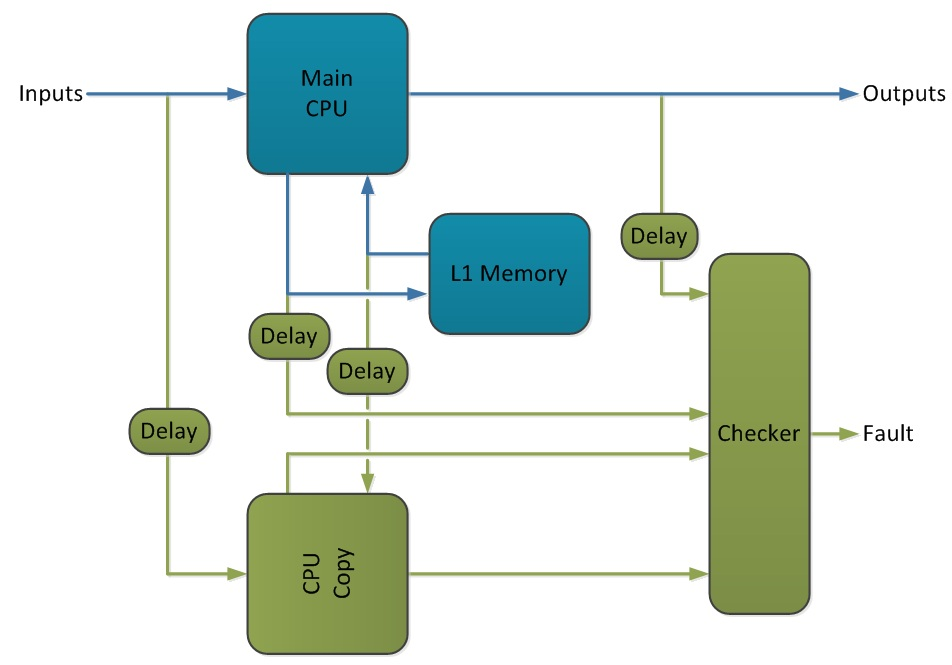

这些关键领域与Cortex-R系列中的许多其他功能相结合，可以开发SoC和更广泛的系统，以满足许多功能安全标准的要求。

### 6.1.3. Software
- 编译器
- Software Test Libraries (STL)

#### 6.1.4. 为什么需要STL
- 任何安全系统都依赖于多种错误检测机制
  - ECC和奇偶校验
  - Dual-redundant Core Lock-step (DCLS)
- 软件测试库提供了另一种检测机制
  - 库被分解为覆盖CPU核心特定块的功能，以确保正确的行为
  - 整个生态系统中的多个供应商（注：每个SoC厂商涉及到功能安全都提供了处理器的STL）

### 6.1.5. Documents

- Safety Manual
  
  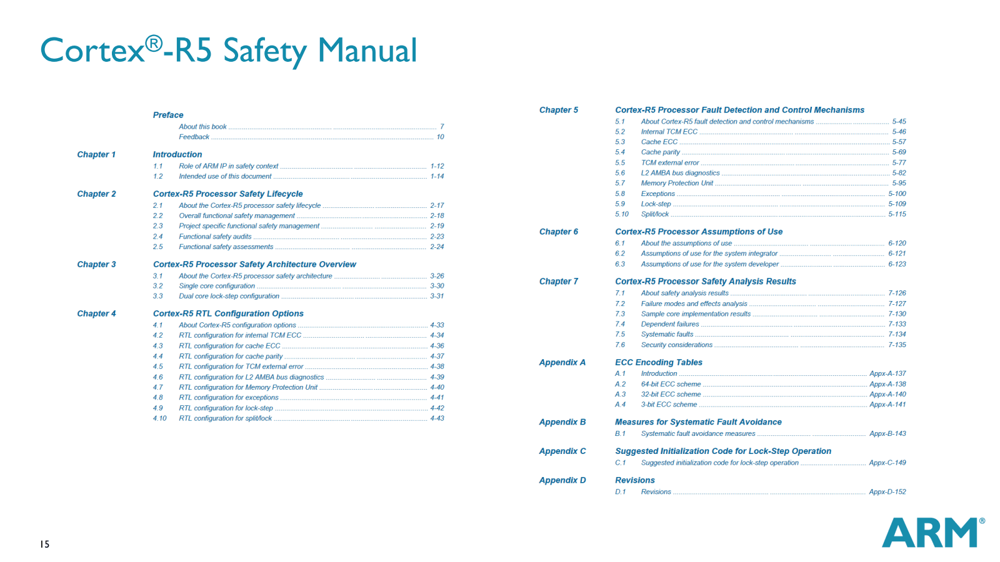 

- FMEA Report
  
  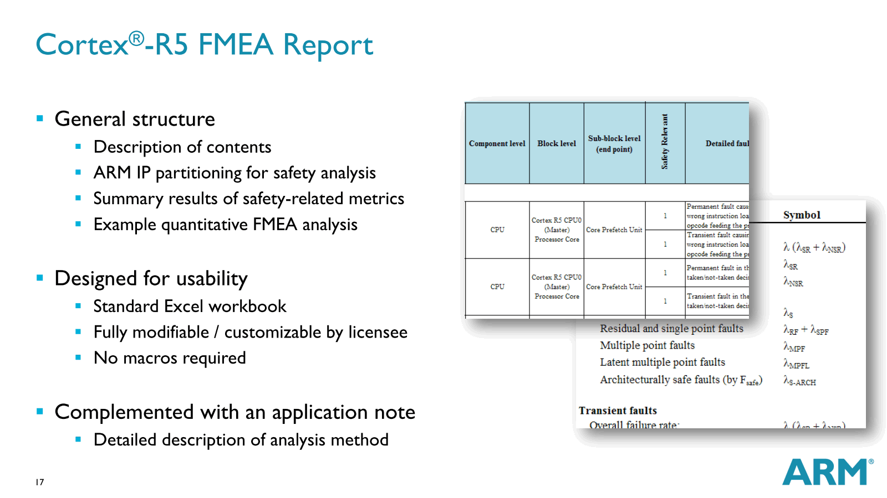 

- 其它：Development Interface Report

## 6.2 NXP - MPC5643L

飞思卡尔的MPC5643L是世界上第一个获得ASIL D功能安全能力的正式ISO 26262证书的微控制器。下图列举了该控制器的安全机制

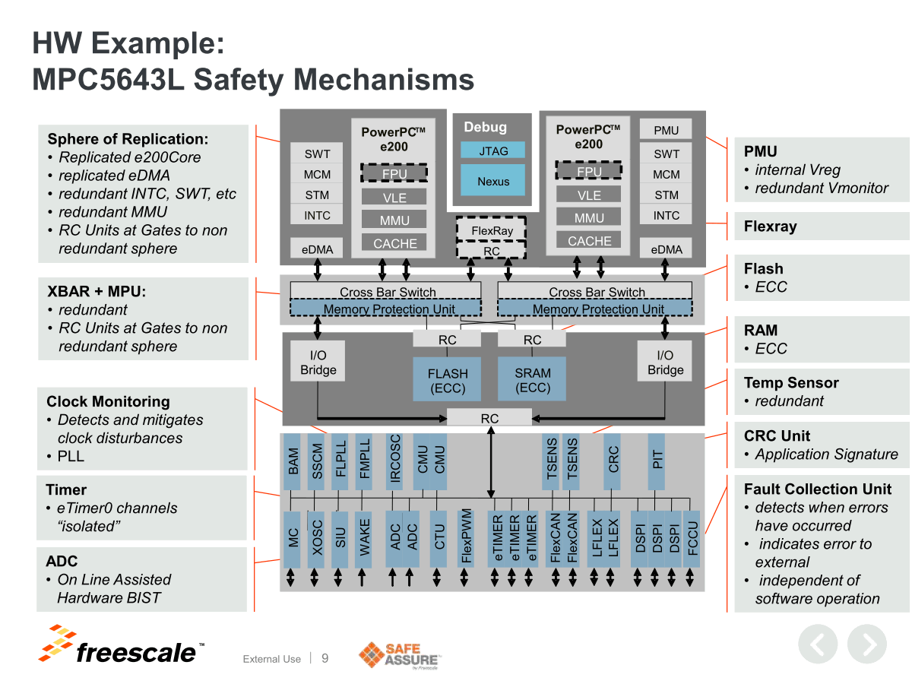

## 6.3 NXP - S32V234

- S32V234 框图

  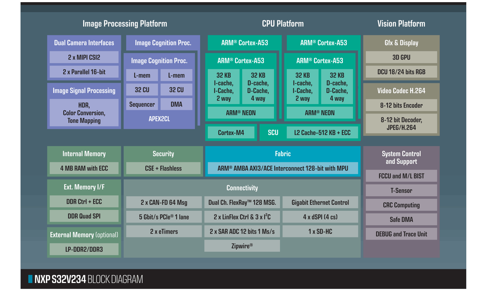 

- S32V234 图像处理
  
  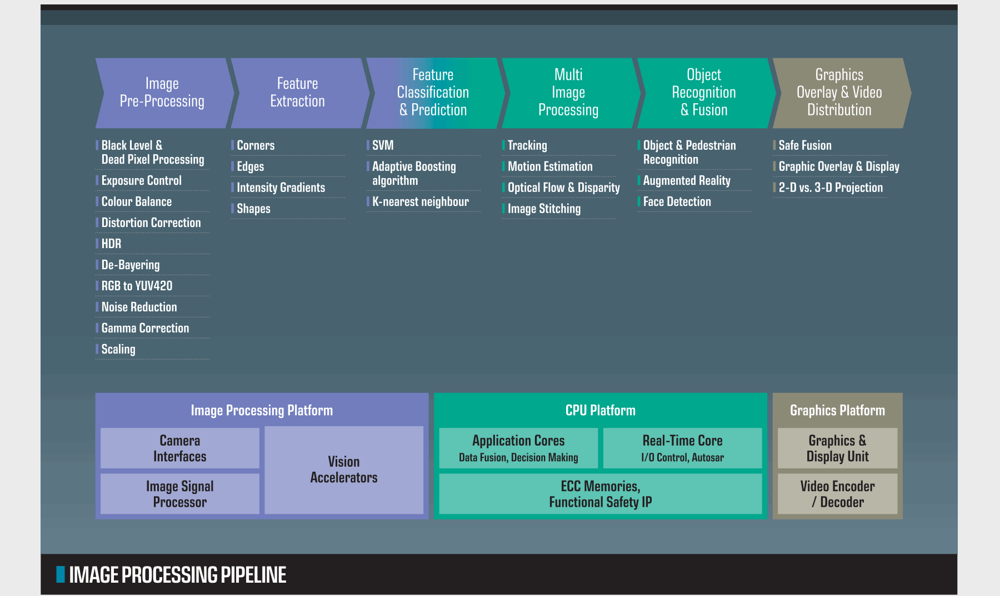 

- S32V234 功能安全机制

  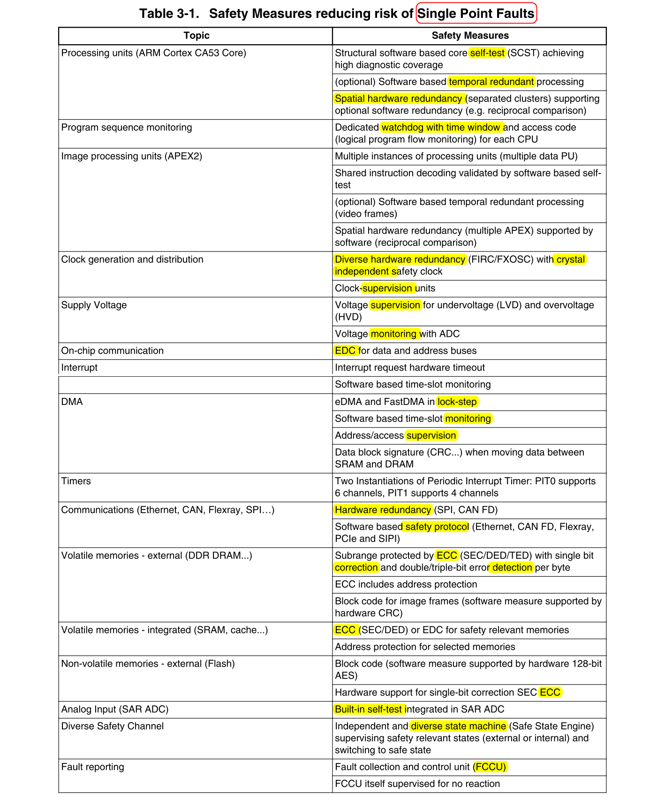 

  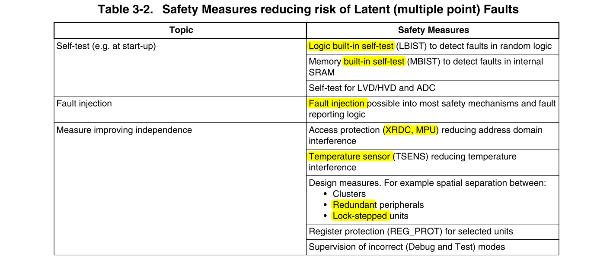 

- Summary
  
  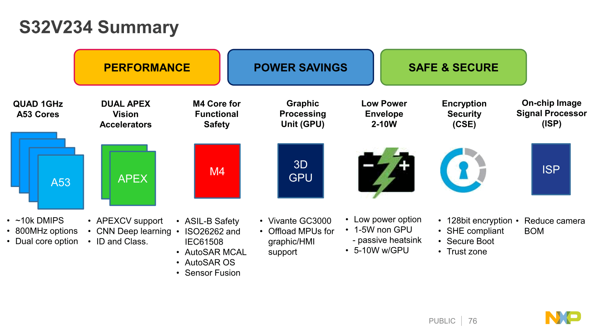

## 6.4. RENESAS - R-Car V3H

  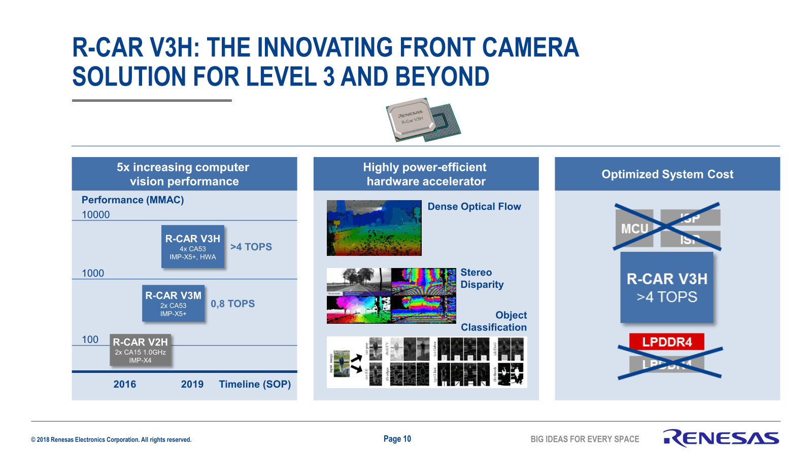   

  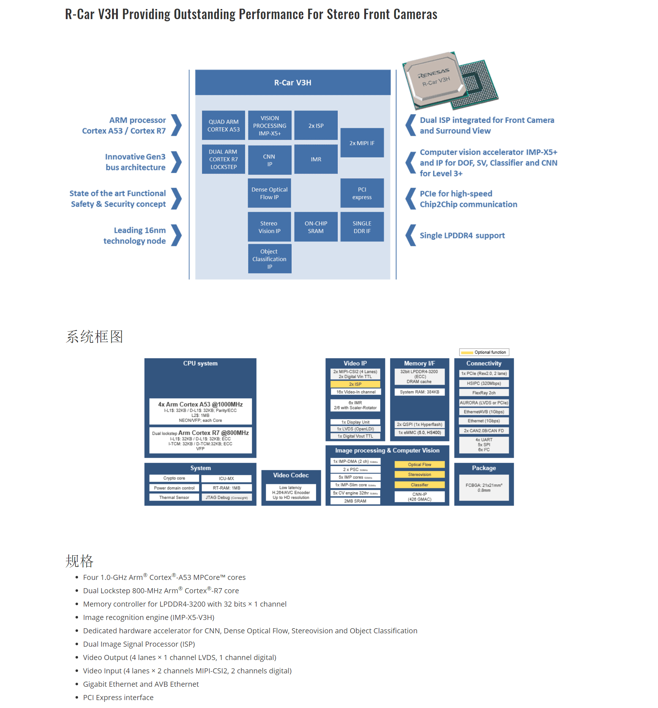 

## 6.5. TI
- http://www.ti.com/solution/sensor_fusion?variantid=1228&subsystemid=21369

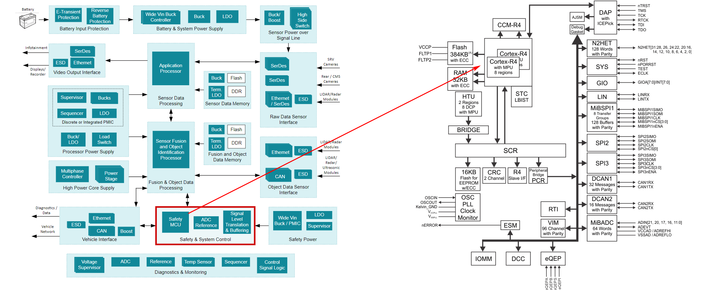

## 6.6. Lock-Step技术介绍
### 6.6.1 Lock-Step技术介绍

可靠性是许多嵌入式系统应用中的关键问题，例如工业控制器或汽车电子。双冗余核心锁步（DCLS）是增强微控制器单元（MCU）可靠性的众多技术之一。

DCLS是开发高可靠性系统的常用技术。在深入研究DCLS之前，了解高可靠性系统的要求是有帮助的。高可靠性系统的技术要求概括为以下四个方面：
- 减少失效的概率。
- 检测失效。
- 纠正失效。
- 鲁棒性 - 单点故障不会导致完整的系统失效。

请注意，根据应用程序和潜在失效的属性，其中一些可能是可选的。

查看可能导致处理器级别失效的内容也至关重要。如[1]中所述，这些失效分为以下几类：
- 内存：存在意外触发可更改系统中的内存状态。例如，常见情况包括辐射粒子撞击，RF发射器的干扰。
- 逻辑：系统内部逻辑中存在硬件失效。通常可以通过扫描测试来检测这类故障。
- 软件：软件中的错误，例如编程错误。例如，内存设置不正确会导致意外的系统失效。

DCLS可帮助系统检测逻辑失效。当检测到逻辑失效时，系统选择要采取的适当措施。

例如，航空电子设备通常具有受α粒子或宇宙射线影响的更高风险。失效检测和校正机制是这种系统中高可靠性的基本特征。DCLS是一种应用于系统的常用技术，**因为它具有失效检测功能**。

正如其名称所示，具有DCLS的系统在内部部署了两个相同的处理器核心。两个内核在相同的状态下初始化（复位），并有相同的输入。因此，应始终观察到两个核心的相同输出。可以通过比较两个核的输出来检测到达其中一个核中的输出的逻辑失效。在检测到失效之后，系统可以根据应用要求选择各种方法来处理失效。

通常，**一个核被称为主核，而另一个被称为冗余核**。冗余核心确认主核心输出的正确性，但不会提高系统性能，因为它从主核心获取相同的指令和数据 

DCLS的一个**关键要求是两个内核都需要使用相同的状态进行初始化**。换句话说，应重置处理器中的所有寄存器（触发器）以保证相同的初始状态。

在许多处理器设计中，硬件设计者可能故意保持某些寄存器（例如架构寄存器）的状态不被复位以降低功耗和硅面积。但是，在DCLS中，来自非复位寄存器的非初始化值可能会传播到输出，从而导致错误的不匹配。为了使DCLS正常工作，通常需要通过硬件或软件方案重置处理器中的所有寄存器。

**DCLS无法检测两个核心中同一点可能发生的潜在失效**，因为失效不会导致输出之间出现任何差异。这些失效被称为共模故障，这会导致DCLS系统中的错误匹配。

已经提出了几种技术来**解决共模故障**。**其中之一是为两个核提供时间多样性**。一种常见的方法是通过将移位寄存器插入输入来将冗余内核延迟几个周期。利用甚至几个周期的时间分集，不太可能在两个核的相同点处发生错误触发。请注意，此方法需要在比较之前重新同步两个内核的输出。

**避免共模故障的另一种技术是以不同方式实现两个核**。硬件设计者可以选择不同类型的算术逻辑单元（ALU），块实现或物理设计来实现冗余核心。这保持了两个内核的相同功能，但降低了由来自电源或信号接口的相同错误瞬态脉冲引起的故障风险。

### 6.6.2. 使用Lock-step技术的Fail-Safe于Fail-Operational系统

如上所述lock-step并不能解决故障，只能检测故障

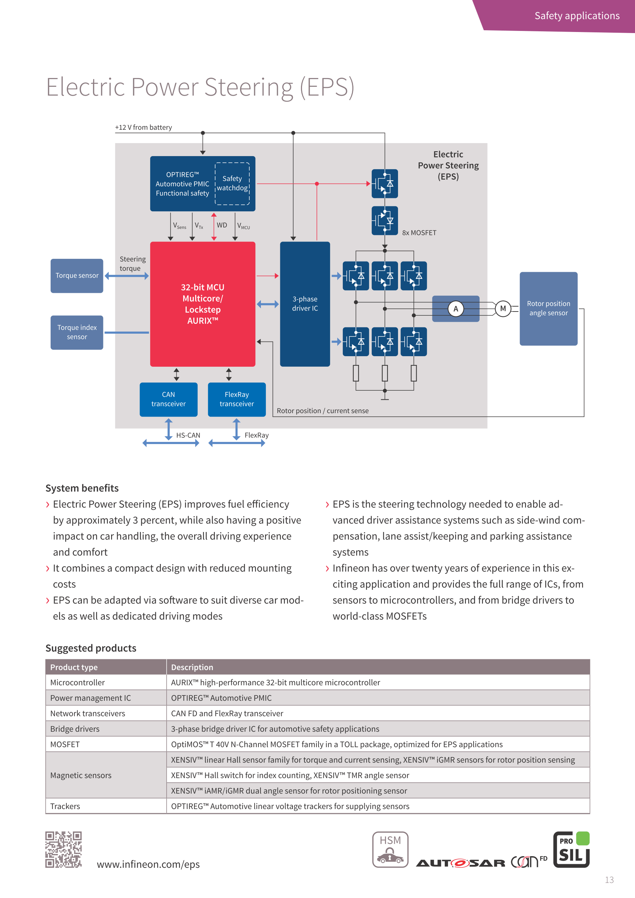

所以如果需要Fail-Operational需要硬件冗余，使用两片lock-step芯片即可

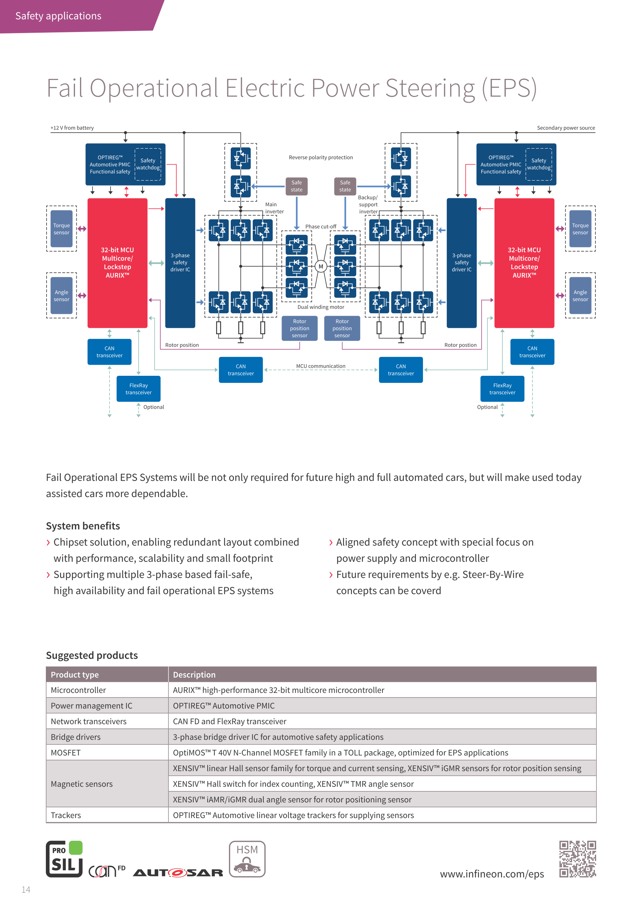

### 6.6.3. 难道必须用Lock-Step吗？
Lock-Step确实是已经被证明安全可靠的系统，但是可以用其他方式同样实现安全的MCU吗？下面是东芝的安全解决方案，只是用了单核+监控方案达到了SIL3。

东芝提供的汽车微控制器具有一个优化的紧密耦合故障监控器作为一种手段，以确保功能安全，并已收到IEC61508 SIL3从一个授权认证机构的技术报告I。这些微控制器提供更安全、更经济的解决方案。

**Toshiba SIL3 Method**

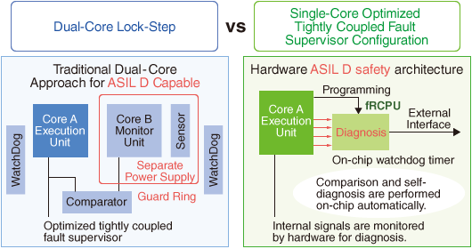

在优化的紧密耦合故障管理器配置中，执行核心A与一组硬件检查器紧密耦合，这些检查器引用内部信号。这样，比较和自我诊断可以自动执行。与传统的双核配置相比，新配置减少了硬件和软件的大小。

**Proposals on Low-Cost Fail-Safe and Fail-Operational Systems**

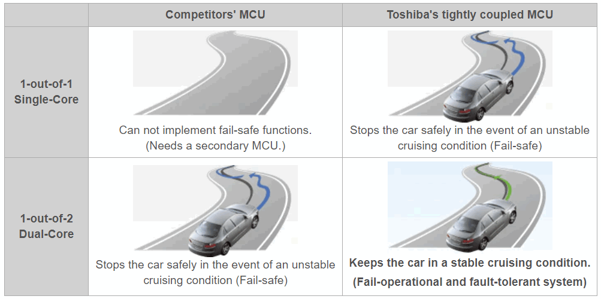

【注】：上图第一行单核就是单核MCU。而下行双核竞争对手为lock-step双核，而东芝的为两片单核MCU。

东芝的单核MCU支持故障安全功能，传统上需要双核实现。此外，东芝的双核MCU支持fail-operational and fault-tolerant系统。

【注】：我们一直看到的都是MCU这种简单的芯片做成lock-step模式，为什么高性能的处理器没有这么做呢？个人理解，因为lock-step确实损失了太多的性能。比如一个硅片只能放下4核的A53，如果做lock-step想达到同样的性能，势必至少得做8核，那目前得工艺可能在同样的硅片上放不下，随着7nm工艺的成熟，下一代ARM可能会在高性能处理器上做lock-step。下面这篇介绍ARM A76AE IP架构的文章就解释了未来的趋势。

### 6.6.4. 关于未来的处理器设计Cortex-A76AE Case Study

根据ISO26262，功能安全是指**由于电气和电子系统的故障行为所造成的危害**而没有不合理的风险。这一声明本身就对任何与安全相关的系统提出了非常具体的要求，而不考虑市场纵向。不同的安全标准也定义了不同层次的安全完整性，即一个特定的系统需要有多“安全”。例如，控制车辆刹车的系统应该具有最高的安全性，因为这样的系统的故障可能是灾难性的。然而，一个控制驾驶员座位上电机的系统，在仍然有安全要求的情况下，将会有一个较低的额定值。在ISO26262中，这被定义为“汽车安全完整性等级”或“ASIL”。ASIL目前被定义为四个不同的级别，从“A”(最低)到“D”(最高)不等。这些级别与系统必须达到的诊断覆盖率有直接关系，换句话说，与给定系统期望检测多少故障有直接关系。

#### 6.6.4.1. The fundamental challenge
随着汽车工业向完全自动驾驶的实现迈进，人们期望这场革命能带来一个更加安全的世界。超过90%的交通事故是由人为失误造成的，而这款新一代汽车最终将使死亡人数减少数万人。然而，要使这类车辆能够普遍部署，仍有几个基本挑战需要解决。自动驾驶系统需要大量的计算性能，因为它们能够控制车辆的方向和速度，所以需要最高水平的安全完整性。

#### 6.6.4.2. So what are the technical options to achieve this?

**1. Lock-Step**

在“Lock-Step”中配置两个CPU内核是实现高诊断覆盖率的传统方法——能够检测错误条件的发生。原理很直接，每个内核都提供给比较器逻辑块，并且每个内核执行完全相同的代码。比较器逻辑在一个周期一个周期的基础上比较输出，只要结果是相等的，一切都很好。如果结果之间存在差异，这可能是应该进行调查或采取行动的故障条件的指示。产生的操作由系统开发人员定义，并且依赖于相关的系统。它可以像重新引导或在给定一段时间之后重新检查错误条件是否仍然存在一样简单。这种锁步进是通过设计固定在硅上的，因此没有灵活性，所以应用是有效地使用两个核心，但只实现了一个核心的性能。这种方法经过了“验证”，**多年来一直适用于微控制器和不那么复杂的确定性微处理器**。

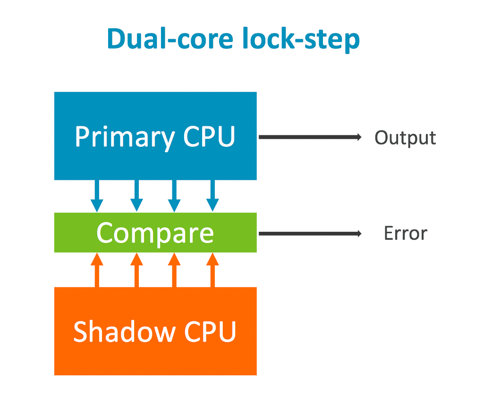

**2. Redundant execution**
  
**提供更高性能能力的cpu通常要复杂得多，也不那么确定，因此锁步更具有挑战性**。这导致了更多的“外来”方法来解决上述挑战。**软件冗余或冗余执行当然是一种选择**。

这种方法假设正在执行两个独立的应用程序，可能在不同的CPU内核上执行，如果正在实现虚拟化，甚至在不同的虚拟机中执行。当应用程序的输出可用时，将通过一个额外的高安全完整性核心(s)对其正确性进行比较，由于其独立的时钟和电源，通常称为“安全岛”。这个安全岛将负责最后的“决定和启动”阶段。这种方法可以减少对高计算集群的诊断覆盖率要求，还可以为实现带来更大程度的灵活性，并提高了效率。然而，它还极大地增加了系统的复杂性，同时降低了交叉检查的粒度。由于软件灵活性的好处，这种方法可能会在未来几年更广泛地应用于某些需要安全性和高计算性能的应用程序。

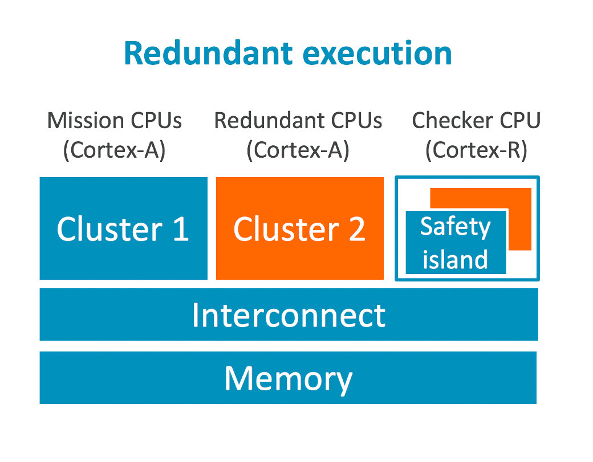

**3. Split-Lock: The best of both worlds**

**最终的解决方案必须是将两种方法的优点——灵活性、性能、简单性和经过验证的优点——结合起来的解决方案**。通过在Cortex-A76AE上引入“分锁”功能，Arm做到了这一点——高计算性能和高安全完整性支持。分锁和锁步有什么不同?本质上，它增加了锁步CPU实现中不可获得的灵活性。它允许系统在启动时以“分割模式”(两个独立的CPU，可用于不同的任务和应用程序)或“锁步模式”(CPU的锁步用于高安全完整性应用程序)进行配置。这种灵活性甚至可以扩展到支持潜在的故障操作模式——在降级模式下继续操作而不是完全关闭系统的能力。例如，在锁步模式下运行时，如果一个内核开始出现故障，系统可能会停止运行，并离线(拆分)故障内核，从而允许在降级的操作模式下继续运行。这种“可分割的”功能对于任何自动驾驶系统都是至关重要的。

在Cortex-A76AE自主类处理器中实现的`Split-Lock`功能也允许相同的基础设计在多个应用程序中使用，无论安全与否，例如车载信息娱乐系统以及自动驾驶系统，都可以在整个供应链中实现巨大的设计效率。

#### 6.6.4.3. Summary
Cortex-A76AE是Arm新推出的安全就绪程序的最新成员，增强了丰富的功能安全知识产权遗产。它是第一个集成了安全性的自自动驾驶类处理器——计算性能级别与分锁功能相结合，在汽车领域实现了新的创新和可伸缩性。该产品由业界最广泛的安全IP组合所补充，还包括软件元素、工具和全面的文档。
了解更多关于Arm Cortex-A76AE的分锁功能:第一个自动驾驶类处理器和Arm安全就绪程序。

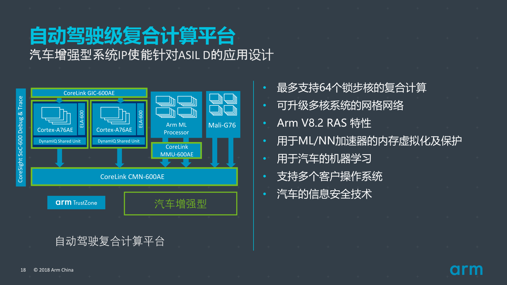

## 参考资料
- [Toshiba Functional Safety Technologies](https://toshiba.semicon-storage.com/ap-en/product/automotive/micro/functional-safety.html)
- [Evolving safety systems: Comparing Lock-Step, redundant execution and Split-Lock technologies](https://community.arm.com/developer/ip-products/system/b/embedded-blog/posts/comparing-lock-step-redundant-execution-versus-split-lock-technologies)
- [Application Note: Cortex-M33 Dual Core Lockstep](http://infocenter.arm.com/help/topic/com.arm.doc.ecm0690721/ARM_ECM_0690721_Cortex_M33_DCLS.pdf)
- [AURIX™ 32-bit microcontrollers for automotive and industrial applications](https://www.infineon.com/dgdl/Infineon-TriCore_Family_BR-2018-BC-v03_00-EN.pdf?fileId=5546d4625d5945ed015dc81f47b436c7)
- [Addressing functional safety applications with ARM Cortex-R5](https://community.arm.com/developer/ip-products/system/b/embedded-blog/posts/addressing-functional-safety-applications-with-arm-cortex-r5)
- Safety Manual for S32V234
- [Functional safety: What is Arm doing to support this critical capability?](https://www.armtechforum.com.tw/upload/2017/Hsinchu/B6_Functional_Safety_What_is_Arm_Doing_to_Support_this_Critical_Capability_HSU.pdf)
- [Integrating Functional Safety with  ARM](http://www.esbf.info/files/Embedded_Security_20151112/Embedded%20Security%20Forum%2020151112%20-%20Integrating%20Functional%20Safety%20with%20ARM%20-%20%E8%80%BF%E7%AB%8B%E5%B3%B0.pdf)

