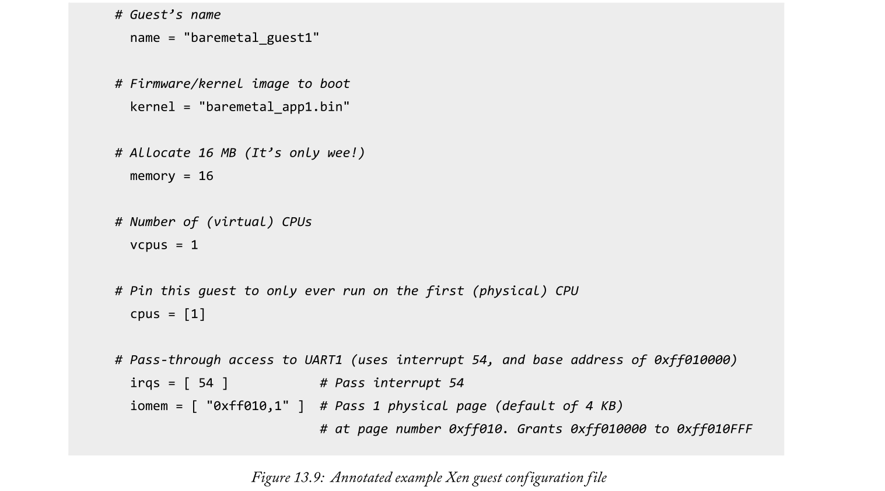

# 7. Xilinx Zynq MPSoC功能安全

## 7.1. MPSoC体系结构介绍
## 7.1.1.  Zynq MPSoC Device Families
所有Zynq MPSoC器件都在同一芯片内包含处理系统（PS）和FPGA可编程逻辑（PL）。PS是设备内的专用和优化的硅元件，包含许多不同的处理单元，以及平台管理和安全系统。PL作为FPGA架构的可编程区域存在，能够加速任意逻辑功能，并且在运行时可重新配置。

目前有三种不同的Zynq MPSoC器件系列可供选择，每种器件都具有相似的基本元件。设备系列被称为CG，EG和EV，并且由于PS和PL内的资源配置而彼此不同。我们将首先讨论每个器件系列的PS之间的差异，然后探讨PL中存在的变化。

有两种类型的PS可供选择，提供各种电源管理和处理功能。这些描述如下：
- 第一个PS包含双核应用处理单元（APU）和双核实时处理单元（RPU）。该PS主要由CG设备系列使用。
- 第二个PS由四核APU，双核RPU和Arm Mali图形处理单元（GPU）组成。该PS由EG和EV设备系列使用。

图3.1提供了Zynq MPSoC器件系列和每个系列中存在的PS的直观表示。完成后，PL也包括在内。

每个芯片的PL中包含的资源也在不同系列之间变化。此外，EV设备系列是唯一包含H.264 / H.265视频编解码器的系列。

表3.1提供了每个Zynq MPSoC器件系列的特性以及可用的FPGA可编程逻辑单元的数量。请注意每个器件系列的应用和实时处理器之间的速度差异。

必须注意FPGA可编程逻辑对应于**速度等级**。这表明与FPGA中的逻辑元件相关的时序延迟。在撰写本文时，Zynq MPSoC的PL有五种不同的速度等级。它们是1，L1,2，L2和3，其中**较高的值对应于最快的FPGA可编程逻辑**。包含字母“L”的速度等级表示FPGA可编程逻辑功耗低。PL的可用速度等级取决于Zynq MPSoC器件系列。您可以在[1]中找到每个设备系列可用的速度等级。

### 7.1.2. Power Domains
Zynq MPSoC有四个主要电源域：低功耗域（LPD），全功率域（FPD），PL电源域（PLPD）和电池电源域（BPD）。每个都是相互独立的，可以隔离以降低功耗并实现功能隔离（安全和安全应用和任务的基本要求）。存在于LPD内的PMU有助于每个域的上电和断电。图3.8说明了每个电源域可访问的处理元素和功能。

请注意，使用PL时，PLPD将处于活动状态，并要求Zynq MPSoC以**全功率模式**运行。但是，可以在不使用时关闭PL并继续使用APU和其他全功率处理元件，因为它们存在于不同的电源域中。类似地，PLPD可以在FPD关闭时运行。

## 7.2. 功能安全设计原则与Xilinx架构支持
在安全关键系统的实施中可以采用几种策略[8]。本节继续总结安全系统的一些常见设计原则，并在适当的时候，重点介绍Zynq MPSoC中的架构支持以及Vivado中可用的安全相关IP。

### 7.2.1. 冗余
设计安全关键系统的一种流行方法是引入冗余。这通常意味着实现设计单元的多个实例，并基于“投票”机制确定正确的输出 - 即物理意义上的冗余。由于这意味着额外的资源，成本敏感型应用程序的一种可能替代方案是`多次重复相同的任务`（“时间冗余”），尽管所涉及的额外延迟可能不适合所有类型的应用程序，并且单个实例减少了failure-resistance(对故障的抵抗性)。出于这个原因，我们讨论的其余部分侧重于物理冗余。

#### 7.2.1.1. 冗余如何工作
冗余涉及实现设计单元的多个功能相同的副本，并比较产生的结果。然后，基于随机错误（例如SEU）极不可能以相同方式同时影响所有实例，选择最常发生的结果（即，具有最多“投票”的结果）。因此，冗余提供了检测faults和识别正确结果的能力。冗余的另一个好处是，如果其中一个冗余实现fail，系统可以继续运行（尽管对任何后续faults或failures的阻抗水平降低）。

通常使用具有三个实例的冗余，称为三模冗余Triple Mode Redundancy (TMR)。如果只有两个输出要比较，如果它们不同，就没有办法说明哪个是正确的;但有三个，应该总是至少有2比1投票赞成正确的结果。这些选项如图9.5所示。双模冗余Dual mode redundancy仍然具有识别Fault已发生的益处，这允许系统采取适当的缓解动作（例如重置组件或重复操作序列）。Zynq MPSoC器件上的实时处理器可以使用双冗余操作，此功能将在第9.3.4节中进一步讨论。

TMR实施中的潜在弱点是检查逻辑，其对投票进行计数，并且其本身可能受到随机故障的影响。为了解决这个问题，可以复制检查逻辑，使其也是冗余的。所需的正确性水平可以是严格的，即结果必须逐位相同，或基于阈值[8]指定。

有时需要更高级别的冗余 - 使用四个或五个实例提供一定级别的故障操作功能（采用四个实例允许一个故障，同时仍保持至少检测故障所需的三个实例最小值;五个实例 将允许两次失败，等等）。这种方法用于航天飞机的设计，它通过四个冗余主处理器和一个备用处理器提供。

冗余可以在系统内的各种层级实现，从低复杂度逻辑功能和软件组件，一直到处理器级，并且安全关键系统可以采用多层冗余。更复杂的系统通常将冗余与多样性结合起来。

#### 7.2.1.2. 优点与缺点
冗余的主要优点是它提供Fault/Failure检测功能，并防止Failure，从而提高系统的安全性。这也更有利于可靠性。

在基于SoC的系统环境中，一式三份地实现硬件组件意味着更大的资源成本和功耗，甚至达到需要更大设备的程度。软件元素内的冗余会增加处理器的负载，这可能会对性能产生影响。此外，实现具有冗余方案的系统的增强的复杂性需要更多的设计工作。在确定适当的冗余级别时，应结合安全要求考虑这些因素。

#### 7.2.1.3. 在Zynq MPSoC上实现冗余
在Zynq MPSoC中，有各种用于合并冗余的机制。我们可以将它们大致归类为：
- 本质上冗余的架构特性 - 值得注意的是，Zynq MPSoC平台管理单元（PMU）和配置安全单元（CSU）都是用TMR实现的[19]。这些单元中的每一个都是设备整体safe and secure操作的基础，因此TMR用于提供高度可靠的正确操作。
- 具有多个实例的架构特性（有助于实现冗余） -  Zynq MPSoC具有多个内核，具体数量取决于设备。如果需要，设计人员可以选择将这些作为冗余方案的一部分，但也可以选择独立部署处理器。特别是，这对RPU可以在特殊的冗余“lock-step”模式下运行，这将在9.3.4节中进一步说明。
- 由设计人员专门实现冗余的组件 - 最后一类是指设计人员可能希望包含的冗余软件和硬件组件，作为其安全方案的一部分。鉴于设备上存在多个处理器和PL，开发具有在一个或多个层次结构级别的冗余的自定义实现的空间很大。IP Integrator支持通过一组预先验证的IP模块实现TMR。

在每种情况下，我们使用术语“冗余”意味着组件的所有副本都是等效的，例如，在PL上实现的设计单元的三个实例以完全相同的方式指定相同的功能，并且使用物理上分离但在其他方面相同的硬件资源集来实现。另一种相关方法是引入多样性的一个方面。

### 7.2.2. 多样性
多样性类似于冗余，在某种意义上它需要设计单元的多个副本。区别在于，当采用多样性时，设计单元以彼此不同的方式实现与/或操作。
#### 7.2.2.1. 多样性如何工作
多样性类似于冗余，但是设计单元之间存在差异，与/或设计单元的操作。有目的地引入不相似的方面以减少系统Error（例如，软件和硬件设计Bugs）的可能性以及可能以相同方式影响多个实例的可能的CCF。

物理多样性需要创建多个实例（例如，在三倍的情况下为三个），并且这**些实例具有相同的功能，但在实现方面彼此不同**。除了核心功能方面，通常可以避免可能共享的存储器，连接总线等。相反，每个不同的实例与其他实例的共同点尽可能少，这减少了单个错误影响所有实例的可能性。

也可以实现时间多样性，这意味着实例的操作是有目的地按时分布的（例如，模块的执行可以通过时间延迟分开，在比较和投票之前进行重新调整，如在TMR方案中）。时间差异提供了一定程度的保护，防止可能导致共因故障的瞬态Fault。

结合时间和物理多样性的方法如图9.6所示。这里，模块的颜色代表功能（顶部）和实现（底部） - 因此所示的三个副本具有相同的功能但不同的实现。随着时间的推移，三个模块的执行交错​​，在比较阶段之前插入适当的延迟以重新同步输出。

#### 7.2.2.2. 在Zynq MPSoC上实现多样性

Zynq MPSoC为将多样性融入设计提供了相当大的空间。这部分源于其固有的多处理器能力，这为使用物理上不同的资源实现多个系统组件实例提供了明显的机会，甚至可以并行运行特定算法的替代硬件和软件版本。硬件/软件方法需要非常不同的实现（减少常见设计错误的可能性），同时还使用物理上独立的物理资源，具有不同的电源，时钟和IO设施，从而降低了CCF的可能性。

Zynq MPSoC器件包含四个电源域：
- Battery Power Domain (BPD)
- Low Power Domain (LPD; contains R-5 real-time processors)
- Full Power Domain (FPD; contains A-53 application processors)
- PL Power Domain (PLPD)

这些域在芯片上彼此物理分离。在某些情况下，还有各个处理器内核的电源门控选项。除了为核心加密和计时任务保留的电池电源域之外，关键设计组件可以在这些域中的两个或更多个域中进行多样化。

在PL电源域内，可以创建设计单元的功能等效副本，每个副本具有不同的物理实现。这些将被合成以生成需要不同资源和路由集的替代网表，从而在PL上产生不同的布局。更进一步，采用Xilinx的隔离设计流程（IDF）可以确保模块完全相互独立，这将在9.3.3节中介绍。

多样性的概念也与先前与Arm Cortex-R5实时处理器配合使用的“dual-lockstep”模式有关。

### 7.2.3  Isolation Design Flow
（BPD，LPD，FPD和PLPD）中列出的电源域在芯片上彼此物理分离，并且可以使用PMU彼此隔离。通过引入模块之间的物理分离，可以将稍微相关的方法应用于系统的PL部分。使用隔离设计流程（IDF）可以实现这一点，这是一种用于safety和security应用的Xilinx设计方法。虽然不是Zynq MPSoC特有的，但它可以在Zynq MPSoC系统中发挥良好作用。
#### 7.2.3.1. 为什么需要隔离? 
特别是在Safety和Security应用中，可能需要在设计中强制某些模块的物理分离，并仔细控制它们之间的任何通信。这具有使模块更加独立的效果，因此从安全角度来看，在没有CCFs风险的情况下实现冗余的可能性更大。图9.7显示了一个指示性的IDF平面图，而功能安全设计的IDF平面图的实例可以在[2]中找到。

#### 7.2.3.2. 使用隔离设计流程
通过采用基于IP Integrator的标准硬件设计流程中的一些额外步骤，在Vivado中遵循IDF。特别是，当寻求模块的物理分离时，布局规划比平时起着更重要的作用。在设计过程的早期阶段需要将功能模块分配给芯片的定义区域，并且这些隔离模块由“fences”分隔，即，否则未使用的逻辑和布线资源的strips，使得在它们之间存在物理间隙。他们。只允许通过专用的“可信路由”路径进行通信。这些功能在图9.7中突出显示。

IDF还集成了一个工具，用于检查隔离的成功实施，Vivado隔离检验器（VIV）。该工具实际上是一组设计规则检查（DRC），其确定满足隔离所需的各种标准，例如，正确实现了模块之间的隔离，**并且来自不同隔离模块的引脚不是彼此相邻的**（从安全角度来看，这会引入CCF的风险）。

### 7.2.4  实时处理器：双锁步模式
Zynq MPSoC提供的最重要的安全相关功能之一是RPU中的两个Arm Cortex-R5处理器能够以自检方式运行。

RPU处理器内核可以以两种不同的模式运行：作为普通的双核处理器，或者工作在安全模式。后者称为“双锁步”模式，两个处理器内核采用相同的操作，具有较小的时间偏移，使用检查机制来确保正确性。图9.8中提供了一个概念图，显示了RPU在双锁步模式下的操作，而扩展的细节可以在第7章的实时处理系统中找到。

双锁步模式采用多样性，使得两个处理器内核执行相同的处理操作，但在时间上稍微偏移（2个时钟周期）。这减轻了同时以相同方式影响两组操作的辐射事件。需要同步和检查逻辑以确保两个内核产生相同的输出 - 如果不是，则标记故障，其处理被定义为系统设计的一部分（例如，RPU可以生成要由PMU根据用户定义的代码）

虽然双锁步模式将RPU的潜在工作负荷降低了50％，而替代的“性能模式”，其中两个核心可用于单独的处理任务集，但它确实代表了实施安全关键系统的重要资源。

### 7.2.5.  共因故障与系统监控
如本章前面所述，嵌入式系统中存在CCF的潜在来源，例如由于系统内多个元件共享的时钟，电源和IO资源。像温度这样的环境条件也可能是CCF的原因，例如 如果温度超过规定的工作范围，则可能同时以相同的方式影响多个子系统。系统监控保护的最重要的要素之一是RPU  - 锁步模式下Arm Cortex R-5处理器内核的操作本身就是一种安全措施，但由于CCF，这两个内核可能同时fail。

作为缓解可能Failures的主动策略的一部分，可以对系统的某些方面进行监控。Zynq MPSoC通过设备的每个PS和PL部分中的专用系统监视器（'SysMon'）组件支持此功能。

#### 7.2.5.1. 系统监控如何工作？
通过测量内部和电源电压值，片上温度，外部模拟信号电压等来进行系统监控，以确保它们保持在指定的工作范围内。SysMon组件还包括一个10位ADC，可以测量外部信号。

PS和PL SysMon实例在操作上非常相似，适用于Zynq MPSoC器件的两个独立区域。它们之间的几个关键差异包括ADC的采样频率（PS为1MHz，PL SysMon为200kHz），编程接口选项，以及PL中辅助模拟输入的可用性，而不是PS SysMon组件的可用性。

#### 7.2.5.2. 在Zynq MPSoC上实现系统监控
设计人员可以选择使用Zynq MPSoC器件上的两个SysMon组件中的一个或两个，即PS SysMon和PL SysMon。后者需要在硬件设计（Vivado框图）中实例化，以便允许访问其全部功能。

PS和PL SysMon组件通过一组专用寄存器进行配置和查询。例如，这允许设计人员为不同信号上的电压条件设置自己的自定义阈值，并指定引发警报的条件（PL和PS SysMon组件各自提供一组16种不同的警报输出）。它们充当PMU处理器的中断，其中软件例程确定响应报告的问题采取什么动作。例如，PMU可以通过执行电源域之一的重置来进行响应。如果芯片温度超过临界上限（默认为125摄氏度），还可以选择让系统执行自动关闭，以防止损坏设备。

### 7.2.6.  Error-Correcting Code (ECC) Memory
虽然可以使用TMR和多样性技术来减轻逻辑电路中的随机故障，但是由于可能存在大量不同类型的数据并且容易受到SEUs（Signle Event Upset）的损坏，因此特殊处理适用于安全应用中的存储器。

#### 7.2.6.1. ECC内存如何工作？
ECC存储器通过向存储器中保存的数据添加额外位来工作，从而可以进行奇偶校验检查以检测并可能纠正错误。错误保护程度随着添加的奇偶校验位的数量而增加，尽管这意味着存储容量和访问时间方面的开销，但由于其提供的数据完整性，ECC在安全系统中通常被认为是值得的。

ECC基于汉明码[5]，在计算和信息理论的标准教科书中有很好的涵盖。最基本的奇偶校验检查能够检测数据字中是否存在奇数个位错误（最有可能是单个错误），但不能确定其位置。这意味着无法纠正错误。稍微增加奇偶校验组件允许生成关于错误位置的信息，使得可以校正数据字内的一位错误，并且检测到第二错误但未校正。通过使用更多奇偶校验位可以实现更高级别的错误保护（校正多于一个错误）。

ECC的缺点是隐含的附加存储，以及执行奇偶校验生成和校正处理的处理开销，这意味着分别略微增加了写入存储器和从存储器读取的时间。
#### 7.2.6.2. 在Zynq MPSoC上实现ECC内存
Zynq MPSoC器件在其各种处理元件中包含许多存储器和高速缓存。包含在CSU和PMU组件中的关键存储器预先配备了ECC，其功能透明。ECC支持也可以在其他元素中使用，并且可以根据需要合并，例如，通过指定RPU和APU子系统以及双倍数据速率（DDR）外部存储器控制器的选项。

ECC内核可以包含在IP Integrator设计中，这样PL中实现的存储器以及与外部存储器之间的数据传输可以选择性地包括错误保护。作为进一步的措施，Interleaving可以应用于ECC保护的存储器，这减少了Clustered SEU导致不可纠正的错误的可能性。

### 7.2.7  故障注入与测试
需要考虑的一个重要实际问题是如何通过测试来验证安全关键系统。毕竟，这样的设计被开发为对由于诸如辐射的环境条件而随机（并且希望非常罕见）发生的误差具有鲁棒性。为了测试目的，必须以受控和有效的方式合成这些错误。

在这样做时，还要记住Zynq MPSoC器件中可能受错误影响的不同类型的存储器。这包括配置存储器（其中加载了比特流文件的内容），以及PL上的Block RAM，分布式RAM和触发器，以及PS内的各种存储器。

支持故障注入和测试是Soft Error Mitigation（SEM）控制器的功能之一，它可作为IP Integrator [15]中的块（IP内核）使用，并与UltraScale和UltraScale +器件（FPGA和SoC）兼容。SEM控制器的主要功能是减轻配置存储器中的错误。以这种方式使用，Core可以集成到产品设计中;它还提供错误注入功能，以便在开发阶段使用。

进一步的fault injection测试机制可以作为设计验证过程的一部分。考虑到所实现的功能的性质因系统而异，这可能需要更多的定制解决方案。例如，可以合并模块以随机翻转特定数据路径中的比特，合成地引入由于辐射效应而通常产生的SEU类型错误，从而提供锻炼和测试错误缓解措施的方法，例如冗余逻辑实现。类似地，软件可以设计为结合fault injection用于测试目的，测试过程由仿真平台辅助，例如Quick EMUlator（QEMU）。fault injection测试的主题是研究界广泛关注的领域。

## 7.3 异构多处理器软件开发

使用AMP可以扩展我们软件系统的边界，利用RPU的Cortex-R5和可能已在PL中实现的任何MicroBlaze处理器。术语AMP意味着我们在每个处理器上运行独立（可能不同）的软件堆栈。每个处理器都没有单独的操作系统，如同有SMP配置。本节的其余部分介绍了Zynq MPSoC中AMP的两个常见用例。首先，我们介绍OpenAMP框架，用于实现无监督的AMP系统，通常用于将任务卸载到RPU和MicroBlaze处理器。其次，我们考虑如何使用Xen管理程序将AMP的优势应用于APU。在我们深入之前，让我们首先考虑一下这些优势是什么？

除了允许我们使用Zynq MPSoC的异构处理器之外，AMP还鼓励我们将复杂的系统分解为更小的，独立开发的任务。这有几个很好的结果：
- 通过较小的独立任务实现易于开发 - 尤其是在团队之间分工时。
- 我们可以混合许多软件堆栈。由于没有单一操作系统控制所有处理器，我们可以选择使用最适合每项任务的软件堆栈。AMP系统通常会使用许多不同的软件堆栈，包括Linux，FreeRTOS和裸机。

AMP还使我们可以明确控制在哪个处理器上执行哪个任务。在开发具有任何硬实时元素的系统时，这种控制非常有用。这种精细控制允许处理器专门用于实时任务，帮助其确定性并最小化其最坏情况延迟（与SMP配置不同，它永远不需要等待计划的CPU时间）。

### 7.3.1  Unsupervised AMP with OpenAMP
OpenAMP是一个框架，旨在通过使用现有的开源组件来开发AMP系统。要了解OpenAMP系统的结构，我们首先介绍一个简单的场景。图13.4描述了一个Cortex-A53处理器将实时任务委托给一个Cortex-R5处理器的情况。图13.4分三个阶段显示了Cortex-R5：复位时，由Cortex-A53配置，最后是执行。

请注意，这里有一些隐含的层次结构 - 在此示例中，Cortex-A53充当“Master”，而Cortex-R5则是“Remote”从属处理器。在运行时，Master决定将任务卸载到Remote处理器，并在内存中设置该处理器的固件映像。然后Remote处理器退出复位并开始执行其委派的任务。此执行的一个重要部分是与主处理器通信 - 这对于至少返回结果是绝对必要的！

OpenAMP通过提供两组功能，使这个常见的AMP场景尽可能简单：
- 1.生命周期管理（LCM）：允许主处理器根据需要为远程处理器加载，运行和卸载固件映像。
- 2.处理器间通信（IPC）：允许主处理器和远程处理器之间的消息传递。

LCM功能由'remoteproc'处理，一个远程处理器框架[11]，IPC功能由'rpmsg'处理，这是一个远程处理器消息框架[12]。remoteproc和rpmsg都是在Linux内核中实现的预先存在的框架。OpenAMP利用这些现有的内核实现，但也提供独立的实现来支持其他（非Linux）软件堆栈。例如，OpenAMP可以支持Linux主机与FreeRTOS或裸机远程处理器通信。虽然这是最可能的配置，但运行FreeRTOS或裸机软件堆栈的处理器也可以用作OpenAMP主机。

为了了解OpenAMP的技术细节，让我们考虑一个更具体的AMP场景，如图13.5所示。有一个Linux主机在其中一个Cortex-A53处理器上运行，与运行FreeRTOS的远程Cortex-R5通信。请注意，主处理器和远程处理器之间不必存在一对一的关系，可以存在一对多的关系。单个主设备可以选择启动许多远程处理器 - 这些远程处理器甚至可以成为他们自己的远程处理器的主设备。此处使用的示例是一个主设备和一个远程设备，但“软件定义的无线电应用程序的混合示例”（第348页）使用了多个远程处理器的配置。

在图13.5中，远程处理器已使用remoteproc初始化。对于远程进程的其余部分，rpmsg负责启用两个处理器之间的通信。

Rpmsg使用两种硬件机制来提供处理器间通信：处理器间中断（IPI）和共享内存。IPI用于指示共享存储器中是否存在新消息，而无需在软件中进行任何轮询。Zynq MPSoC具有对IPI的硬件支持，详见技术参考手册[13]的第13章（“中断”）。共享内存用于存储实际消息，并由另一层名为“VirtIO”的软件管理（我们保证在本节中不再引入任何框架名称！）。rpmsg使用VirtIO作为传输层，如[14]中所述。主处理器将为每个远程处理器配备一个rpmsg通道。在每个通道中，开发人员可以选择使用多个逻辑端点来分隔消息类型。这类似于TCP/IP连接，其中许多端口号（或rpmsg的“端点”）可用于每个单独的IP地址（或“通道”）。

接下来，我们继续考虑OpenAMP的remoteproc组件。Remoteproc的基本功能都与LCM [15]有关，包括：
- 将远程固件加载到内存中以供远程处理器执行。
- 通过从Reset释放远程处理器来开始执行远程固件。
- 通过初始化rpmsg通道在主处理器和远程处理器之间建立通信
- 关闭远程处理器。

通过这四个功能，我们可以控制远程OpenAMP应用程序的生命周期。但是，必须在固件映像中嵌入一些额外信息，以便remoteproc可以执行这些任务。这些额外信息定义了远程处理器所需的系统资源 - 包括CPU标识符，远程固件的代码和数据应放在内存中的地址，以及用于初始化rpmsg的IPI/共享内存信息。这些详细信息放置在固件映像内的静态链接“资源表”中，并在准备远程处理器时由remoteproc解析。

图13.6总结了远程OpenAMP流程的整个生命周期。master使用remoteproc API来加载和启动远程固件。在复位后，远程处理器初始化rpmsg所需的资源，触发握手以建立rpmsg通道。然后，应用程序正在运行，可以使用rpmsg API与主服务器进行通信。当要关闭远程处理器时，主设备会向远程控制器发送自定义“关闭”消息，然后远程处理器执行任何特定于应用程序的清理操作。关闭消息被确认，双方都关闭了他们的remoteproc实例。

最后一个涉及的主题包括开发人员如何使用现有应用程序并使用OpenAMP将其与更大的Zynq MPSoC设计集成。如图13.6所示，远程固件负责一些初始化和清理任务，以及与主站进行通信。开发人员必须确保他们实施：
- 1.用于描述远程固件所需资源的资源表。。
- 2.在开始初始化rpmsg时调用remoteproc_resource_init（）。
- 3.定义回调函数，描述如何处理rpmsg通道创建，接收和删除事件。
- 4.使用rpmsg_send（）将任何特定于应用程序的消息发送回主处理器。
- 5.当告知要关闭时，调用remoteproc_resource_deinit（）来清理分配的资源。

只需要极少量的额外开发工作就可以使应用程序很好地集成到OpenAMP系统中。通过OpenAMP，我们可以扩展我们的Zynq MPSoC软件，不仅可以利用运行Linux的APU，还可以将实时/硬件接口任务委派给RPU，甚至是MicroBlaze处理器。这对于使用异构处理器来说是绝对重要的技能，幸运的是，OpenAMP使得实现相对轻松。

### 7.3.2  Supervised AMP with the Xen Hypervisor
软件虚拟化在桌面计算中已经司空见惯。虚拟化允许一组处理器运行许多不同的“客户”操作系统（通常称为“虚拟机”或VM）。称为hypervisor的软件层负责管理这些VM。虚拟化可以提供受监督的AMP环境，因为它可以支持许多不同的（或非对称的）软件堆栈，这些堆栈都由hypervisor监督。虚拟化在桌面和服务器中有许多不同的用途 - 包括始终保持服务器满载（因此需要更少的处理器和节省能源），隔离软件以确保Safety或Security，以及支持为不同平台编写的legacy软件。实际上，这句话甚至是使用在VM中运行的软件来键入的。

在嵌入式系统中使用虚拟化是一项相对较新的技术（Xen的Arm支持于2013年首次发布！）。这已经被诸如Zynq MPSoC之类的具有硬件支持虚拟化的处理器的设备开始采用。在Zynq MPSoC中，这种硬件支持源于Cortex-A53的Armv8架构和SMMU。这些对于以接近native性能运行虚拟化软件至关重要。有关虚拟化的硬件支持的更多信息，请参见第155页的“系统虚拟化”和第206页的“使用虚拟化和Armv8隔离软件”。因此，现在我们可以在Zynq MPSoC中使用虚拟化，让我们考虑一下为什么我们想要。

嵌入式系统中有许多用于虚拟化的用例，但其中大多数都源于客户之间的隔离以及客户的动态管理。
- 隔离意味着每个guest虚拟机都可以自由运行不同的软件堆栈。在APU中，开发人员可以选择同时运行Linux，FreeRTOS和裸机应用程序。每个任务都可以在最适合它的平台上独立开发。
- Hypervisor强制执行严格隔离，以便每个guest虚拟机只能与已明确分配给它们的外围设备进行交互。这有助于确保设计的安全关键部分即使另一个客户崩溃也能保持运行。实际上，安全认证通常需要这种去耦来证明良好的设计实践。
- Guests解耦也会使系统更容易集成和维护。例如，如果我们更新现有Guest或引入新Guest，我们可以确信它不会对现有Guest产生实际影响。同样，我们可以独立测试每个Guest，然后只需要一个非常简单的集成过程来协调整个系统。
- hypervisor层使我们能够检测并响应每个guest虚拟机中的故障或崩溃。我们可以通过hypervisor监控每个访客，发现可能导致操作系统崩溃的故障以及其中的任何监控代码。为了提供最佳的正常运行时间，Guest可以重新启动，或者可以维护冗余的后备Guest。

这只是几个例子，但我们可以开始理解为什么嵌入式系统中的虚拟化趋势已经开始。有许多不同的虚拟机管理程序解决方案，但在使用Zynq MPSoC时，大多数开发人员可能会选择Xen虚拟机管理程序。为何特别是Xen？

Xen正式支持Zynq MPSoC硬件（利用Armv8的虚拟化功能），并通过DornerWorks [18]提供商业支持。从各方面来说，Xen都是免费的，并使用GPLv2许可证。进一步采用开源软件，它已成为Linux平台上事实上的虚拟化解决方案，并被作为Linux Foundation的一部分采用。显然，Xen不会很快消失。这也意味着在Zynq MPSoC上为Xen制造的应用程序将在未来几年内可移植到其他支持Xen的系统。

现在特别关注Xen，它是一个“layer  one” hypervisor，意味着它直接位于硬件上方。所有客户操作系统（或Xen命名法中的“域”）都位于Xen之上。要为Xen提供控制接口，总会有一个特权域名为“dom0”。Dom0通常是一个Linux系统，可以访问硬件，并可以通过用户友好的工具（如'xl'）与Xen内核进行通信。该工具使用户能够通过Linux控制台管理Guest域 - 包括Guest域的LCM，提供对每个域的控制台访问，以及控制每个域的资源（例如CPU数量，内存，调度提示等等）。图13.7显示了在APU上运行的基于Xen的监督AMP系统的示例。这包括用于控制的dom0，Xen内核以及运行不同软件堆栈的示例Guest域。

暂时将其与Zynq MPSoC相关联，如果Guest域严格隔离，我们如何与硬件（例如PL中实现的IP）进行交互？实际上有两种方法可以在Xen系统中实现这些驱动程序[17]。第一种也是比较熟悉的方法是为设备设置一个pass-through。pass-through允许dom0从（通常）单个Guest域授予对外围设备的完全访问权限。Guest域可以完全像没有Xen那样使用外围设备 - 即Guest甚至不需要知道它正在被虚拟化。开发人员可以使用简单的ASCII配置文件告诉Xen实现pass-through，我们将在后面讨论。然后，Xen配置SMMU以将guest虚拟机的内存访问传递到外设，并配置GIC以将来自外设的中断路由到运行guest虚拟机的任何处理器。此配置如图13.8所示。

与硬件外围设备通信的第二种方法是使用“半虚拟化”（PV） - 其中Guest域知道它们正在被虚拟化。对于PV，驱动程序通常分为两个：前端驱动程序和后端驱动程序。这在图13.8中可视化。驱动程序的两半使用共享内存进行通信，其方式与OpenAMP为IPC进行的操作非常相似。

虽然会产生轻微的性能影响，但这种结构有明显的动机：
- 多个guest虚拟机可以安全地共享同一设备，因为它由单个域控制。控制域还可以实现调度方案以防止任何一个Guest独占设备。
- 每个guest虚拟机只需要实现一个通用的前端驱动程序。这在Guest域和实际硬件实现之间引入了一层抽象，从而产生了极其便携和可重用的应用程序。

同样，要触及的最后一个重要主题是**开发人员需要做些什么才能在自己的应用程序中利用Xen**。我们面临与OpenAMP相似的挑战，例如描述每个Guest的资源需求，以及必要时在Guest之间进行通信。首先，PetaLinux工具可以非常容易地用于生成基于Linux的dom0的Xen系统。就目前而言，这是默认的PetaLinux配置，详见[20]。对于系统中的任何Guest域需要两件事：
- 1.Guest的固件映像。例如，裸机elf可执行文件或Linux映像。
- 2.纯文本配置文件，用于描述Xen对guest虚拟机的资源要求。

对于Linux Guest，固件映像可以是另一个PetaLinux项目，甚至是启用了相应驱动程序的自定义Linux构建。

最后，要创建配置文件（例如bare_guest.cfg）描述的Guest域，我们只需使用dom0控制台中的'xl'工具：xl create bare_guest.cfg。

一旦我们在Xen上运行多个guest虚拟机，我们可能希望让它们相互通信。可以使用Xen分配的共享内存区域（如[17]中所述）执行此操作。这与OpenAMP之前看到的机制非常相似。但是，对于guest虚拟机（尤其是Linux guest虚拟机）来说，通过虚拟网络使用TCP/IP进行通信实际上更为常见。这种网络配置非常简单，只需要在guest虚拟机的配置文件中添加一行，并使用任何丰富的现有TCP/IP库。

我们已经看到如何在Zynq MPSoC上使用Xen来启用受监控的AMP，从而可以相对轻松地充分利用APU的多个处理器。这可以是一个非常灵活的解决方案，允许混合软件堆栈，促进解耦，便携式系统设计，并可以使用隔离safety  and security。

## 7.4. Xilinx ADAS Solution (Confidential)

<!-- 

 -->

## 7.5. 现代嵌入式高性能处理器功能划分

- Case1: ARM IP
  

- Case2: Xilinx ADAS

## 7.6. 处理器通信机制

## 参考资料
- [Exploring Zynq® MPSoC](https://www.zynq-mpsoc-book.com/wp-content/uploads/2019/04/MPSoC_ebook_web_v1.0.pdf)
- [详解 Zynq UltraScale+ MPSoC无与伦比的低功耗与高灵活性特性](https://china.xilinx.com/support/documentation/white_papers/c_wp470-ultrascale-plus-power-flexibility.pdf)
- [ABSTRACTING INTER-PLATFORM COMMUNICATION IN AUTOMOTIVE]()
- Xilinx ADAS Solutions
- XAPP1320
- XAPP1335
- XAPP1336
- UG1228
- UG1186