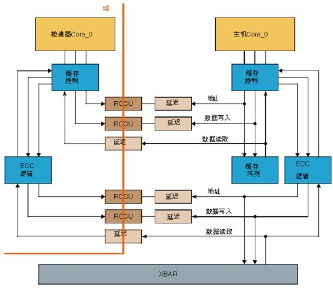

# 8. 安全机制

以下关于安全机制的6个问题来源于[NXP客栈](https://mp.weixin.qq.com/s/eFsPFapd76wiuGQ_sXU6eQ)。

- **Q1: 什么是安全机制? 为什么微控制器需要安全机制?**
  
  - 安全措施:活动或技术解决方案,以避免或控制系统失效和检测随机硬件失效，或控制硬件随机失效或减轻他们的**危害影响**;

  - 安全机制:由E / E功能或元素或其他技术实现的技术方案,为了实现或**维护一个安全的状态**检测故障或控制失效。

  Safety measure的概念定义更宽泛，包含safety mechanism的定义范畴，大家时常提及的MCU的安全机制或产品设计中的安全机制，应该是safety mechanism这个概念。

  在产品中实现安全机制，可防止失效事件导致单点故障或减少残余故障，并防止故障潜伏。支持功能安全应用的MCU，一定提供了诸多安全机制，如：ECC/Lockstep/Watchdog/CMU/BIST等。

  安全机制必不可少，行业内还出现支持ASIL B或ASIL D应用的MCU，两者最核心的差异就在可用安全机制的多少上。

- **Q2: 有软件安全机制和硬件安全机制的区分吗?**

  大部分安全机制是要求软硬件配合完成的，但也有少部分纯硬件安全机制或纯软件安全机制。

  比如常见的Lockstep安全机制，可认为是一种硬件安全机制，在MCU上此机制的实现基本**对用户应用层软件透明**。

  Lockstep锁步核校验
  - 主核和检查核都可以从XBAR和缓存阵列读数据
  - 只有主核对XBAR和缓存阵列进行写操作
  - 主核和检查核都可对缓冲控制读写数据
  - 主核的输出会送到XBAR和RCCU
  - 检查核的输出只能送到RCCU
  - 检查核位于安全域，物理上与主核隔离

  

  一些基本由用户软件自行实现的安全机制，比如CAN通信中的Frame Counter，是在多帧传输中为了防止桢丢失或者帧错乱通过应用层软件对报文进行的编码或加密，这种安全机制可认为是纯软件的安全机制。

- **Q3：安全机制与故障容错时间有关系吗？**

  **安全机制就是为了在故障容错时间内，有效检测故障控制失效影响,并维持系统的安全状态**。安全机制的设计与使用必须考虑故障容错时间。目前MCU安全目标对应的故障容错时间一般为10ms,用户在使用功能安全MCU时一定要考虑这个时间，并且零部件产品级的故障容错时间需要大于MCU的FTTI。

- **Q4:功能安全的微控制器,应如何选择安全机制?**

  在功能安全开发中，选定一款符合功能安全要求的微控制器，到底需要使用哪些安全机制也是工程师需要重点考虑的问题。**原则上，一款ASIL D的微控制器，把MCU自带的安全机制全部用上，并启用safety manual 里要求的一些外部机制 均可支持用户完成ASIL D的功能安全开发，但理解和实现所有的安全机制，极具挑战**。

  这里简单总结一下，一些基本的安全机制是必须启用的，如：**针对Core的Lockstep、针对RAM/Flash的ECC、针对电源的监控、针对时钟的监控(CMU及QA Watchdog)、针对ADC的自测试，以及针对安全机制或寄存器的BIST等**。 其他一些安全机制，可视实际使用了MCU什么资源再针对性的选择相关的安全机制，比如使用了CAN通信，可选择使用E2E保护机制，这是可以参考MCU Safety Manual及ISO26262-5 附录D的安全机制列表进行评估。

  最后，还得通过量化的FMEDA计算来检验是否选择了足够的安全机制，原则上能通过FMEDA计算，达到相应的量化指标，即可认为选择的安全机制已经足够；若FMEDA计算不达标，说明还需要启用更多的安全机制。

- **Q5: 如何保障安全机制本身的安全?**

  安全机制本身也可能出现失效，这在功能安全里一般被认定为latent fault，不属于单点失效。SPC5744P是支持ASIL D应用要求的MCU，针对这款MCU内部提供多种安全机制的自测试，常见的有MBIST和LBIST，是针对储存和逻辑部分的内嵌自测试，BIST一般会在MCU上电后开始自测试，自测试通过MCU才能正常上电，这也是保证上电后MCU安全机制有效可用的一种方式。

  NXP为方便用户进行功能安全开发，同时提供Coretest和sBoot,这两套代码包均包含对部分MCU安全机制的自测试功能实现。

  ISO26262同时要求，针对ASILD的应用，其安全机制可以在一次驾驶循环内测试一次，针对MCU一次上下电，即是一次驾驶循环。ISO2626这条要求，说明针对安全机制，不用在每个FTTI故障容错时间内都对安全机制进行测试，这也减轻了软件开发工作量。

- **Q6: AUTOSAR或MCAL是否自带足够的安全机制？**

  AUTOSAR只是一套标准的基础软件架构，用户需要在此基础上进行二次开发，加入更多的安全机制才能符合功能安全要求，但AUTOSAR基础架构部分已支持四大安全机制。
  - 内存分区
  - 时间监控
  - 逻辑监控
  - E2E保护
    
  MCAL更没有提供足够的安全机制，MCAL只是MCU抽象层的驱动代码包，提供符合AUTOSAR的各项标准接口函数，用户可利用这些功能代码库去实现更多的安全机制。

  所以，用户购买了MCAL或者AUTOSAR之后，不代表已经实现了软件功能安全机制的开发，还需要功能安全软件工程师在此基础上，实现具体的安全机制。

## 8.1. 软件安全需求来源

许多软件安全要求直接来源于**技术安全要求**;然而，除了技术安全要求外，软件安全要求还有其他来源:
- 确保软件健壮性和质量的需求
- 确保不受干扰的要求
  
下图显示了软件安全需求的三个来源:

软件BUG是一个非常重要的错误来源，如果不是汽车功能安全方面的头号错误来源的话。您对安全关键软件了解得越多，您的软件安全需求就会越好。

### 8.1.1 软件健壮性与质量
需求中存在缺陷是事故的主要原因之一。该标准提供了许多关于如何开发安全重要软件的建议，例如，该标准讨论了除了技术安全要求之外的两个核心原则来驱动软件安全要求：
- 第一个原则是确保稳健性和质量
- 第二个原则是免于干涉

将首先讨论确保稳健性和质量，**鲁棒性**具体是指我们是否有软件面临嵌入式输入或stressful的环境条件。例如，无效输入可能是超出其允许范围的参数。

**质量**意味着软件可以满足其功能要求以及非功能性要求。如可维护性，适应性，可用性和性能。

到目前为止，我们已经看到技术安全要求，以及质量和稳健性如何导致软件安全要求。接下来，我们将讨论免受干扰的软件安全要求，设备之间的干扰可能发生在V模型的任何级别。由于软件设备不能始终物理分离，软件干扰是一个特别重要的话题。不受干扰意味着一个软件设备不应导致其他软件设备出现故障，因此，软件被分割成单独的部分以便故障不会传播。

在软件设备具有相同ASIL情况下，ISO26262确实停止强制干涉。但是，当不同ASIL值的软件组件相互通信，或在同一ECU上运行时，你需要证明不受干扰。

为了确保软件设备不会相互干扰，我们需要了解三种类型的干扰，即空间、时间和通信干扰。

## 8.2. 免受空间干扰

免受空间干扰意味着一个软件分区不应该更改另一个软件分区的代码或数据，换句话说，软件设备之间的内存和存储应该是分开的，否则，代码和数据可能会损坏。

实际上，你需要注意读取，写入和执行权限。

想想软件分区之间的关系是一种信任，高级设备不信任任何低级设备，所以ASIL D可以从QM设备中读取，然而ASIL D设备应该尽可能减少QM设备的读数，ASIL D设备也可以写入QM设备，但QM设备却只能读取ASIL D设备，关键设备不应写入较高的ASIL设备。

同样，如果QM设备能够执行由ASIL D设备提供的功能，但是ASIL D设备不会信任QM功能，并且不执行QM功能。

举一个具体的例子，如果QM设备中的软件漏洞错误地为ASIL C分区创建指针地址会发生什么？QM设备可能会写入一个ASIL C设备，这可能会导致违反安全目标，所以我们应该阻止或检测它。

接下来，让我们讨论时间干扰。

### 8.2.1. 免受空间干扰的安全机制

有一些常见的机制可以确保不受空间干扰，比如MPU和相关数据的双重存储。
- MPU是一种预防方法，因为它阻止元素访问它们不应该访问的内存。可以对MPU进行编程，以便在软件元素之间设置正确的读、写和执行权限。
- 双存储相关数据，类似与2的补码是一种检测方法。使用2的补码，您可以检测到数据已经更改并且不再有效。但是你不能再使用这些数据了。

其他防止记忆干扰的机制包括:
- 冗余检查，如CRC，以确保数据不会意外更改。
- 具有内存错误检测和校正功能的微控制器
- 允许软件单元拥有自己的虚拟内存空间的操作系统

提到的一种机制是存储2的补码的安全相关数据。2的补码是二进制中表示负整数的一种方法。

CRC(循环冗余检查)是一种检查数据在传输过程中是否发生了更改的方法。它们的工作方式是向数据添加一个附加值，然后确保该值在传输过程中没有发生变化。

请注意，对于解决死锁，禁用会停止进程抢占的OS中断是低效的，并且可能会影响总体响应时间和系统延迟。另一种选择是由实时操作系统(RTOS)提供的Priority ceiling protocol。
> In real-time computing, the priority ceiling protocol is a synchronization protocol for shared resources to avoid unbounded priority inversion and mutual deadlock due to wrong nesting of critical sections. In this protocol each resource is assigned a priority ceiling, which is a priority equal to the highest priority of any task which may lock the resource. The protocol works by temporarily raising the priorities of tasks in certain situations, thus it requires a scheduler that supports dynamic priority scheduling.[1]

## 8.3. 免受时间干扰-Part1
时间干扰是指随着时间的推移一个设备阻止另一个设备的执行。

例如，如果两个软件设备共享数据，更高优先级的线程可以连续访问数据，低优先级的线程则会一直等待，这被称为**阻止执行**。

还有许多其他时间干扰的例子，我们将讨论几个月。

当两个执行线程需要彼此资源时，会发生**死锁**。线程1拥有资源A需要资源B，线程2拥有资源B需要资源A。

类似的干扰被称为**Livelocks**，两个线程想要相同的资源，在这种情况下，两个线程都有礼貌地让其他线程先行，但它们会搁置一边，然后同时获取资源。

时间干扰的另一个例子是软件系统之间的不正确同步。例如，考虑一辆自主车辆，有用于车辆检测的雷达系统和相机系统，每个系统都有自己的问题，但是如果有问题的时钟不能正确同步，那么传感器融合就无法完成。因为随着时间的推移将无法压缩信号。

因此，时钟需要同步或所有软件系统都需要使用相同的主时钟。

当发生任何时间或执行人相关的故障时，需要采取安全机制，这可能是功能退化，并最终过渡到安全状态以避免安全目标违规。

### 8.3.1. 解决死锁

有多种算法可以避免死锁，包括一种称为禁用中断的措施。当中断被启用时，一个进程可以中断另一个进程。在我们的例子中，线程1需要资源B，并试图获取A，但是线程2不断中断线程1来获取A。禁用中断将允许线程1获取A。

### 8.3.2. 免受时间干扰的机制

避免时间干扰的机制包括循环执行调度、基于固定优先级的调度、时间触发调度、处理器执行时间监视、程序序列监视和到达率监视。

## 8.4. 免受时间干扰-Part2

现在，我们来讨论执行时间的不正确分配和不正确的执行顺序。这些类型的时间干扰的发生条件为软件系统提前执行，推后执行或执行时间太长。功能安全标准建议三种不同的机制用于处理执行时间和执行顺序的故障，它们能实时监督，监测截止期限和控制流量。

所有这三种机制都与查验点一起协作。软件系统会在执行开始和结束时报告其状态.

现场监督会限制给定时间段内软件系统的执行次数，当达到查验点时，系统会分析系统执行的次数。

截止日期监控考察软件系统执行需要多长时间，如果某个系统耗时过长，则会发生错误。

最后，控制流量监控确保软件进度按正确的顺序进行，例如，执行顺序可能无序或软件系统在顺序中间执行而非在开始时执行。

独立的软件块将包括在系统架构内用于分析查验点，如果发生违反安全目标的故障那么系统应该转换到安全状态。

## 8.5. 免受通信干扰
### 8.5.1. 概览
我们要讨论的最后一个干扰源是通信干扰,在车辆系统中软件设备需要交换电子控制单元之间的信息.即使发送者和接收者的ASIL相同,也有必要防止干扰.软件系统之间的通信渠道往往会有较低的ASIL或QM评级，受保护的通信通道将检测数据传输错误.

确保免受通讯干扰的最常见机制之一，被称为 E2E 或者端对端协议，E2E 协议可以帮助防止由于硬件，软件和电磁干扰导致的通信下降。该协议检查数据在传输过程中是否损坏，这样当数据损坏可能违反安全目标时，车辆可以被引导至安全状态。

在车道偏离警告示例中，有一个技术安全要求可以采用 E2E 保护机制解决，其中一个要求是应确保LDW 扭矩请求信号数据传输的正确性和完整性。接下来我们将向你展示 如何将此要求细化为软件安全要求。

### 8.5.2. 通讯干扰的常见原因
造成通信故障的原因有很多。这些原因将在软件安全分析或有时在技术安全分析中进行分析:
- Repetition of information（重复的信息）
- Loss of information （信息丢失）
- Delay of information （延迟的信息）
- Insertion of information  （插入的信息）
- Masquerade or incorrect addressing of information （伪装或不正确的信息寻址）
- Incorrect sequence of information （信息序列不正确）
- Corruption of information （污染的信息）

### 8.5.3. 保障通讯不受干扰的其他机制
有一些方法可以避免通信干扰。这些机制可以用来定义有助于避免通信错误的软件安全需求。确保不受干涉的机制包括:
- Loopback of information （信息回环）
- Acknowledgement of information （信息确认）
- Appropriate configuration of I/O pins （I/O引脚的适当配置）
- Bus arbitration by priority （优先级总线仲裁)
- E2E protocol （E2E协议）

例如，一项技术安全要求是“确保‘LDW_Torque_Request’信号数据传输的有效性和完整性”。该技术安全要求可以细化为软件安全要求，即数据应受End2End机制的保护。

### 8.5.4. E2E保护协议示例规范
下图显示了E2E协议的示例。

该机制涉及在传输数据时添加两个额外的数据字节，称为CRC(循环冗余检查)和SQC(序列计数器)。
- 要计算CRC，需要对要传输的数据运行一个数学公式。然后在传输之前将CRC结果附加到数据上。当接收到数据时，再次对数据集运行数学公式。数据所附的CRC值与接收端计算的CRC值相同;否则，数据数据可能在传输中已损坏。
- SQC只是一个与数据一起发送的计数器。这样接收者可以确保消息没有丢失。

## 参考资料
- Udacity Self Driving Car - Functional Safety
- [NXP客栈: MCU功能安全6问](https://mp.weixin.qq.com/s/eFsPFapd76wiuGQ_sXU6eQ)