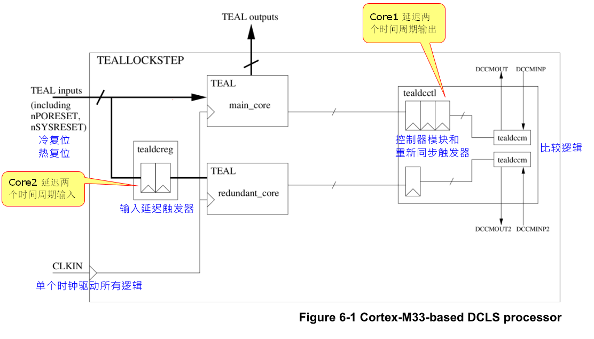
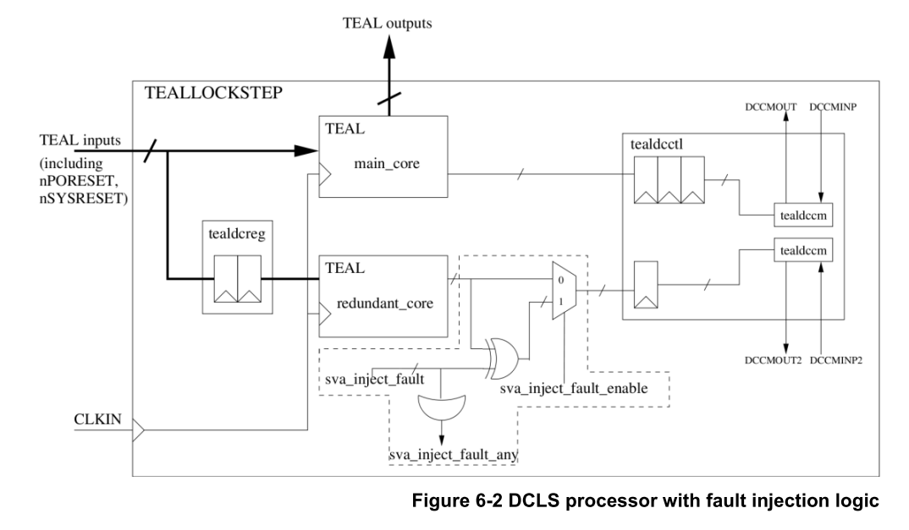

# Cortex-M33 Dual Core Lockstep 
## 2 前言
- DCLS:  Dual-redundant Core Lock-step 
- MCU:  Micro Controller Unit 
- RAR:  Reset All Registers 
- RTL:  Register Transfer Level 

## 3 Introduction
### 3.1  Document purpose 
可靠性是许多嵌入式系统应用中的关键问题，例如工业控制器或汽车电子。双冗余核心锁步（DCLS）是增强微控制器单元（MCU）可靠性的众多技术之一。本应用笔记的目的是帮助硬件开发人员在MCU系统中使用和设计带DCLS的Cortex-M33处理器。
ARM提供了：
- DCLS示例，它是两个Cortex-M33处理器实例的实例化，它们串联执行相同的代码
- 方式是检查输出等效性。然后必须在系统逻辑中适当地处理来自任一核的任何输出的不匹配。

阅读本应用笔记不需要了解处理器中的详细硬件设计。

### 3.2  Document scope 
本应用笔记介绍了理解DCLS的背景知识，其中包括：
- 为什么DCLS有利于可靠性及怎样做到可靠性。
- DCLS的典型考虑因素。
- 使用Cortex-M33处理器的DCLS示例。

DCLS示例是在寄存器传输级（RTL）逻辑上设计和验证的。本应用笔记中介绍的DCLS的一些设计注意事项和实现技术可能不在示例中。

## 4  Why DCLS is good for reliability and how it works 
本章介绍与DCLS相关的背景知识。

它包含以下主题：
- 高可靠性系统。
- 为什么DCLS有利于可靠性。
- DCLS工作原理。

### 4.1  High reliability system  
#### 4.1.1  Requirements for a high reliability system 
DCLS是开发高可靠性系统的常用技术。在深入研究DCLS之前，了解高可靠性系统的要求是有帮助的。在[1]中，Joseph Yiu将高可靠性系统的技术要求概括为以下四个方面：
- 减少失效的概率。
- 检测失效。
- 纠正失效。
- 鲁棒性 - 单点故障不会导致完整的系统失效。

请注意，根据应用程序和潜在失效的属性，其中一些可能是可选的。

#### 4.1.2  Sources of failures 
查看可能导致处理器级别失效的内容也至关重要。如[1]中所述，这些失效分为以下几类：
- 内存：存在意外触发可更改系统中的内存状态。例如，常见情况包括辐射粒子撞击，RF发射器的干扰。
- 逻辑：系统内部逻辑中存在硬件失效。通常可以通过扫描测试来检测这类故障。
- 软件：软件中的错误，例如编程错误。例如，内存设置不正确会导致意外的系统失效。

### 4.2  Why DCLS is good for reliability 
DCLS可帮助系统检测逻辑失效。当检测到逻辑失效时，系统选择要采取的适当措施。

例如，航空电子设备通常具有受α粒子或宇宙射线影响的更高风险。失效检测和校正机制是这种系统中高可靠性的基本特征。DCLS是一种应用于系统的常用技术，**因为它具有失效检测功能**。

### 4.3  How DCLS works 
正如其名称所示，具有DCLS的系统在内部部署了两个相同的处理器核心。两个内核在相同的状态下初始化（复位），并有相同的输入。因此，应始终观察到两个核心的相同输出。可以通过比较两个核的输出来检测到达其中一个核中的输出的逻辑失效。在检测到失效之后，系统可以根据应用要求选择各种方法来处理失效。

通常，一个核被称为主核，而另一个被称为冗余核。冗余核心确认主核心输出的正确性，但不会提高系统性能，因为它从主核心获取相同的指令和数据 

## 5  Typical considerations for DCLS 
本章介绍了设计DCLS系统的典型注意事项。

它包含以下主题：
- 重置所有寄存器。
- 避免共模失效。
- 优化成本。

### 5.1  Reset all registers 
DCLS的一个关键要求是两个内核都需要使用相同的状态进行初始化。换句话说，应重置处理器中的所有寄存器（触发器）以保证相同的初始状态。

在许多处理器设计中，硬件设计者可能故意保持某些寄存器（例如架构寄存器）的状态不被复位以降低功耗和硅面积。但是，在DCLS中，来自非复位寄存器的非初始化值可能会传播到输出，从而导致错误的不匹配。为了使DCLS正常工作，通常需要通过硬件或软件方案重置处理器中的所有寄存器。

Cortex-M33处理器提供RAR（复位所有寄存器）配置[2]，必须在实现之前选择，以确保所有寄存器都正确复位。

### 5.2  Avoid common mode failures 
DCLS无法检测两个核心中同一点可能发生的潜在失效，因为失效不会导致输出之间出现任何差异。这些失效被称为共模故障，这会导致DCLS系统中的错误匹配。

已经提出了几种技术来**解决共模故障**。**其中之一是为两个核提供时间多样性**。一种常见的方法是通过将移位寄存器插入输入来将冗余内核延迟几个周期。利用甚至几个周期的时间分集，不太可能在两个核的相同点处发生错误触发。请注意，此方法需要在比较之前重新同步两个内核的输出。

**避免共模故障的另一种技术是以不同方式实现两个核**。硬件设计者可以选择不同类型的算术逻辑单元（ALU），块实现或物理设计来实现冗余核心。这保持了两个内核的相同功能，但降低了由来自电源或信号接口的相同错误瞬态脉冲引起的故障风险。

### 5.3  Optimize the cost 
对于DCLS处理器，可以放宽冗余内核上的时序，原因如下：
- 处理器的输出仅由主内核驱动。冗余核心通常不直接连接到系统。
- 冗余内核的输入通常由触发器延迟，以在内核之间引入时间多样性（见5.2）。这些触发器可以作为流水线操作的方法，以避免源自核心输入的关键路径。

硬件设计人员可以利用冗余核心接口上的宽松时序来优化冗余核心的成本。

另一方面，建议实现两个比较器逻辑实例，并且来自一个或两个的输出不匹配有资格作为故障。这可以防止比较器逻辑中的单个故障，从而禁用DCLS功能。

## 6  DCLS Example with Cortex-M33 processor 
本章介绍了Cortex-M33处理器的DCLS示例。

它包含以下主题：
- 使用Cortex-M33处理器设计DCLS之前的注意事项。
- RTL设计。
- DCLS控制器和比较器。
- 验证方法。
- 外部逻辑要求。

### 6.1  Considerations before designing DCLS with the Cortex-M33 processor 
在使用Cortex-M33处理器设计DCLS之前，考虑处理器级别的Cortex-M33处理器的以下功能是有帮助的[2]：
- 复位所有寄存器（RAR）是一个可用的配置参数。
- 内部没有内部存储器（SRAM）。
- 具有异步时钟边界的调试访问端口（DAP）和跟踪端口接口单元（TPIU）已从处理器级别中排除。
- 所有内部逻辑都有一个时钟源CLKIN。
- 有两个复位信号，nPORESET和nSYSRESET，分别用于上电复位（冷复位）和系统复位（热复位）。
  
通过这些考虑，带有Cortex-M33处理器的DCLS的RTL设计非常简单。我们在6.2中介绍细节。

### 6.2  RTL design 
ARM建议在两个内核之上添加一个新级别的模块，并为集成添加DCLS逻辑。图6-1显示了基于Cortex-M33的DCLS处理器子系统示例。

该DCLS处理器子系统（TEALLOCKSTEP模块）包含以下子模块：
- TEAL：单个Cortex-M33处理器实例
- tealdcctl：DCLS控制器模块和重新同步触发器
- tealdccm：DCLS控制器内部的比较器逻辑
- tealdcreg：冗余核心输入延迟触发器

该示例的重要说明总结如下：
- M33处理器（TEAL）的所有逻辑都是重复的，M33处理器内部不需要进行任何更改。
- DCLS处理器的所有逻辑（TEALLOCKSTEP）共享相同的外部时钟源CLKIN。
- DCLS处理器子系统的所有输出均由主内核驱动，DCLS处理器子系统的所有输入均直接输入主内核。
- 所有输入都直接连接到主内核，相同的信号连接到冗余内核，除了CLKIN之外还有两级背对背触发器。这为DCLS处理器提供了时间多样性，从而降低了共模故障的风险。
- 在比较两个内核的输出之前，它们分别由3级和1级触发器重新同步。这些触发器组还用于隔离来自比较器逻辑的任何关键输出路径。

- 比较器逻辑实例化两次，以防止比较器逻辑中的单个故障，从而禁用故障检测功能。
- 引脚DCCMOUT[0]和DCCMOUT2[0]分别是来自主比较器和冗余比较器的故障指示信号。它们中的每一个都表示在置位时已从相应的比较器检测到故障。

实现示例时，必须保证以下各项：
- 两个处理器内核都配置为RAR参数设置为1.这可以通过覆盖M33两个实例的RAR参数来完成。
  
  例如：
  
  TEAL＃（.RAR（1））main_core（... 
  
  TEAL＃（.RAR（1））redundant_core（...

- 外部复位信号nPORESET和nSYSRESET与CLKIN同步。

### 6.3  DCLS controller and comparators 
DCLS控制器将来自两个内核的输出信号传递到比较器，并将鉴定信号控制到故障指示器信号。故障指示灯信号是粘滞的，这意味着只有上电复位或来自DCLS控制器的信号才能清除它们。

DCLS控制器提供访问比较器的接口。故障指示信号驱动控制器引脚DCCMOUT[0]和DCCMOUT2[0]，可通过取消置位控制器引脚DCCMINP[0]和DCCMINP2[0]（清除故障指示信号为负）来清除。

每次DCLS从上电复位退出时，发送到比较器的重新对准触发器有三个伪造数据周期。为了避免错误检测由伪造数据引起的故障，DCLS控制器使用鉴定信号来保证比较器在上电复位后的前三个周期内不会发射。

### 6.4  Verification methodology 

客户可以选择使用满足其要求的方法（模拟和正式）组合来验证DCLS逻辑。

ARM建议如果使用属性，则应写入以下三个属性以确保DCLS逻辑在功能上正确：
1.除非故意注入故障，否则不应断言DCCMOUT[0]。
2.导致两个内核之间输出差异的任何故障都应导致相应的DCCMOUT[0]置位。
3.一旦DCCMOUT[0]置位，它应保持置位状态，直到上电复位或DCCMINP[0]置为无效。

ARM建议客户将故障注入逻辑添加到原始RTL设计中，类似于图6-2中虚线所示的示例。

验证环境可以通过设置sva_inject_fault_enable（故障注入限定符）和任何位sva_inject_fault [1118：0]（故障位选择）来反转冗余核心输出的任何位，以模拟已到达冗余核心输出的故障。

在输出上注入故障而不是内部寄存器状态提供了更好的故障注入可控性，因为并不总是能够确定内部存储器的注入故障何时会导致输出差异。

### 6.5  External logic requirements 
在此示例中未实现对任何故障的反应。它是关于如何在IP集成商的故障检测中从故障中恢复系统的集成决策。

本应用笔记仅演示了寄存器传输级别（RTL）上的DCLS示例。但是，您可能希望在RTL设计阶段之后应用其他实现技术。例如，您可能希望使用不同类型的ALU或布局图来实现冗余逻辑，以降低共模故障的风险。

将DCLS与其他故障检测机制结合以进一步提高故障检测率也是可行的。合成时Cortex-M33处理器的几个可配置功能适用于故障检测。有关详细信息，请参阅[3]。

