# Xilinx Reduces Risk and Increases Efficiency for IEC61508 and ISO26262 Certified Safety Applications

可在单个设备中实现集成的安全/非安全功能。Xilinx提供当今最佳的工具和技术，可轻松实现IEC / ISO安全认证。

## ABSTRACT
本白皮书介绍了使用Xilinx®FPGA和SoC器件为安全应用设计和开发可编程电子设备的工业和汽车客户的关键可靠性方面。本白皮书的主要重点是解释如何使用符合IEC 61508 / ISO 26262标准的高度集成，高性能可认证系统创建解决方案。目标是降低风险，提高合规性，缩短认证时间并降低系统成本。

指导设计师： 
- 安全设计的关键可靠属性
- 如何使用Xilinx技术和方法来解决与安全系统设计相关的基本挑战

详细描述了Xilinx在过去十年中精心开发的定义，分区和验证程序。采用这些经过验证的工具和流程，可以获得安全模块设计元素，这些元素可以通过功能安全认证。

本白皮书展示了Xilinx定期发布数十年的质量和可靠性数据如何成为安全设计量化的基石，包括FIT率和减少干扰。应用Xilinx器件的All Programmable特性，可以创建适合可靠性目标和要求的架构和功能。
利用Xilinx开发工具链和隔离设计流程（IDF）方法，设计可以从多样性通道和冗余通道的实施，减少common cause failures以及减少随机错误中受益，从而实现无与伦比的系统安全性和可靠性。

## Introduction
### Business Context
在当今的经济环境中，制造商面临着通过尽可能降低成本和提高生产率来实现价值的巨大压力。由于过去几年不加区别地削减成本，墨西哥湾漏油事件和其他大型事故等事件在很多方面影响了企业及其客户，股东和员工。降低此类不良事件风险的有效安全策略已变得至关重要。许多调查表明，70％的安全事故是由人为因素造成的，如疲劳，超负荷，分心，过度自信等等。投资更智能的自动化可以减少人为影响，改善安全决策，增加潜在不良事件的早期检测，减少停机时间并提高生产率。更好，更智能的自动化可以提供可靠性。

可靠性被定义为提供可以合理信任的服务的能力。世界各地的普通公民都关心他们的汽车的可靠性，供水的可用性和安全性，家庭的可维护性，药物的安全性以及他们生活的安全性。所有这些问题都相互影响，必须谨慎管理。

从商业角度来看，产品制造商可以理解地关注：
- 产品的可靠性，以避免在保修期内退货
- 能源和材料的可用性以维持其运营
- 其机器的可维护性
- 其工厂的安全性和人员
- 其设施和IT基础设施的安全性

必须谨慎和一致地管理所有这些问题。

许多企业高管和管理人员认识到需要投资技术和解决方案来改善和管理可靠性;如果要实现和维护卓越的可靠性，必须将safety，security和可用性作为首要任务。一流的公司了解投资最新可靠性技术的重要性，以便在尽可能少的复杂性和中断的情况下实现对适用法规和标准的认证合规性。

然而，更重要的是能够在发生之前识别关键问题，以避免因设备故障，操作员错误或不正确的安全干预而导致的计划外停机。显然，不可预见的停机事件可能会引发重大的财务损失，因此投资可靠的技术是明智的选择。组织必须了解并了解资产停机的原因，以提高整体生产力和可靠性。

### The System Challenge
Xilinx在十五年前就认识到可靠性是其客户的重要资产，并致力于提供有助于设计更可靠系统的解决方案。Xilinx代表系统可靠性的工作重点是可靠性，safety，security，可维护性和高可用性架构。设计更可靠系统的方法也得到了监管机构认证的流程和工具的支持。Xilinx的认证可以立即为客户带来益处，因为它们缩短了实现客户系统实现和认证的时间。

Xilinx的目标是提供保护可靠系统所需的工具和功能。解决这些挑战的属性，威胁和方法如图1所示。

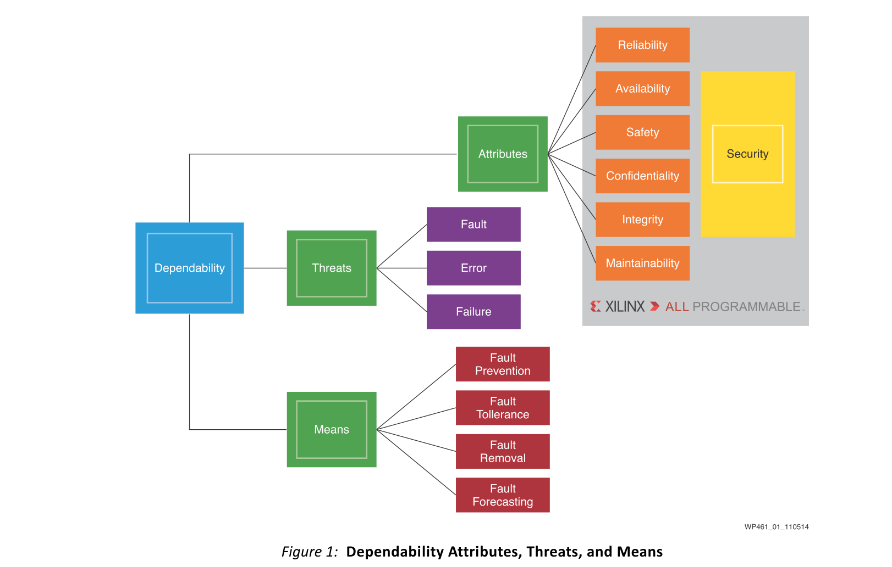

可靠性由一组属性构成，这些属性受到威胁的影响，可以使用成功管理可靠系统的方法来缓解这些威胁。本白皮书首先标记可靠性属性，威胁和方法，因为这些定义允许设计团队在设计最终系统时共享这些重要的通用术语。

首先，可靠性的attributes：
- Reliability是系统无差错服务的连续性，或者系统在指定时间内完成指定任务的可能性。
- Availability是指系统在指定时间段内随时可用的操作可用性。
- Maintainability的定义是系统可以如何快速访问，检查和修复。
- Safety表示系统受到保护的可能性，以防止可能会对用户和/或环境造成损害的意外操作或响应。
- Security是对非法电子渗透导致数据泄露或丢失的免疫力的系统的保护和防御。
- Integrity表示系统不能被不正确地更改的确定性。
- Confidentiality是系统防止未经授权披露信息的有效性。

然后，可靠性的威胁threats：
- Error是指计算值，观察值或测量值与真实，指定或理论上正确的值或条件之间的差异。错误可以是随机的或系统的。错误基本上是导致Failure的任何系统状态。
- Fault被定义为异常情况，可能导致功能单元执行所需功能的能力降低或丧失。Fault是系统Failure的原因。
- Failure是终止系统或功能单元执行所需功能的能力。（子系统Failure可能会在更高层系统中造成Fault。)

通过适当地避免或减轻Errors，Faults和Failures以使不希望的结果最小化来实现满足这些可靠性属性的设计。可以识别四种方法(means)来防止可靠性威胁(threats)：
- Fault Prevention: 定义了如何避免和防止fault引入或fault发生。
- Fault Tolerance: 是如何在出现Faults时提供满足其规范的服务。
- Fault Removal: 定义了如何在Faults的数量和严重性方面减少Faults的存在。
- Fault Forecasting: 是评估Faults的产生和后果的能力。

必须创建适当的流程，以通过应用适当的工具来管理整个产品生命周期中的属性及其方法，从而避免设计错误。这首先通过使用特定方法来确定和量化威胁，然后通过部署在产品本身内实施纠正方法的适当架构和技术来实现。

### Functional Safety
IEC 61508和ISO 26262是规范功能安全设备认证的两个主要标准。这两个标准定义了整个设计过程的特定安全生命周期。要获得产品认证，需要评估特定的设计细节，制造商的安全管理系统以及参与产品创建的专业人员的能力。Xilinx人员具备安全计划所需的IEC 61508和ISO 26262培训。
- 功能安全是安全的一个子集，如图2所示。它是总体安全的一部分，取决于有源系统（例如，温度测量，断电能源）或根据其设计的安全功能运行的设备。
- 非功能性安全是通过依赖于无源系统的措施（例如，导电部件上的绝缘）实现的安全性。

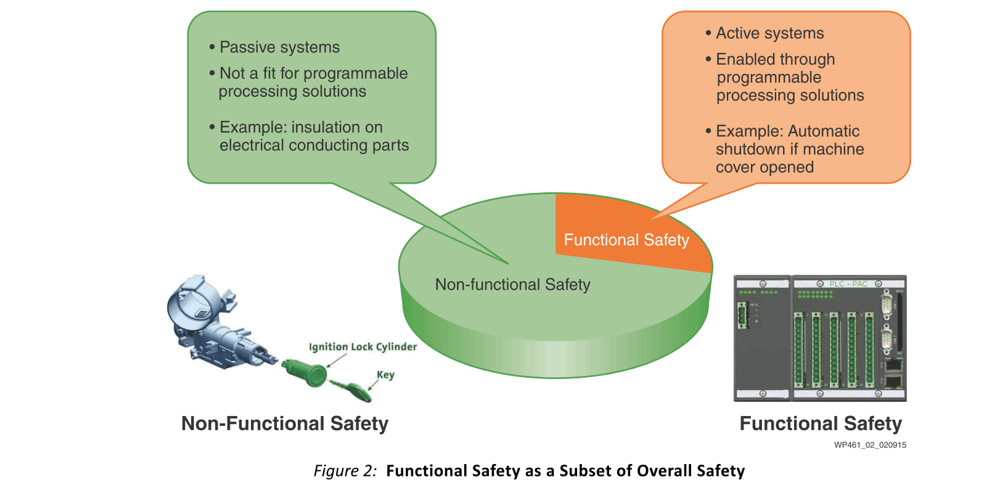

可编程电子安全设备开发的基本概念被业界概括为：如果随机，系统和常见原因故障不会导致
- 安全系统故障导致人员受伤或死亡，
- 泄漏到环境，
- 与/或设备或生产的损失。
  
则安全系统在功能上是安全的。

### Industrial Application Domain
工业，汽车，航空电子和通信系统正在迅速发展，以实现更大的集成。图3给出了典型工业自动化设备及其集成趋势的示例。

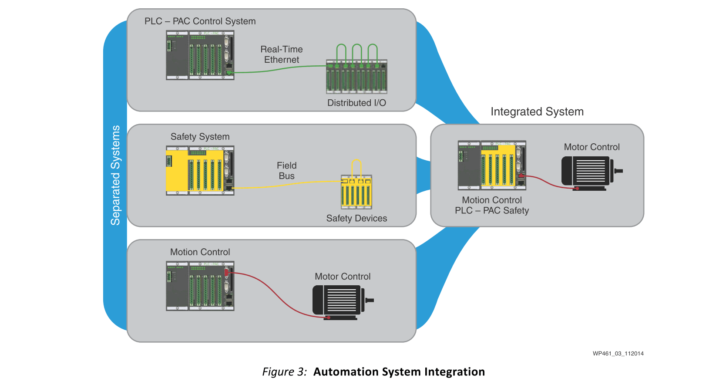

传统的自动化系统包括诸如可编程逻辑控制器（PLC）之类的设备的组合，其对激活本地或分布式I / O的过程进行排序。运动控制器计划电机控制器集合的运动和轨迹，这些电机控制器又驱动移动自动化部件的电动机。安全控制器使用安全输入传感器和安全输出执行器来监督整个系统，以便在发生违规时将受控过程置于安全状态。安全控制系统还具有通信网络 - 实时以太网和现场总线，如图3所示。这些安全系统需要安全性和机密性，以避免导致安全风险甚至工厂停机的违规行为。

传统的配置很常见，是（马后炮）后来添加的东西。最初，系统被设计用于仅承载功能方面（例如，PAC加运动加电动机控制器）。然后添加了其他属性（安全性和安全性），使系统复杂且充满陷阱，并且其可靠性非常难以评估。除了少数专家之外，这种复杂性无法理解，有时甚至他们对系统的潜在行为也有不完全的理解。所有类型的复杂性增加使设计人员难以考虑所有潜在的系统状态，或操作员难以安全有效地处理所有正常和异常情况和干扰。事实上，安全系统的领先专家将复杂性定义为智能无法管理[参考文献1]。

降低复杂性的现代方法是利用较小的硅尺寸和微电子中的不动产的可用性来包括图1中列出的可靠方法。为了有效，这种方法必须包括所有相关的设计过程和产品寿命。可靠的条件。在图3中，这种集成被描述为集成系统标签下所示的所有三个系统的并集。

显然，集成系统必须具有足够的性能来维持独立系统的功能。采用软处理器IP内核编程的FPGA（或者最好是类似Zynq®-7000器件之一的SoC）提供足够的性能，以保持和增强所需的功能，同时保持所需的可靠性属性的交付。

从根本上说，将分散的功能集成到硅中可以实现更大的去耦，因为可靠的功能嵌入在较低的系统级别。因此，可靠性可以在问题的根源进行管理，而不是事后的想法。这种方法降低了复杂性，因此降低了系统的不可管理性。

传统架构不会被这种方法淘汰。集成的可靠性管理可降低风险并提高诊断功能，但在系统级别，仍必须实施适当的可靠性架构。例如，如果担心影响集成部件的常见故障可能会使整个系统失效，则设备级别的重复（冗余）通常是适当的（或强制要求的）。

Xilinx通过为每个可靠性属性提供经过认证的方法来实现这种集成，从而可以适当地定制设计。图4显示了Xilinx支持的定制属性如何允许客户进行适当分配的示例。

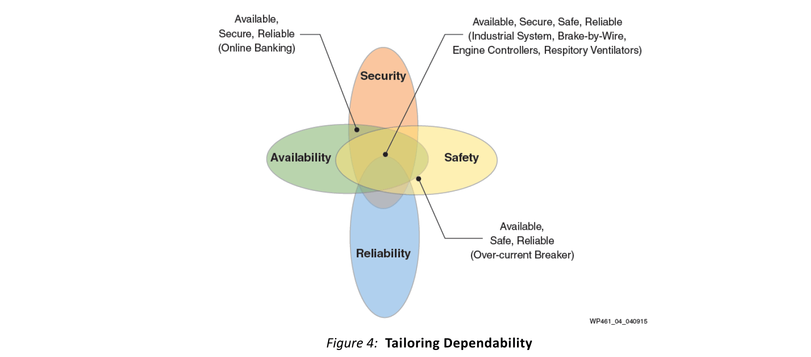

与安全不相关的可靠性，高可用性，高安全性系统，例如在线银行，证券交易所实时数据处理和关键业务网站中常见的系统，仍可充分利用Xilinx的安全解决方案和可用性图案。工业系统，发动机控制器，呼吸通风设备，线控制动系统和电力系统等制造工艺目标属于中心部分，安全，可靠，高可用性和安全关键系统重叠（图4）。图4的右下部分用于安全，可靠，高可用性系统，这些系统与security无关，例如过电流中断开关。

### Synergistic Design and Functionality
图4还表明了一种“更深层次”的解释：属性表现为一组共同工作以满足可靠性要求的层。这也称为分层方法。分层方法有助于识别和管理所需的属性，使每个层都覆盖特定的可靠性属性，其中属性的交集确定整个系统的行为。

正确实施，分层可以非常有效。但是，单独正确实施分层并不能保证成功。例如，正确实现的安全属性要求可能指定，如果密码泄露，系统必须锁定系统的每个访问门户。虽然这种行为在银行应用中可能非常合适且合理，但在不同的背景下实际上可能非常危险 - 例如，在化工厂中。

在一家化工厂，如果密码被泄密，接着是第二次高度不安全的命令，可能需要立即进行人为干预，以避免不可预见的不良后果，例如完全停工或甚至爆炸。在锁定所有输入的情况下，人类的干预可能在所需的时间范围内无法实现。

因此，Xilinx的建议是，必须在整体协同实现中指定所有可靠性属性，即每个子系统必须了解每个其他子系统的操作方法，并且必须在该上下文中可预测且安全地协同工作。

瑞士奶酪模型强调了可靠系统中协同作用的重要性。

### The Swiss Cheese Model
与之前的化工厂示例一样，许多著名的历史灾难，例如最近的深水地平线爆炸和石油泄漏（2010年），挑战者航天飞机发射爆炸（1986年），以及三哩岛的部分核灾难电厂（1979），可以使用瑞士奶酪模型进行描述和分析。

最初由认知心理学研究员James T. Reason撰写的“人类错误”一书中描述，瑞士奶酪模型侧重于涉及复杂系统的事故因果关系，这是多种因素共同作用的结果。单独来看，这些因素通常不会导致严重的问题发生 - 但在汇合时，它们可能导致危险甚至是灾难性事件。

在瑞士奶酪模型中，防止失败的模型被模拟为一系列障碍，表示为切片奶酪。切片中的孔表示系统各个部分中没有协同作用（即弱点）。在模型中，这些孔不是静态的;相反，它们在切片上的大小和位置不断变化。当每个切片中的一个孔暂时与所有其他切片中的孔对齐时，系统会产生故障，允许（在Reason的话语中）“事故机会的轨迹。”切片中这些瞬间对齐的孔的重合可以导致不可预见的失败情景。

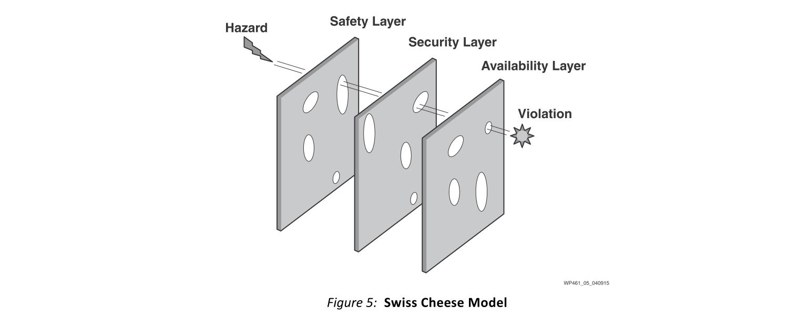

Reson的最重要贡献在可靠性领域，认为最后一层奶酪中的洞是允许最终事故发生的 - 但是如果没有一系列先前在背景中处于休眠状态的故障，事故将不太可能发生。

Xilinx认识到瑞士奶酪模型的效果，并建议客户在设计可靠系统架构时采用整体方法。必须考虑文化，组织和流程设计，提供相互意识的防御层，以充分减轻错误的必然性。

## Reliability
Xilinx在发布的质量和可靠性信息方面有着悠久的历史记录[参考文献2]。凭借其可靠性监控计划，Xilinx可确保产品性能达到或超过内部程序以及国际标准和个别客户要求所规定的可靠性规范。质量监控器从成品中取样。计划结果发布在季度UG116，设备可靠性报告[参考文献4]中。Xilinx对质量的关注以及零缺陷思维和以质量为中心的文化反映在PPM数据以及设备可靠性报告中详述的时间故障（FIT）率和单事件翻转（SEU）数据中。

### Upset Event Effects
所有可编程或其他集成电路在某种程度上都易受单事件效应（SEE）的影响。其中一些影响可能是灾难性的（例如单事件闩锁[SEL]），而其他影响可以恢复，例如对数据的不满，或者在可编程设备的情况下，对配置存储器的不满（一个SEU）。自从开始理解这些现象以来，Xilinx一直在积极寻求消除影响的方法，以及在这些事件发生时减轻此类事件的方法。对于每个技术工艺节点，赛灵思已经降低了由SEU引起的固有FIT速率（参见图6）。

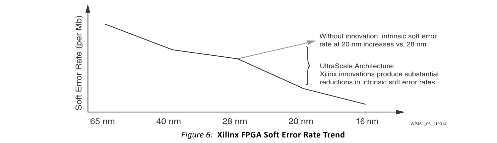

然而，单独的硅特征不能成为商业上安全的设备。Xilinx相信采用分层方法来解决这个问题，就像在安全领域一样（见图7）。

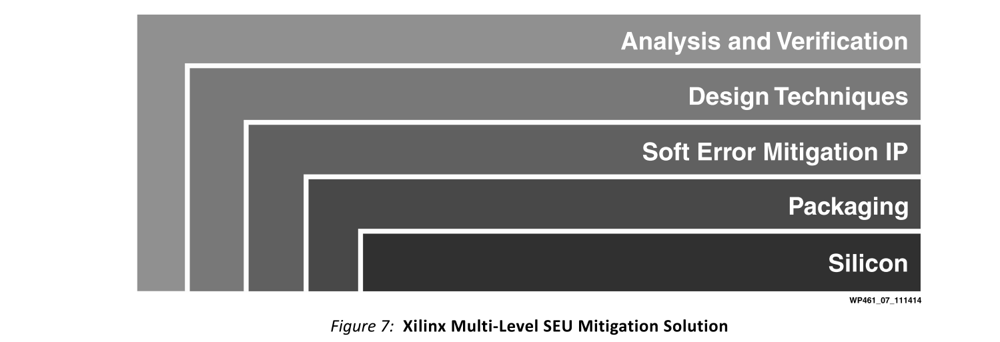

首先，这个解决方案必须从基础硅开始。从那里，必须解决包装材料。除此之外，Xilinx还提供软错误缓解IP（SEM IP）以及各种实现方法，允许用户创建故障安全和容错设计。此外，赛灵思还定期测量其性能，并努力在硅片和IP中进行每一代产品的改进。最后，Xilinx提供的工具可帮助客户了解其特定操作环境的影响，以便他们了解必须添加哪些附加层才能提供真正安全的上下文。

可靠性数据的公开分发，包括SEU FIT率[参考文献4]，随时可用。更多信息，请参见Xilinx网站单事件翻转页面[参考文献5]，Xilinx白皮书中考虑围绕FPGA，ASIC和处理器中的单事件效应[参考文献6]，以及Xilinx白皮书“Mitigating Single-Event Upsets[参考7]。

### Mitigation of the Inherent Silicon FIT Rate
#### Silicon Features
如前所述，第一个必要的缓解层是降低设备的固有FIT速率。这从FPGA / SoC的核心元素开始：配置存储单元。Xilinx花费大量时间研究SEU抗性存储器中的最佳实践以进行配置。Xilinx采用专有设计技术进行设计和布局，广泛的仿真，测试芯片运行和实际光束测试，不断降低每代器件的FIT速率。

#### Packaging Technology
除了芯片外，Xilinx还严格控制器件封装中使用的材料。这使得来自Alpha辐射的SEU减少了几个数量级。

#### User Features
除了积极控制存储器单元架构的实际设计外，Xilinx还实施了用于SEU背景检测和校正的专有方法。FRAME_ECC原语可以插入用户的设计中，允许在配置帧级别进行单错误校正和双错误检测。凭借增强的配置帧交错，Xilinx在多比特翻转（MBU）的影响方面实现了前所未有的降低，显着降低了MBU的影响（如果不是实际上否定的话） - 所有这些都对设计性能没有影响。

但是，在此类别中，Xilinx尚未停止在配置存储器中。Xilinx用户存储器阵列（Block RAM）具有强大的架构和内置纠错功能，可以校正单比特错误和任何双比特错误的检测，而不是自校正。

#### Software Mitigation, Classification, and Prediction
根据分层方法，Xilinx提供SEM IP以帮助分类和减少SEU和MBU效应[参考文献8]。SEM IP建立在Xilinx器件的嵌入式硅片功能之上，但增加了其他功能，如错误分类和错误注入。错误分类和错误位置是减少整个设备FIT的基础。Xilinx器件围绕配置帧阵列构建（每个都配有FRAME_ECC）。这个大型存储器阵列包含无数位，但只有少数位实际影响用户设计的操作。根据设计本身，更小的数字会影响用户IP的安全关键功能。所有这些位可分为以下几类：
- 器件配置位：器件配置阵列中的所有位
- 基本位：与用户设计相关的那些位[参考9]
- 优先级基本位：与用户定义的安全关键位相关的位
- 关键位：导致功能的位如果他们改变状态就会失败

Xilinx解决方案的优势在于识别这些位是Xilinx基础设计软件的一部分，可供用户根据自己的需求进行定制[参考文献8]。

由于并非所有操作环境或应用程序都需要如此强大的SEU解决方案，因此Xilinx提供SEU FIT率计算器[参考7]，允许用户在给定环境中识别应用程序的预计FIT率。更多信息可在Xilinx航空电子设备页面[参考文献10]中找到。（访问此页面需要注册。） 
## Xilinx Certified Processes
工程系统中的瑞士奶酪模型反映了工程组织的结构，管理，程序和文化，实际上创建了用于生成最终系统的过程。这不仅仅是拥有良好流程的问题，而是拥有经过认证的流程，这些流程能够区分（a）通过了解事实实现可靠性，以及（b）希望通过依赖猜测来实现可靠性。

为了向客户提供保证，Xilinx实施了经过全面认证的最先进工艺，这些工艺可以协同工作以维持整个Xilinx产品生命周期[参考文献2]：
- Xilinx定期对质量活动进行内部质量审核，以确认其有效性并遵守规定的程序。
- Xilinx进行真正的根本原因分析，以解决问题，将其转化为改进的机会。Xilinx与分包商和供应商一起采用基于团队的八学科（8D）调查方法，然后采用数据驱动方法开发永久有效的解决方案。
- 自1995年以来，Xilinx符合ISO 9001质量管理体系认证，ISO 9001：2008认证适用于定制嵌入式软件和逻辑设计的设计，测试和部署。
- 自2004年以来，Xilinx已通过TL 9000电信认证 
- Xilinx质量手册的结构基于ISO 9001：2000，TL 9000，TS 16949，Military（QML）以及其他行业标准。
  - 它适用于SoC，FPGA，CPLD和配置器件的设计，制造和测试。
- Xilinx Ireland（XIR）已获得授权经济运营商（AEO）证书。
  - 目前，美国和欧盟正在共同努力相互承认AEO。
- 自2004年以来，Xilinx一直遵守SoC STACK International，StackTrak  -  IC质量和可靠性要求的供应商认证计划，以及AEC-Q100组件和设备认证，并为汽车行业提供全面的PPAP支持。
- Xilinx符合国防部MIL-PRF-38535定制微电路认证，适用于Q级和N级。
- Xilinx自2008年通过ISO 14001：2004I认证，RoHS和无铅认证，OHSAS 18001：2007认证。
- Xilinx已证明符合功能安全[参考文献3]。
（访问此页面需要注册。）
  -  IEC 61508（ISE®DesignSuite 14.2-14.7的TÜV南德意志集团认证）
  -  ISO 26262（ISE Design Suite 14.2-14.7的TÜV南德意志集团认证）
- 确保对Xilinx的最高满意度 在产品方面，Xilinx为组件，软件，电路板和电缆开发了正式的退回材料授权（RMA）程序。
- Xilinx建立并实施了一个专注于防止所有制造合作伙伴质量问题的流程，目标是通过使用因果分析来最大限度地减少重要的变异来源，从而获得最高的产品产量，质量和可靠性。

## IEC 61508 Requirements for FPGAs
涵盖IEC 61508的所有要求超出了本白皮书的范围;因此，只描述了FPGA的主要要求，读者应该熟悉这一规范。必须考虑方法和硬件/软件的安全生命周期，以便解决随机故障和系统错误。生命周期必须由实施安全设备的任何人管理。IEC 61508建议采取若干措施，特别是IEC 61508-2（第2部分）第7.1.3.1条建议安全生命周期的V模型，其中每个开发阶段都有相应的验证和确认阶段。

然后，第7.4.4.2节规定了六个主要要求：
- 1.必须将硬件安全完整性的架构限制定义为输入要求
- 2.必须量化随机故障的影响，以确定可达到的完整性级别
- 3.如果架构以片上冗余为目标，则应使用第2部分的附录E.
- 4.必须遵循第3部分的规定并使用标有字母S（代表“系统安全”完整性）的三条可能路线来满足系统安全完整性（也称为“系统能力”）
  - a. 路线1S：必须遵循第3部分的处方以控制系统故障
  - b. 路线2S：必须证明设备已在使用中证明
  - c. 路线3S：必须证明预先存在的软件符合第3部分，如果希望这种软件是可信任的。
- 5.必须在检测到故障时定义系统行为（即执行适当的安全措施）的要求。
- 6.必须为数据通信过程定义要求，以确保交换信息的完整性 

然后，IEC 61508-2第7.4.4节规定了硬件安全完整性架构约束，参考其第2部分附录C中描述的等式。

所有六项指令都太多了，无法在本白皮书中详细说明; 只要知道它们必须全部作为第一优先事项就足够了。

然后，IEC 61508-2建立了两种可能的路由来定义硬件安全完整性级别，其中一种可以用于安全功能。由于Routes 1H和2H是特定于应用的，因此IEC 61508-2遵循特定的应用标准来确定必须使用哪两个：
- 1.Route 1H，基于硬件容错和安全故障分数概念
- 2.Route 2H，基于来自最终用户反馈的组件可靠性数据，增加置信度和针对指定安全完整性级别的硬件容错

ISO 26262对如何实现安全完整性给出了类似的要求（有时不那么严格）。

很容易看出，遵守安全标准是一个参与的过程; 除此之外，还必须确保产品的使用寿命至少延长十到十五年。

### How Xilinx Solves Functional Safety Challenges
FPGA专门针对IEC 61508-2进行了解决，冗余设计是实现所需安全完整性级别的推荐途径。通过提供更高级别的集成，Xilinx FPGA和SoC可以通过实现比其他解决方案更少组件的安全设计来降低系统成本，从而简化冗余设计的创建。Xilinx产品提供两种实现冗余的方法：
- 双芯片解决方案可用于应用标准不允许使用单芯片解决方案的情况，这种解决方案成本更高。
- 如果应用标准允许，单芯片解决方案可用于实现安全功能，例如IEC 61508-2附录E允许高达SIL3。Xilinx FPGA和SoC功能使该选项可行。如果没有被其他行业特定规范明确排除，该解决方案对客户而言是最佳价值。

#### Xilinx Software and Implementation Methodologies
##### Qualified Tools
实施者必须使用经过认证的开发工具，以确保它们能够涵盖IEC 61508-2第4点列出的系统性“FPGA要求”。Xilinx对其工具链进行了认证，创建了一个功能安全包，允许FPGA用户按照正确的方法和程序实施安全设计。用于安全指导的安全指南元素，IEC 61508和ISO 26262（功能安全包休息室[参考3]中提供）涵盖了Xilinx ISE FPGA编程工具链，版本14.2-14.7。它用于开发符合IEC 61508第2版和ISO 26262的安全相关FPGA应用设计。它还包括SIL1至SIL3或ASIL-A至ASIL-D的要求。

合格的工具链描述了基于Xilinx工具的安全FPGA设计的设计方法和流程。它引导用户使用分区和/或隔离几个功能构建块来实现设计流程的应用，以实现所需的冗余级别且无干扰。这允许合成FPGA的最终比特流，以满足指定的SIL或ASIL。它还根据IEC 61508第2版推荐的V模型，为实施的验证和测试（例如，时序，温度，功耗，违反设计规则和隔离违规）提供指导。

##### ISE Design Tool Suite 14.2 through 14.7 FPGA Programming Tool Chain
Xilinx目前在ISE Design Suite 14.2 FPGA编程工具链[参考3]和ISE Design Suite 14.7（图8）中获得TÜV南德意志集团认证，符合以下安全标准：
- IEC 61508 Edition 2.0 2010-04
- ISO 26262 First Edition 2011-11-15

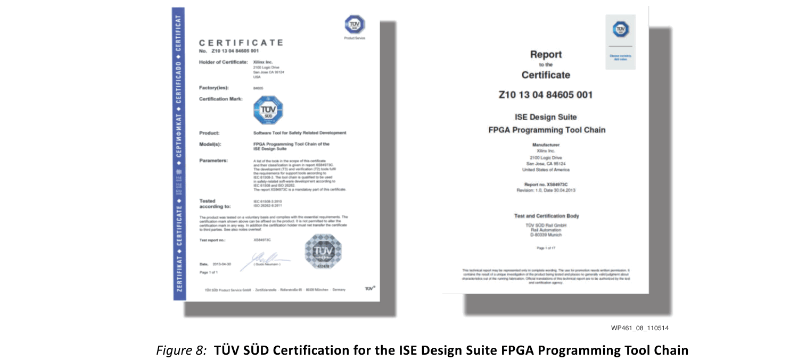

##### Isolation Design Flow (IDF)
Xilinx隔离设计流程（IDF）[参考11]是一种软件方法，允许逻辑和物理隔离一个逻辑功能。这是一个两阶段设计，包括：
- 隔离：使用ISE PlanAhead™楼层规划工具对功能块进行物理和逻辑隔离。
- 隔离验证：称为隔离验证工具（IVT）的软件应用程序，用于验证功能块的物理隔离以及块之间路由连接的正确隔离。

这种两阶段设计流程已获得TÜV南德意志集团的IEC 61508和ISO 26262认证。

IDF允许在单个FPGA内实现多个物理隔离的独立功能，利用每个功能之间未使用的设备组件的栅栏。每个隔离的功能由该栅栏分隔，在设备内产生隔离区域。该流程采用早期布局规划，模块化设计，模块化综合，并遵守一套指导方针和考虑因素，以确保所需功能之间的隔离。

在实现设计之后，必须使用IVT来验证隔离的设计规则（隔离模块之间的隔离）是否已成功实现。隔离块也可以被视为分离和解耦物理块的结构，如IEC 61508-2标准的表E.2中所定义。

## Common Cause Failure Mitigation
常见原因是对任何安全应用的担忧，因为它们甚至会严重影响最精心设计的设计。IEC61508-2附件E专门针对使用Beta因子方法的最常见FPGA原因，要求实现多种缓解机制。

图9显示了可能影响安全系统的典型共同原因以及Xilinx用于解决这些问题的缓解方案。SEM IP指的是Xilinx Soft Error Mitigation IP [参考文献8]。

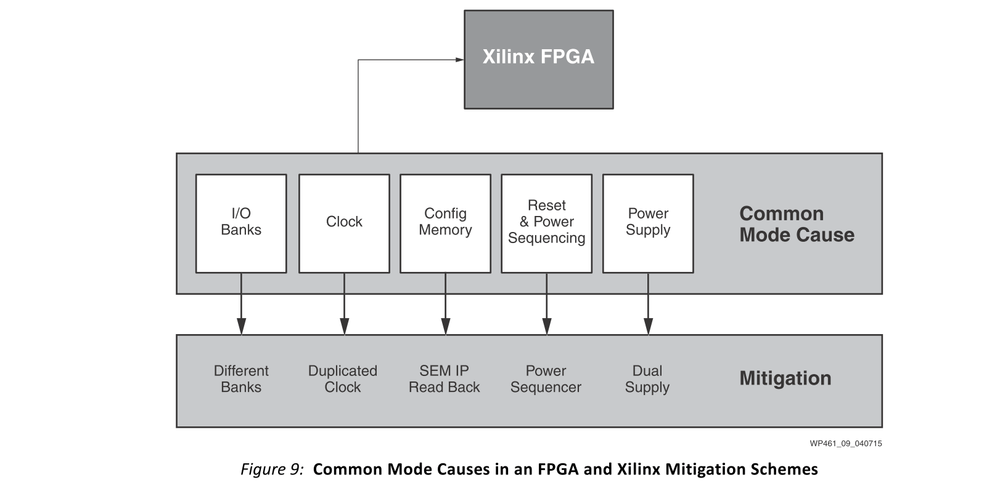

安全系统中可能存在多种常见原因故障，必须解决这些问题。表1中突出显示了其中一些，以及Xilinx FPGA / SoC中使用的缓解方案。

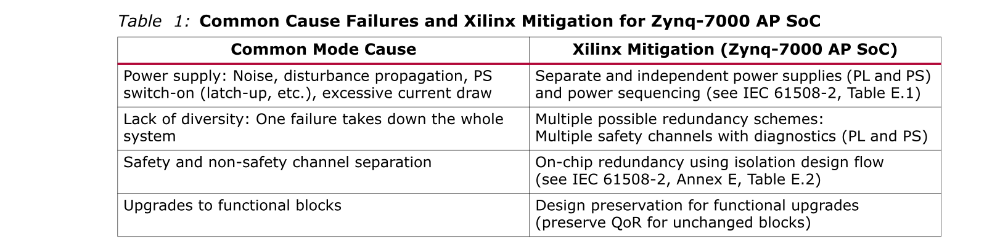

### The Zynq-7000 AP SoC Answer to IEC 61508
电源代表了一种共模问题;不同电源层的可用性允许实现独立的冗余电路。
#### Voltage Domains for PS and PL
IEC 61508-2，附录E（摘自E.1）规定：

e）应采取适当措施，避免因电源故障引起的危险故障，包括常见原因故障。

注5：电源故障包括但不限于：
- 噪声
- 电源线上的干扰传播
- 非同时电源接通可能导致闩锁或高浪涌电流过大等影响
- 短路产生的电流消耗

Zynq-7000 AP SoC通过为PS和PL采用独立的独立电源解决了这些电源问题，如图10所示。

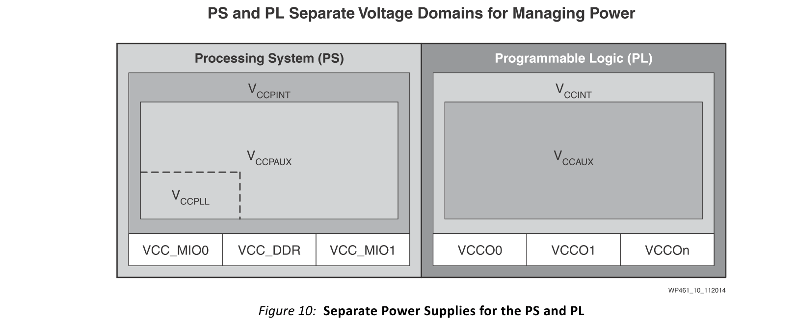

#### Zynq-7000 AP SoC Redundancy Schemes
有多种方法可以使用冗余来减轻Failure。通过复制已存在的功能来实现冗余功能。冗余可以增加系统的可用性并且可以增加系统的稳健性。

冗余可以在不同的系统级别实施，具体取决于要满足的要求。由于safety相关的功能可能非常复杂且完全复制的成本很高，因此通常只复制此类功能的特定部分。

Zynq-7000设备提供多种可能的架构。所有方案都需要隔离（IDF）块来对抗共模故障。有关四种可能的Zynq-7000 AP SoC架构，请参见图11。

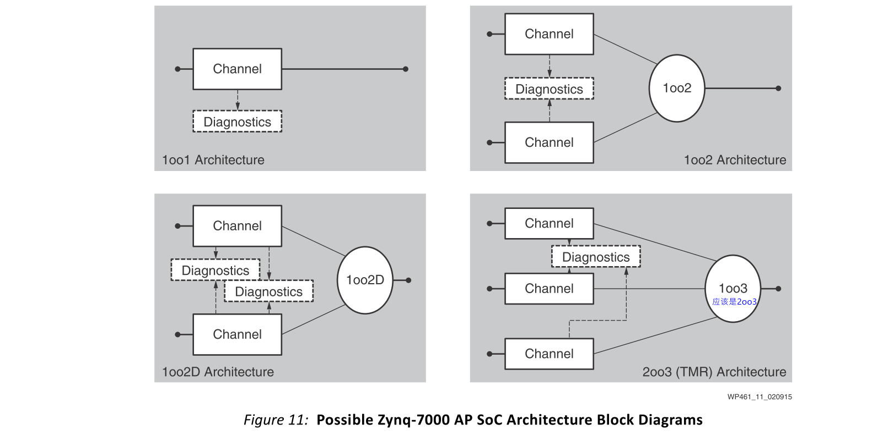

#### On-Chip Redundancy with Isolation Design Flow

众所周知，共因故障会对冗余设备的安全性和可用性产生负面影响。使用IDF [参考文献11]有助于以多种方式降低冗余系统对常见故障的敏感性。IEC 61508-2（附录E，表E.2）强调了几种降低基本β因子（IC易感性）的技术和措施。图12显示了表E.2的片段，并重点介绍了三种技术/措施，其中使用IDF可以显着降低片上冗余（O​​CR）系统的βIC。例如，IDF中定义的“栅栏”或隔离区域是“用于解耦单独物理块的结构”（IEC 61508-2，表E.2，第4项）。

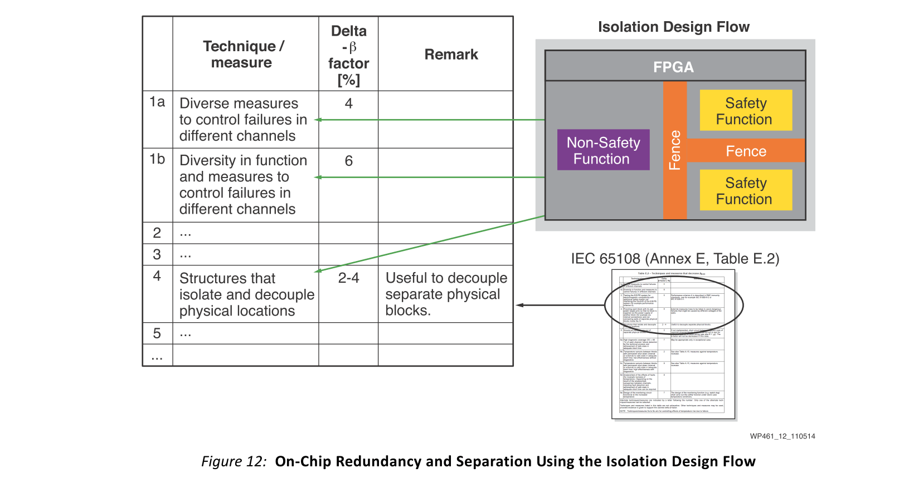

### Implementation Diversity
多样性是一种冗余，其中提出了不同的实现以确保冗余组件中的共同开发错误的独立性。

设计多样性可以抵御安全关键系统中的共模或共因开发错误。系统设计概念试图降低由于一个功能故障路径中的共同开发错误而导致故障的可能性，这可能导致另一个功能故障路径。这是通过设计具有足够不同特性的功能性故障路径来实现的，以最小化错误在另一个组件中表现出来的可能性。生成的任何故障都会在系统中成功屏蔽并被忽略。

可以在软件或硬件中执行多样性。在硬件中，使用由具有相同初始规范的不同制造商设计和交付的组件或子系统来实现多样性。

Zynq-7000系列有多种安全通道可供选择：
- 可编程逻辑（PL）和处理系统（PS）
- PL和MicroBlaze™处理器和PS（APU）
- PL和PS（APU）以及双锁步MicroBlaze处理器

有关Zynq-7000器件中可能的多样性选项，请参见图13和图14。

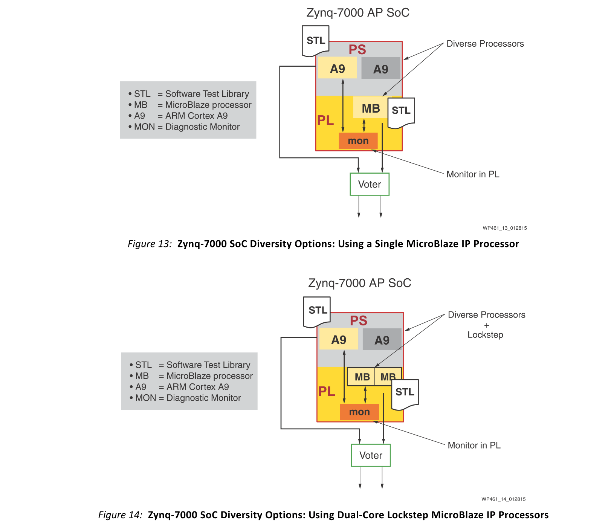

#### Lockstep Concept
在锁步架构中，两个处理器（Master和Checker）在严格同步中执行相同的代码。Master可以访问系统内存并驱动所有系统输出。Checker连续执行主处理器提取的指令。Checker产生的输出（地址和数据）为比较逻辑（监视器）提供信息。比较逻辑检查Master和Checker数据，地址和控制线的一致性。对任何一对重复总线的值的不一致表明在任一CPU上都有故障（没有确定哪个CPU有故障）。Dual-Lockstep MicroBlaze处理器系统[参考文献12] [参考13]的框图如图15所示。

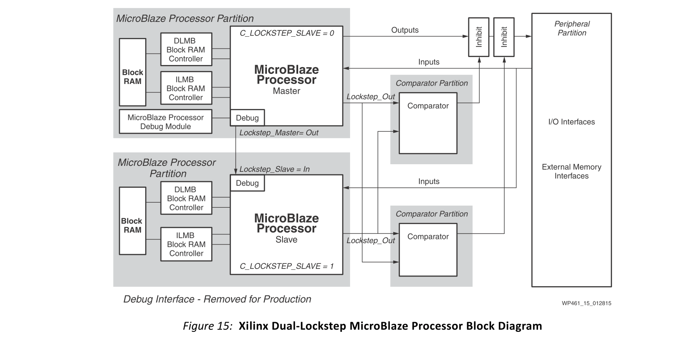

锁步实现存在一些限制。监视器无法检测总线和内存错误。这些错误实际上是共模故障的根源，导致两个CPU以相同的方式失败。必须使用错误检测（校正）技术（例如奇偶校验位（纠错码））保护总线和存储器免受故障。

锁步架构可用作fail-silent节点，提供检测在CPU，内存或通信子系统上无差别地发生的任何100％覆盖单个错误（永久或瞬态）的能力。

#### Redundant Dual-Lockstep Concept
可以采用冗余双锁步MicroBlaze [Ref 12] [Ref 14]处理器实现来弥补这些限制中的一些。图16显示了可能的冗余Dual-Lockstep MicroBlaze处理器系统的高级框图。

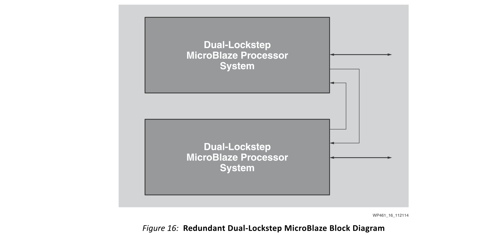

- 在双锁步架构中，两个fail-silent通道共享同一个内存子系统。
- 实现冗余双锁步架构的方法还包括三模冗余（TMR）解决方案，因为它具有相同的容错属性。
- 当需要故障操作功能时，两个通道可以按锁步模式排列
  - 提供CPU故障的屏蔽功能，如TMR解决方案
  - 可用作两个完全并行的fail-silent通道，提供双重性能 

## System Security
Xilinx一直走在为可追溯到Virtex®-II Pro系列的众多产品提供安全FPGA解决方案的最前沿。在每一代中，Threats都会随着它们的发展而进行分析，并添加了其他功能来应对它们。先从硅功能开始，然后实现完全集成的安全IP（安全监控），Xilinx已经证明了其在为FPGA / SoC开发人员提供安全解决方案方面的领先地位。有关Xilinx安全解决方案的高级概述，请访问Xilinx网站[参考文献15]。
### Silicon Features
Xilinx采用分层的安全方法，每层都建立在前一层。这一基本原则为开发人员构建了一个安全的基础。当然，第一层是硅本身。如果基础层不安全，则没有平台是安全的。这无异于在沙地上建造房屋。Xilinx采用芯片安全功能，例如AES256加密和256位HMAC认证方案，用于验证和提供FPGA负载的机密性。此外，Xilinx还提供RSA2048来验证Zynq-7000 AP SoC第一阶段引导加载程序（FSBL），并提供必要的代码以将此身份验证扩展到所有后续设备负载。在此安全层的基础上，Xilinx通过向用户展示如何禁用JTAG控制器等外部接口，提供了“锁定FPGA / SoC门”的方法。除了这种物理保护外，Xilinx还演示了如何使用系统监视器或XADC来监视器件的环境电压和温度。所有这些以及更多内容都在Developing Tamper Resistant Designs with Xilinx Virtex-6 and 7 Series FPGAs[Ref 16]。基于所有这些功能，Zynq-7000 AP SoC等设备可在应用电源时提供安全平台。

### Intellectual Property (IP)
对于那些不希望组装自己的定制安全解决方案，但在安全性是首要任务的环境中运行的用户，Xilinx在单个封装中提供安全的解决方案。此解决方案是安全监视器。它提供了一个包含在单个IP内核中的可靠安全层。安全监视器不仅包括使用前面引用的Xilinx应用笔记[参考文献16]中描述的内置安全功能，还通过监视设备配置内存来增加一层安全性，以确保自初始配置以来没有任何变化。对系统运行状况的这种后台监视可以检测并且如果需要，可以通过对手或单事件扰乱（SEU）来纠正任何配置内存更改。如果检测到问题，则用户可以纠正它并返回到安全状态 - 或者，如果需要，将设备内容清零，从而保护用户的IP。有关安全监视器IP内核的完整功能的更多信息，请参阅安全监视器IP产品简介[参考资料17]。

## Conclusion
凭借将安全和非安全功能紧密集成到单个器件中的能力，Xilinx产品（提供众多其他优势）提供一流的质量，FIT，SEU处理以及无与伦比的工具和技术（如IDF和IVT）以满足客户最严格的安全目标。由于Xilinx安全技术符合认证标准，因此客户可以依赖无风险的安全解决方案。

有关Xilinx功能安全解决方案的高级概述，请参见Xilinx产品简介Xilinx All Programmable Functional Safety Design Flow Solution[参考文献18]。

### Xilinx Deliverables for Functional Safety

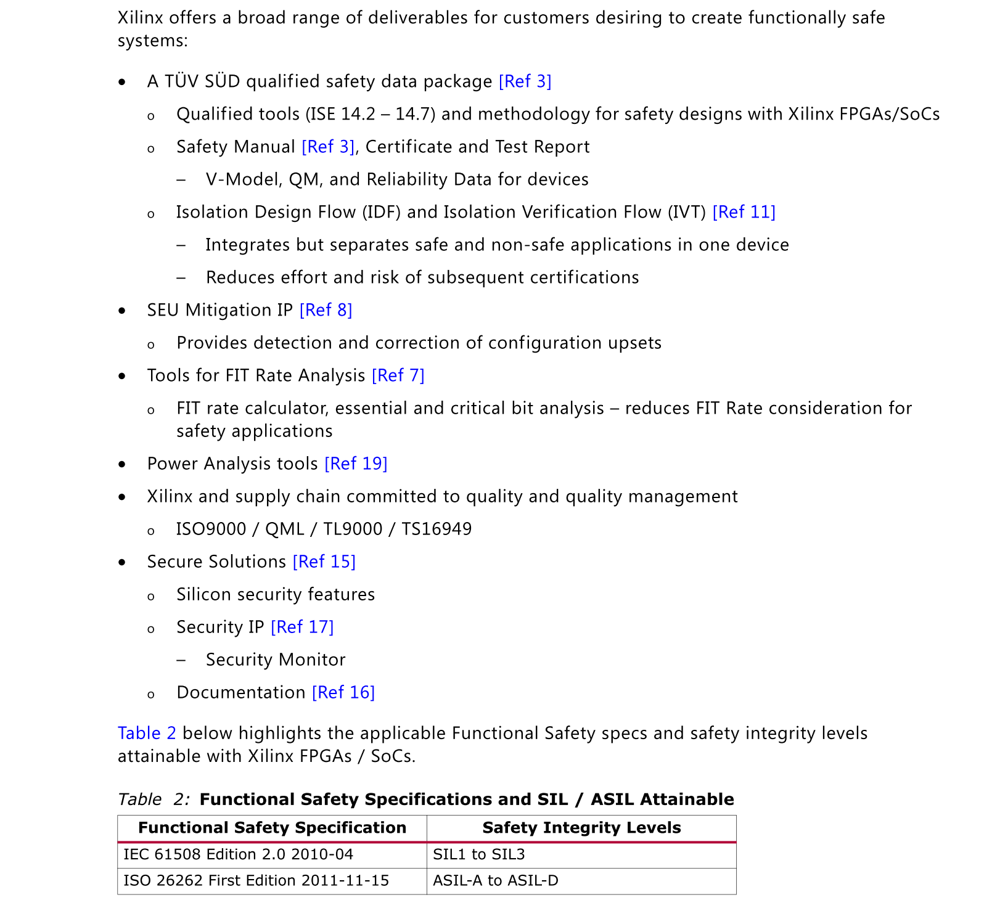